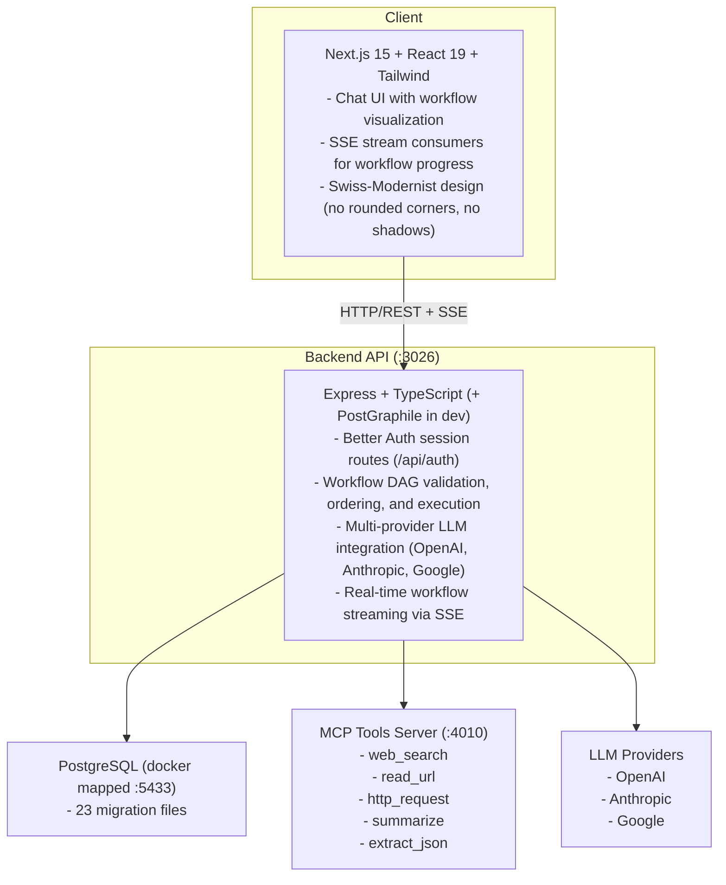

# HardWire

<p align="center"> 
    
</p>

<p align="center">
  <strong>AI-Native Web Search with Deterministic Workflows</strong>
</p>

<p align="center">
  Transform LLM interactions into structured, auditable workflows with DAG execution, CI-style pipeline visualization, and fail-fast error handling.
</p>

---

## Overview

**HardWire** is a full-stack AI chat platform that enforces **deterministic, user-defined workflows** instead of unpredictable free-form conversations. Users describe workflows in natural language, which compile into executable **Directed Acyclic Graphs (DAGs)**. Every workflow run renders inline as a CI-style pipeline with step-by-step logs, tool invocation transparency, and fail-fast semantics.

**What makes it different:**
- **Deterministic Execution** — Workflows follow strict topological order; no silent degradation to free-form chat
- **Full Transparency** — Every tool call, every step output, every error is visible and auditable
- **Proposal-Based Editing** — All workflow changes require user approval before taking effect
- **Reproducibility** — Workflow versions are pinned to runs for exact replay

**The stack:**
- **Frontend:** Next.js 15 + React 19 + Tailwind with Swiss-Modernist design system
- **Backend:** Express + PostgreSQL + PostGraphile + Vercel AI SDK
- **MCP Tools Server:** Standalone tool registry and execution service
- **Infrastructure:** Railway/Terraform for AWS (App Runner, RDS, ElastiCache, CloudFront)

---

## Quick Start

**See [GETTING_STARTED.md](./GETTING_STARTED.md) for complete step-by-step setup instructions.**

---

## Reviewer Notes

### What to Look At First

| File | Why |
|------|-----|
| `backend/lib/workflowRunner.ts` | DAG execution engine — the core innovation |
| `backend/app/chats/chats.ctrl.ts` | Example of collection pattern with Either monad |
| `frontend/src/contexts/ChatContext.tsx` | SSE streaming and workflow state management |
| `mcp-tools-server/app/v0/tools/tools.executors.ts` | Tool implementations with security controls |
| `context/BRIEF.md` | Full product specification |

### What to Judge

- **Workflow execution model** — Topological sort, fail-fast, version pinning
- **Code organization** — Consistent collection structure across all backend modules
- **Error handling** — Either monad pattern throughout services
- **Security** — MCP server URL allowlist, private IP blocking, session validation
- **Test coverage** — Integration tests, and LLM evals

---

## Architecture



---

## Repository Structure

```
hardwire/
├── backend/                 # Express API server
│   ├── app/                 # API collections (chats, messages, workflows, etc.)
│   ├── lib/                 # Shared libraries (LLM, workflow engine, auth)
│   ├── middleware/          # Express middleware (auth, validation, rate limiting)
│   ├── migrations/          # PostgreSQL migrations (21 files)
│   ├── tests/               # Unit and integration tests
│   └── evals/               # LLM evaluation suites
│
├── frontend/                # Next.js 15 React application
│   ├── src/app/             # App Router pages
│   ├── src/components/      # React components (chat, auth, workflows)
│   ├── src/contexts/        # State management (Auth, Chat, Modal)
│   └── src/lib/             # API client, error handling
│
├── mcp-tools-server/        # MCP tools microservice
│   ├── app/v0/tools/        # Tool routes, executors, service
│   ├── data/tools.json      # Tool registry
│   └── tests/               # Tool tests
│
├── infrastructure/          # Terraform AWS configuration
│   └── environments/
│       ├── prod/            # Production environment
│       └── staging/         # Staging environment
│
├── docs/                    # MkDocs API documentation
│   ├── site/content/        # Markdown documentation
│   └── mkdocs.yml           # MkDocs configuration
│
├── marketing/               # Vite marketing site
│   ├── index.html           # Landing page
│   └── src/                 # Animations and interactions
│
├── context/                 # Project documentation and standards
│   ├── BRIEF.md             # Full product specification
│   ├── PRD.md               # Product requirements
│   ├── COLLECTION-STANDARDS.md  # Backend module patterns
│   └── DESIGN-SYSTEM.md     # Frontend design tokens
│
├── docker-compose.yml       # Full-stack local development
├── GETTING_STARTED.md       # Step-by-step setup guide
└── AGENTS.md                # AI coding assistant context
```

See individual directory READMEs for detailed documentation:
- [`backend/README.md`](./backend/README.md)
- [`frontend/README.md`](./frontend/README.md)
- [`mcp-tools-server/README.md`](./mcp-tools-server/README.md)
- [`infrastructure/README.md`](./infrastructure/README.md)
- [`docs/README.md`](./docs/README.md)
- [`marketing/README.md`](./marketing/README.md)
- [`context/README.md`](./context/README.md)

---

## Key Concepts

### 1. Workflow DAG Execution

Workflows are compiled into Directed Acyclic Graphs and executed with strict topological ordering.

- **Topological Sort** — Steps run in dependency order
- **Fail-Fast** — Any step failure halts the entire workflow
- **Version Pinning** — Runs are tied to specific workflow versions
- **SSE Streaming** — Real-time progress updates to the frontend

**Evidence:** `backend/lib/workflowRunner.ts`, `backend/lib/workflowDags/`

### 2. Proposal-Based Workflow Editing

All workflow modifications go through a review cycle:

1. User describes change in natural language
2. LLM generates structured tool calls (add_step, modify_step, etc.)
3. System creates a proposal with change preview
4. User approves or rejects
5. Applied changes create a new workflow version

**Evidence:** `backend/lib/workflowProposals/`, `backend/app/workflowChatMessages/`

### 3. Either Monad Error Handling

All service functions return `Either<ResourceError, SuccessType>` for explicit error propagation.

```typescript
const result = await createChat(params);
if (result.isError()) {
  return res.status(result.value.statusCode).json(result.value);
}
return res.status(201).json(result.value);
```

**Evidence:** `backend/types/either.ts`, all `*.service.ts` files

### 4. Collection Module Structure

Every API resource follows a strict file pattern:

```
app/<collection>/
├── <collection>.types.ts      # TypeScript interfaces
├── <collection>.errors.ts     # Custom error classes
├── <collection>.validation.ts # Joi schemas
├── <collection>.ctrl.ts       # Request handlers
├── <collection>.router.ts     # Express routes
├── <collection>.service.ts    # PostGraphile operations
└── <collection>.helper.ts     # Either-wrapped business logic
```

**Evidence:** `backend/app/chats/`, `context/COLLECTION-STANDARDS.md`

### 5. MCP Tools Registry

Tools are served by a standalone microservice following the Model Context Protocol pattern:

- **List/Search/Get** — Tool discovery
- **Run** — Tool execution with input validation
- **Security** — URL allowlist, private IP blocking, timeout handling

**Evidence:** `mcp-tools-server/`, `backend/lib/mcpToolsServer/`

---

## License

Proprietary. All rights reserved. Brandon McFarland.
