# Hardwire Textbook

<p align="center"> 
    
</p>

**HardWire: A Comprehensive Codebase Textbook**

This is a college-textbook-level study guide for the HardWire codebase. It assumes no prior knowledge of the technologies, programming patterns, or algorithms used, and is designed to bring a reader from zero to full comprehension.

**How to Use This Guide**

- **Chapters 1–5** cover foundations: vocabulary, architecture, backend conventions, DAG algorithms, and workflow execution.
- **Chapters 6–10** are deep dives: LLM integration, frontend, MCP tools, infrastructure, and testing.
- **The Glossary** at the end defines every technical term used in the guide.
- Each chapter ends with **Study Questions** for self-assessment.
- Code snippets marked with ```ts are real code from the codebase; ```pseudocode blocks are simplified for clarity.
- Mermaid diagrams rely on Mermaid rendering; if your viewer supports Mermaid, you will see the diagrams inline.

**Table of Contents**

| Chapter | Title | Focus |
|---------|-------|-------|
| 1 | Orientation and Vocabulary | Shared terminology and mental model |
| 2 | System Architecture | How the parts fit together |
| 3 | Backend Conventions and the Error Model | Express, middleware, Either monad |
| 4 | Workflow DAG Algorithms | Topological sort, cycle detection |
| 5 | Workflow Modification and Execution | LLM tool calls, DAG modification, execution engine |
| 6 | LLM Integration, RAG, and Tooling | Provider abstraction, RAG pipeline, prompt engineering |
| 7 | Frontend Application | React, Next.js, SSE streaming, state management |
| 8 | MCP Tools Server | Tool isolation, JSON-RPC protocol, safety |
| 9 | Infrastructure | Terraform, VPC, AWS services |
| 10 | Testing, Evals, and Quality Assurance | Jest, LLM evals, mocking strategies |
| — | Glossary | Alphabetized definitions of all terms |

---


# HardWire: A Comprehensive Study Guide

## Part I — Foundations and Architecture (Chapters 1–5)

---

# Chapter 1: Orientation and Vocabulary

## 1.1 What Are We Building?

HardWire is a **deterministic workflow chat platform**. Let us unpack every word in that phrase, because each one carries significant weight.

**Chat platform**: At the surface level, HardWire looks like a chat application. A user types a message, and the system responds. There is a conversation history, a sidebar for navigation, and a streaming text response that appears token by token. If you have used ChatGPT, Claude, or any modern AI assistant, the interaction model will feel familiar.

**Workflow**: Unlike a freeform chat where the AI simply generates a response to whatever you say, HardWire structures its work around *workflows*. A workflow is a predefined sequence of steps, each with its own instruction, that together accomplish a complex task. Think of it as a recipe: step 1 gathers ingredients, step 2 preheats the oven, step 3 mixes the batter, and so on. Each step may depend on previous steps, and each step can use specialized tools (like web search, code execution, or database queries).

**Deterministic**: This is perhaps the most important word. Large Language Models (LLMs) are inherently probabilistic — ask the same question twice and you may get different answers. HardWire imposes *structure* on top of this probabilistic foundation. By defining a workflow as a Directed Acyclic Graph (DAG) of steps, the system ensures that the *order* of execution is deterministic even if the content generated at each step is not. The same workflow will always execute its steps in the same topologically valid order, making the system predictable, debuggable, and auditable.

**Platform**: HardWire is not a single program. It is a collection of services — a frontend web application, a backend API server, a database, an authentication system, a tool execution server, and cloud infrastructure — that work together. Understanding how these pieces fit together is a major goal of this guide.

### 1.1.1 A Day in the Life of a HardWire Request

Imagine a user named Alice who wants to research a topic and produce a summary report. Here is what happens:

1. Alice opens HardWire in her browser (the **frontend**, built with Next.js and React).
2. She selects a workflow called "Research Report" from the sidebar.
3. She types: "Write a report on the current state of quantum computing."
4. The frontend sends this message to the **backend** (an Express.js server).
5. The backend authenticates Alice, validates her request, and creates a new chat session.
6. If a workflow is selected, the backend loads the **latest workflow version** and its DAG (steps like "Search the web," "Synthesize findings," "Write introduction," "Write body," "Write conclusion"), then validates it.
7. When a **workflow run** starts, the backend orders steps using the same **stable topological sort** (`sortWorkflowDagSteps`) used for workflow previews, so the execution order matches what the UI shows when multiple orders are valid.
8. For each step, the backend sends a prompt to an **LLM** (Large Language Model), incorporating the step's instruction, any tool results, and the accumulated context from previous steps.
9. Some steps invoke **tools** — for example, the "Search the web" step calls the MCP `web_search` tool (currently backed by DuckDuckGo) through the MCP tools server.
10. The LLM's response streams back to Alice's browser via **Server-Sent Events (SSE)**, so she sees text appearing in real time.
11. The final result is a structured, multi-step report that Alice can review, edit, or re-run.

This entire flow — from keystroke to final report — traverses every layer of the HardWire stack. By the end of this guide, you will understand each layer in detail.

### 1.1.2 Message With Workflow Selected — Call Chain

When a user submits a message with a workflow selected, the backend follows this path:

1. `POST /api/chats/:chatId/messages` → `createMessageHandler`.
2. Validate request, load or create the chat, and block if a workflow run is already in progress.
3. Persist the user message.
4. If `workflowId` is present, start `runWorkflow` **asynchronously** and immediately return a response containing `workflowRunId`.
5. Inside `runWorkflow`:
   - Load the workflow and latest version.
   - **Validate** the DAG (cycles, missing deps, duplicate IDs, tool refs).
   - Create the `workflow_runs` DB record.
   - **Sort** steps with `sortWorkflowDagSteps` (stable topological order).
   - Execute each step in order, streaming updates via SSE.
6. When the run completes, an assistant (or system) message is saved to the chat.

This separation lets the API respond quickly while the workflow runs in the background.

**Why create the workflow run record before sorting the DAG?**

The backend creates the `workflow_runs` record early so it can return a `workflowRunId` immediately. The client needs that ID to subscribe to the SSE stream endpoint and to poll for run status. If the record were created later, the API would have to block until sorting (and potentially tool-loading) finishes, which would make the UI feel slow and could cause timeouts.

This early record is also the system’s anchor for observability. Once the run exists, every subsequent step run, log entry, and status update has a stable parent ID to attach to. That means the UI can show “run started” right away, and any errors that happen during sorting or early execution still have a run record to report against. Importantly, the DAG is **validated before** the run is created, so the system does not create runs for structurally invalid workflows. Sorting happens next and is deterministic, but it does not block the initial response or the creation of the run record.

## 1.2 Foundational Terms

Before we dive into code, we need to establish a shared vocabulary. This section defines every term you will encounter, starting from the most basic and building up.

### 1.2.1 Networking and Web Fundamentals

**HTTP (HyperText Transfer Protocol)**: The protocol that powers the web. When your browser loads a page, it sends an HTTP *request* to a server, and the server sends back an HTTP *response*. Every request has a *method* (GET, POST, PUT, DELETE, PATCH), a *URL*, *headers* (metadata), and optionally a *body* (data). Every response has a *status code* (200 for success, 404 for not found, 500 for server error), *headers*, and a *body*.

**API (Application Programming Interface)**: A contract between two pieces of software. In the context of HardWire, the backend exposes a REST API — a set of HTTP endpoints that the frontend can call to create chats, send messages, load workflows, and so on. The API defines what URLs are available, what data to send, and what data to expect back.

**REST (Representational State Transfer)**: An architectural style for APIs. RESTful APIs use HTTP methods semantically: GET to read, POST to create, PUT/PATCH to update, DELETE to remove. Resources are identified by URLs (e.g., `/api/chats/123/messages`). HardWire's primary API follows REST conventions.

**GraphQL**: A query language for APIs, invented by Facebook. Instead of having many fixed endpoints, GraphQL exposes a single endpoint where clients specify exactly what data they want. HardWire uses **PostGraphile**, which automatically generates a GraphQL API from a PostgreSQL database schema. This gives the backend the ability to perform complex queries without writing custom SQL for every operation.

**SSE (Server-Sent Events)**: A protocol built on top of HTTP that allows a server to push updates to a client. Unlike a regular HTTP request-response cycle (where the client asks and the server answers once), SSE keeps the connection open and the server sends events as they occur. HardWire uses SSE to stream LLM responses token by token, so the user sees text appearing in real time rather than waiting for the entire response to complete.

**WebSocket**: An alternative to SSE for real-time communication. WebSocket is bidirectional (both client and server can send messages at any time), while SSE is unidirectional (server to client only). HardWire chose SSE over WebSocket — we will discuss why in Chapter 2.

### 1.2.2 Data and Algorithms

**JSON (JavaScript Object Notation)**: A text format for representing structured data. It uses key-value pairs (`{"name": "Alice", "age": 30}`) and arrays (`[1, 2, 3]`). Nearly all data exchanged between HardWire's frontend and backend is JSON.

**DAG (Directed Acyclic Graph)**: A graph where edges have direction (A → B means A leads to B, not the reverse) and there are no cycles (you cannot follow edges and return to where you started). DAGs are the core data structure of HardWire's workflow system. Each workflow step is a node, and dependencies are directed edges.

**Topological Sort**: An ordering of a DAG's nodes such that for every directed edge A → B, A appears before B in the ordering. This is how HardWire determines the execution order of workflow steps. If step "Write Body" depends on step "Research," then Research must come first in the topological order.

**Graph Cycle**: A path through a graph that starts and ends at the same node. Cycles are forbidden in HardWire workflows because they would create infinite loops — step A depends on B, B depends on C, C depends on A, so none of them can ever start.

### 1.2.3 AI and Machine Learning

**LLM (Large Language Model)**: A neural network trained on vast amounts of text that can generate human-like text given a prompt. Examples include GPT-4, Claude, and Llama. HardWire uses LLMs as the "brain" that generates content at each workflow step.

**Prompt**: The text input given to an LLM. In HardWire, each workflow step has an *instruction* that becomes part of the prompt, along with context from previous steps and any tool results.

**Token**: The basic unit of text that LLMs process. A token is roughly 3/4 of a word in English. "Hello world" is two tokens. "Antidisestablishmentarianism" might be four or five tokens. LLMs generate responses one token at a time, which is why streaming is possible.

**Tool Call**: A mechanism by which an LLM can request that external code be executed. Instead of generating only text, the LLM outputs a structured request like "call the web_search tool with query 'quantum computing 2026'." The system executes the tool and feeds the result back to the LLM. HardWire uses tool calls both for workflow execution (e.g., web search) and for workflow editing (e.g., add_step, delete_step).

**RAG (Retrieval-Augmented Generation)**: A technique where relevant information is retrieved from an external source (like a web search or a document database) and included in the LLM's prompt. This helps the LLM generate accurate, up-to-date responses rather than relying solely on its training data. HardWire uses Exa for web search as part of its RAG pipeline.

**MCP (Model Context Protocol)**: A protocol for connecting LLMs to external tools and data sources. HardWire runs an MCP tools server that manages the execution of tools like web search, allowing the LLM to interact with the outside world in a standardized way.

### 1.2.4 Infrastructure and DevOps

**Terraform**: An infrastructure-as-code tool. Instead of clicking through AWS console screens to create servers and databases, you write Terraform configuration files that declare what infrastructure you want, and Terraform creates it. HardWire's **AWS reference architecture** is defined in Terraform, while the live demo deployment runs on Railway.

**AWS (Amazon Web Services)**: The cloud platform used for HardWire’s **reference architecture**. The live demo is deployed on Railway, but the AWS blueprint documents how HardWire would run on services like App Runner, RDS, and S3/CloudFront.

**PostgreSQL (Postgres)**: A powerful open-source relational database. HardWire stores all its data — users, chats, messages, workflows — in PostgreSQL. PostGraphile sits on top of Postgres and auto-generates a GraphQL API from the database schema.

**PostGraphile**: A tool that introspects a PostgreSQL database and automatically creates a high-performance GraphQL API. This means that when you add a table to the database, you automatically get GraphQL queries and mutations for it without writing any resolver code.

### 1.2.5 Programming Concepts

**TypeScript**: A superset of JavaScript that adds static typing. Instead of writing `function add(a, b)`, you write `function add(a: number, b: number): number`. This catches errors at compile time rather than runtime. The entire HardWire backend is written in TypeScript.

**Monad**: A design pattern from functional programming for chaining operations that might fail, produce side effects, or have other complications. HardWire uses an **Either monad** for error handling — every operation returns either a Success or an Error, rather than throwing exceptions. We will explore this in depth in Chapter 3.

**Middleware**: In the context of Express.js (HardWire's backend framework), middleware is a function that sits between the incoming HTTP request and the final handler. Middleware can authenticate users, validate input, log requests, rate-limit traffic, and more. Multiple middleware functions form a pipeline that each request passes through.

## 1.3 Project-Specific Vocabulary

These terms are unique to the HardWire codebase:

| Term | Meaning |
|------|---------|
| **WorkflowDAG** | The JSON representation of a workflow — an object with a `steps` array, where each step has dependencies |
| **WorkflowStep** | A single node in the DAG — has an `id`, `name`, `instruction`, optional `tools`, and optional `dependsOn` |
| **Collection** | A backend module responsible for one resource type (e.g., chats, messages, workflows). Follows the Router → Controller → Service pattern |
| **Tool Call (workflow editing)** | An LLM-emitted instruction to modify a workflow DAG (add_step, update_step, delete_step, reorder_steps) |
| **Tool Call (workflow execution)** | An LLM-emitted instruction to execute an external tool (web_search, code_execute, etc.) during workflow step execution |
| **Rewire Strategy** | When deleting a workflow step, how to reconnect its dependents: "auto" (inherit the deleted step's dependencies) or "manual" (point to a specific step) |
| **Temp ID** | A temporary identifier used during DAG modification so that newly added steps can be referenced by subsequent tool calls before they receive permanent IDs |
| **Either** | The error-handling type used throughout the backend. Every service function returns `Either<ResourceError, T>` |
| **ResourceError** | The base error class. Contains a developer message, a client-safe message, a status code, and an error code |

## 1.4 Mental Model: How Everything Connects

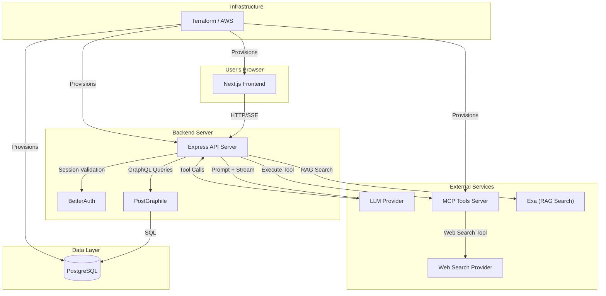


## 1.5 The Conceptual Flow

Understanding HardWire requires grasping three related flows:

**Flow 1: The Chat Flow** — User sends message → Backend authenticates → Message stored in DB → LLM generates response → Response streamed back via SSE → Response stored in DB.

**Flow 2: The Workflow Execution Flow** — User selects workflow → DAG loaded from DB → DAG topologically sorted → Each step executed in order → Each step's result fed as context to the next step → Final result assembled.

**Flow 3: The Workflow Editing Flow** — User (or LLM) requests workflow changes → LLM emits tool calls (add_step, delete_step, etc.) → DAG is cloned → Modifications applied → DAG validated (no cycles, no missing deps) → DAG re-sorted → Updated DAG saved as a **new workflow version**.

These three flows are related but not concurrent. A chat message can trigger workflow execution (Flow 2). Workflow editing (Flow 3) happens when a user explicitly requests a change (typically before or after a run) and produces a new workflow version; it does not modify a workflow mid-run.

> **Key Takeaway**: HardWire is not just a chatbot. It is a structured execution engine that uses LLMs as the reasoning component within a deterministic workflow framework. The DAG data structure is the backbone that provides determinism, and the Either monad is the safety net that ensures errors are handled gracefully at every layer.

## 1.6 Reading This Guide

This guide is organized in dependency order — each chapter builds on the previous ones:

- **Chapter 1** (this chapter): Vocabulary and mental models
- **Chapter 2**: System architecture — how the pieces fit together
- **Chapter 3**: Backend conventions and error handling — the patterns every backend module follows
- **Chapter 4**: The DAG algorithms — the computer science heart of the system
- **Chapter 5**: Workflow modification and execution — how workflows are changed and run

Later chapters (6–10) cover the frontend, authentication, LLM integration, infrastructure, and testing.

## Study Questions

1. In your own words, explain what makes HardWire "deterministic" even though it uses LLMs, which are inherently probabilistic.
2. What is the difference between a workflow's *structure* (its DAG) and its *content* (the text generated at each step)?
3. Why does HardWire use SSE rather than a simple request-response pattern for LLM outputs?
4. Explain the relationship between PostGraphile, PostgreSQL, and GraphQL. Why use all three instead of just writing SQL queries directly?
5. What is a "tool call" in the context of an LLM? Give two different examples of how HardWire uses tool calls.
6. Describe the three related flows (chat, execution, editing) and explain how they might occur within a single user session.
7. What would happen if a workflow DAG contained a cycle? Why is this problematic?
8. Define the following terms in your own words: monad, middleware, DAG, RAG, MCP.
9. Why does the codebase use TypeScript instead of plain JavaScript? What benefit does static typing provide in a complex system like HardWire?
10. Draw (on paper) a simple workflow DAG for a task you do regularly (e.g., making breakfast, writing an essay). Label the nodes and edges. Identify which steps depend on which.

---

# Chapter 2: System Architecture

## 2.1 The Big Picture

HardWire follows a **layered architecture** with clear separation of concerns. Each layer has a single responsibility, communicates through well-defined interfaces, and can be understood (and, to a degree, replaced) independently.

Let us examine the full system architecture, starting with the broadest view and progressively zooming in.

### 2.1.1 The Four Tiers

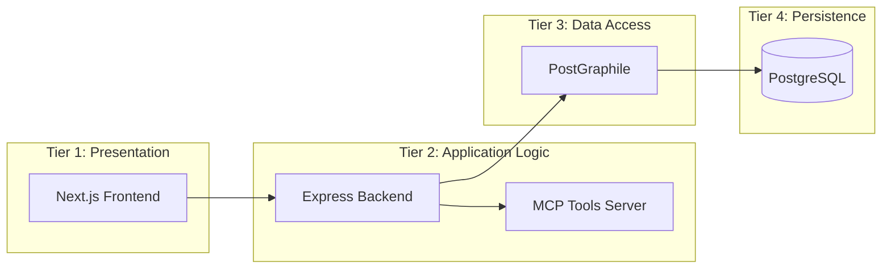

**Tier 1 — Presentation (Next.js Frontend)**: Everything the user sees and interacts with. React components, state management, routing, and SSE consumption. The frontend makes HTTP calls to Tier 2 and renders the responses.

**Tier 2 — Application Logic (Express Backend + MCP Tools Server)**: The "brain" of the system. The Express backend handles authentication, request validation, business logic, workflow execution, and LLM orchestration. The MCP Tools Server is a separate process that manages external tool execution (web search, etc.).

**Tier 3 — Data Access (PostGraphile)**: The translation layer between the application and the database. PostGraphile converts GraphQL queries into optimized SQL, so the backend can request complex data without hand-writing SQL for every use case.

**Tier 4 — Persistence (PostgreSQL)**: The single source of truth. All state — users, sessions, chats, messages, workflows, workflow DAGs — lives in PostgreSQL.

### 2.1.2 Full Architecture Diagram

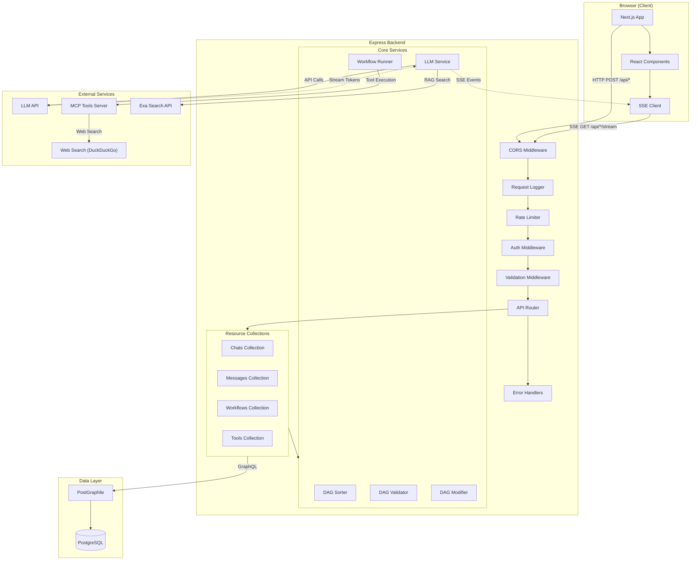


## 2.2 Component Deep Dive

### 2.2.1 The Frontend: Next.js + React

Next.js is a React framework that provides server-side rendering (SSR), file-based routing, and optimized bundling. In HardWire, the frontend is responsible for:

- **Rendering the UI**: Chat interface, workflow editor, sidebar navigation, settings panels
- **State management**: Tracking the current chat, selected workflow, message history, and streaming state
- **API communication**: Making HTTP requests to the backend for all data operations
- **SSE consumption**: Opening persistent connections to receive streamed LLM responses
- **Client-side routing**: Navigating between chats, workflows, and settings without full page reloads

The frontend does NOT contain business logic. It does not sort DAGs, validate workflows, or call LLM APIs directly. It is a *thin client* that delegates all logic to the backend.

### 2.2.2 The Backend: Express.js

Express.js is a minimal, unopinionated web framework for Node.js. It provides the plumbing for handling HTTP requests: routing, middleware, request/response objects, and error handling. HardWire builds a structured application on top of Express using a consistent set of patterns (which we explore in Chapter 3).

The backend is responsible for:

- **Authentication**: Verifying user identity via BetterAuth sessions
- **Authorization**: Ensuring users can only access their own data
- **Request validation**: Checking that incoming data matches expected schemas
- **Business logic**: Workflow DAG manipulation, execution orchestration, tool call processing
- **LLM orchestration**: Sending prompts, receiving streaming responses, processing tool calls
- **Data persistence**: Reading from and writing to PostgreSQL via PostGraphile
- **Error handling**: Converting internal errors to appropriate HTTP responses

### 2.2.3 PostGraphile: The Data Access Layer

PostGraphile deserves special attention because it plays a role that, in many applications, would require hundreds of lines of hand-written code.

In a traditional backend, you would write:
1. A SQL query: `SELECT * FROM chats WHERE user_id = $1`
2. A data access function that executes the query and returns typed results
3. Possibly an ORM (Object-Relational Mapper) layer

PostGraphile eliminates steps 1–3 by introspecting the PostgreSQL schema and automatically generating:
- GraphQL types for every table
- Query resolvers for reading data (with filtering, pagination, ordering)
- Mutation resolvers for inserting, updating, and deleting data
- Relationship resolvers for foreign keys

This means when you add a new table to the database, you immediately have a full CRUD API for it without writing a single line of backend code.

### 2.2.4 The MCP Tools Server

The MCP (Model Context Protocol) Tools Server is a separate process that manages external tool execution. When the LLM decides it needs to search the web, execute code, or perform some other external action, the request flows through the MCP server.

Why a separate server? **Isolation and security**. Tool execution involves external HTTP requests, processing untrusted inputs and responses, and performing side effects. By isolating tool execution in a separate process, HardWire can:
- Apply different resource limits and security policies
- Scale tool execution independently from chat handling
- Restart the tools server without affecting active chat sessions
- Implement tool-specific rate limiting and monitoring

### 2.2.5 Exa: The Web Search Engine

Exa is a search API optimized for AI applications. HardWire uses Exa in the **non-workflow RAG pipeline** (i.e., when a user message is handled by the LLM directly rather than a workflow run). That flow is:

1. The backend decides search is needed (via RAG gating)
2. The backend calls Exa via `searchWeb(query)`
3. Exa returns relevant web pages with their content
4. The content is fed back to the LLM as prompt context

Workflow steps that need web search use the MCP `web_search` tool instead. That flow is:

1. The LLM emits a tool call requesting web search
2. The backend routes the tool call to the MCP Tools Server
3. The MCP server performs the web search (currently backed by DuckDuckGo HTML search)
4. The results are returned to the LLM as tool output

Exa was chosen for the RAG pipeline because it returns content directly (not just links), making it well suited for prompt augmentation.

## 2.3 Data Flow: End-to-End Sequence

Let us trace a complete request through the system. Alice sends a message in an existing chat that has a workflow attached.

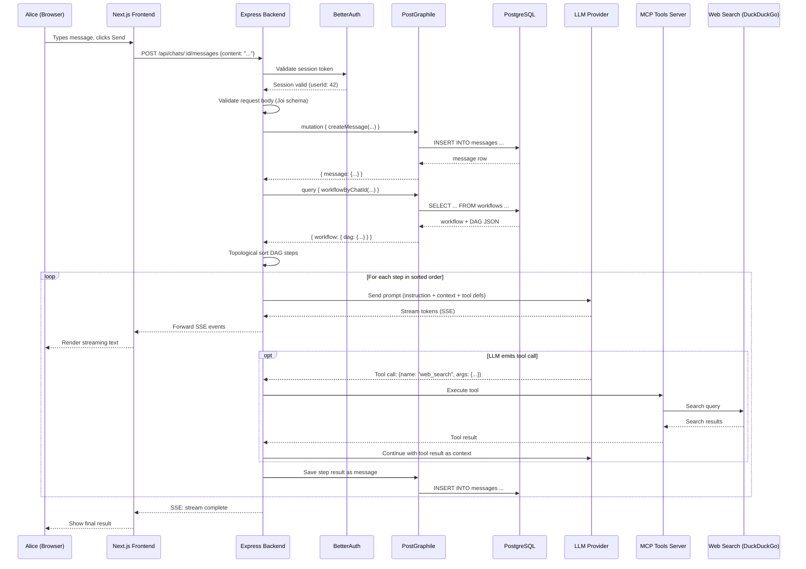

## 2.4 Why This Architecture? Tradeoff Analysis

Every architectural decision involves tradeoffs. Let us examine the key decisions and their alternatives.

### 2.4.1 Monolith vs. Microservices vs. HardWire's Hybrid

| Approach | Description | Pros | Cons |
|----------|-------------|------|------|
| **Monolith** | Single deployable unit | Simple deployment, no network overhead between components, easy to debug | Hard to scale individual components, one bug can crash everything |
| **Microservices** | Each component is a separate service | Independent scaling, independent deployment, technology diversity | Network latency, distributed debugging, operational complexity |
| **HardWire (Hybrid)** | Main backend is a monolith; MCP tools server is separate | Best of both worlds — simple core with isolated tool execution | Two deployments to manage, inter-service communication for tools |

HardWire's choice is pragmatic. The core application (auth, chat, workflows) does not need independent scaling of individual components — it is a cohesive unit where the components are tightly coupled by design. But tool execution is genuinely different: it is externally facing, side-effectful (HTTP requests, data fetching), potentially long-running, and benefits from isolation. Separating only the tools server strikes a good balance.

### 2.4.2 REST + PostGraphile vs. Pure REST vs. Pure GraphQL

| Approach | Description | Pros | Cons |
|----------|-------------|------|------|
| **Pure REST** | Hand-written endpoints for everything | Simple, well-understood, easy to cache | N+1 queries (e.g., list chats, then fetch messages per chat), over-fetching, lots of boilerplate |
| **Pure GraphQL** | Client-driven queries for everything | Flexible, no over-fetching, strong typing | Complex server setup, caching is harder, security concerns with arbitrary queries |
| **HardWire (REST + PostGraphile)** | REST endpoints for business logic; PostGraphile for data access | REST for simple external API, GraphQL power for internal queries | Two paradigms to understand, PostGraphile learning curve |

This is a clever approach. The external API (what the frontend calls) is REST — simple, predictable URLs with standard HTTP semantics. But internally, the backend uses PostGraphile's GraphQL to query the database with maximum flexibility. This avoids the boilerplate of writing SQL/data access code while keeping the external API simple.

### 2.4.3 SSE vs. WebSocket

| Feature | SSE | WebSocket |
|---------|-----|-----------|
| Direction | Server → Client only | Bidirectional |
| Protocol | HTTP | Custom (upgrades from HTTP) |
| Reconnection | Built-in automatic reconnection | Manual reconnection logic |
| Proxy/CDN support | Excellent (it is just HTTP) | Often problematic |
| Browser support | Universal (except IE) | Universal |
| Complexity | Simple | More complex |

HardWire chose SSE because the primary use case — streaming LLM responses from server to client — is unidirectional. The client sends messages via regular HTTP POST requests and receives streamed responses via SSE. WebSocket's bidirectional capability is unnecessary overhead, and SSE's built-in reconnection and HTTP compatibility make it simpler to operate.

### 2.4.4 PostgreSQL vs. NoSQL

| Feature | PostgreSQL | MongoDB/NoSQL |
|---------|-----------|---------------|
| Schema | Strict, enforced by DB | Flexible, enforced by application |
| Relationships | First-class (foreign keys, joins) | Manual (embedded docs or references) |
| Transactions | Full ACID | Varies (some support, often limited) |
| JSON support | JSONB columns with indexing | Native document storage |
| PostGraphile | Perfect fit | Not applicable |

PostgreSQL is ideal for HardWire because the data is inherently relational (users have chats, chats have messages, chats have workflows, workflows have DAGs). Additionally, PostgreSQL's JSONB column type allows storing the workflow DAG as a flexible JSON document within a relational row — the best of both worlds. And PostGraphile requires PostgreSQL specifically.

## 2.5 System Constraints and Design Principles

The HardWire architecture is governed by several design principles:

**1. Deterministic Execution Order**: Given the same workflow DAG, the steps will always execute in the same order. This is enforced by the stable topological sort algorithm (Chapter 4).

**2. Immutable DAG Modification**: When modifying a workflow DAG, the original is never mutated. The modifier clones the DAG first, applies changes to the clone, validates the clone, and only then saves a **new workflow version**. Older versions remain intact, preventing partial modifications from corrupting the workflow and preserving history.

**3. Fail-Safe Error Handling**: Every operation that can fail returns `Either<ResourceError, T>` rather than throwing exceptions. This forces every caller to explicitly handle errors, preventing unhandled exceptions from crashing the server.

**4. Layered Validation**: Input is validated at multiple layers — the rate limiter checks request frequency, the auth middleware checks identity, the validation middleware checks data shape (Joi schemas), and the business logic checks semantic correctness (DAG validation).

**5. Streaming by Default**: LLM responses are always streamed via SSE. This provides a better user experience (text appears immediately) and reduces perceived latency.

**6. Separation of Concerns**: Each module has a single responsibility. The DAG sorter only sorts. The DAG validator only validates. The DAG modifier only modifies. The workflow runner (`runWorkflow` in `backend/lib/workflowRunner.ts`) orchestrates them all.

> **Key Takeaway**: HardWire's architecture is a pragmatic hybrid — a monolithic backend for cohesive application logic, a separate tools server for isolated execution, PostGraphile for eliminating data access boilerplate, and SSE for efficient streaming. Every choice is driven by the specific needs of a deterministic workflow chat platform.

## 2.6 Deployment Architecture

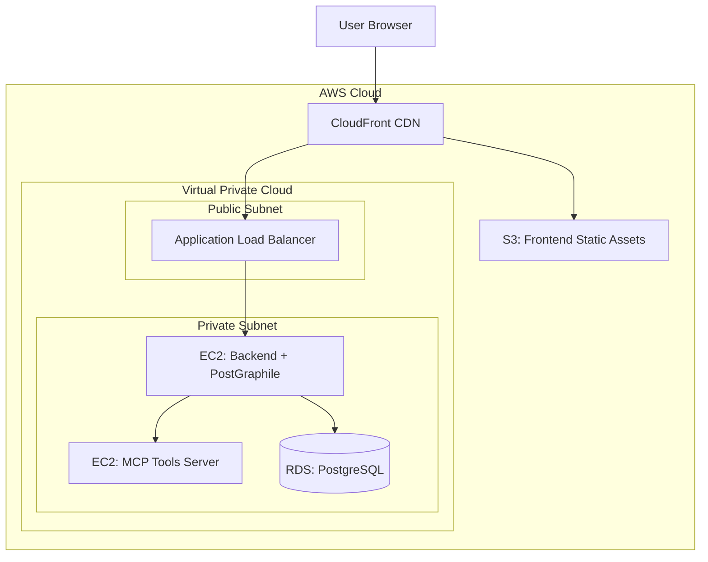

**Note:** This AWS diagram represents the **reference architecture** in `infrastructure/`. The live HardWire demo is deployed on Railway (see `infrastructure/README.md` for current deployment details).

In the AWS reference architecture, the Terraform-defined infrastructure follows best practices: the database is in a private subnet (not accessible from the internet), the backend services are behind a load balancer, and static frontend assets are served from S3 through CloudFront for fast global delivery.

## Study Questions

1. Draw the four tiers of HardWire's architecture and explain the responsibility of each tier.
2. Why does HardWire use a hybrid architecture (monolith + separate tools server) instead of a pure monolith or pure microservices? What specific characteristics of tool execution justify the separation?
3. Explain how PostGraphile eliminates boilerplate. If you had to add a new "tags" feature (users can tag chats with labels), what would you need to do at the database level, and what would PostGraphile automatically provide?
4. Trace the complete data flow for a user sending a message in a chat with an attached workflow. Include every component the request touches.
5. Compare SSE and WebSocket. Under what circumstances would WebSocket be a better choice for HardWire?
6. Why does HardWire store the workflow DAG as JSON inside a PostgreSQL JSONB column rather than as separate rows in a `workflow_steps` table? What are the tradeoffs?
7. Explain the principle of "immutable DAG modification." Why is it important to clone the DAG before modifying it?
8. What would happen if the rate limiter middleware were placed *after* the authentication middleware instead of before it? What security implications would this have?
9. Describe three ways in which HardWire's architecture would need to change if it needed to support 1 million concurrent users instead of its current scale.
10. The system uses "layered validation" at multiple levels. Why not just validate once at the outermost layer?

---

# Chapter 3: Backend Conventions and the Error Model

## 3.1 What Is Express.js?

Express.js is a **minimal and unopinionated web framework for Node.js**. To understand what that means, we need to start from the beginning.

Node.js allows you to run JavaScript (and TypeScript) on the server — outside of a web browser. Node.js provides a built-in HTTP module that can listen for incoming requests and send responses. However, the built-in module is extremely low-level:

```ts
// Raw Node.js HTTP server (no Express)
import http from 'http';

const server = http.createServer((req, res) => {
    if (req.method === 'GET' && req.url === '/hello') {
        res.writeHead(200, { 'Content-Type': 'application/json' });
        res.end(JSON.stringify({ message: 'Hello, world!' }));
    } else {
        res.writeHead(404);
        res.end('Not found');
    }
});

server.listen(3000);
```

This works, but it is painful. You must manually parse URLs, handle different HTTP methods, parse request bodies, set response headers, and manage errors. Express provides a layer of abstraction that makes all of this dramatically simpler:

```ts
// Same thing with Express
import express from 'express';

const app = express();
app.get('/hello', (req, res) => {
    res.json({ message: 'Hello, world!' });
});
app.listen(3000);
```

Express gives you:
- **Routing**: Map URL patterns to handler functions (`app.get('/users/:id', handler)`)
- **Middleware**: A pipeline of functions that process every request
- **Request/Response helpers**: `req.params`, `req.body`, `res.json()`, `res.status()`
- **Error handling**: Centralized error handlers that catch and format errors

"Minimal and unopinionated" means Express does NOT dictate how you structure your application. It does not include an ORM, a template engine, or an authentication system. You choose your own tools. HardWire chooses PostGraphile for data access, BetterAuth for authentication, and Joi for validation.

## 3.2 What Is Middleware?

Middleware is the single most important concept in Express. A middleware function is a function that has access to the request object (`req`), the response object (`res`), and the *next* middleware function in the pipeline (`next`).

```ts
// A simple middleware that logs every request
const loggerMiddleware = (req, res, next) => {
    console.log(`${req.method} ${req.url}`);
    next(); // Pass control to the next middleware
};
```

Middleware functions form a **pipeline**. Each request flows through every middleware in order. Each middleware can:
1. **Process the request** (read data, add data to `res.locals`, log, etc.)
2. **Short-circuit the pipeline** (send a response early, e.g., for authentication failure)
3. **Pass control to the next middleware** (call `next()`)

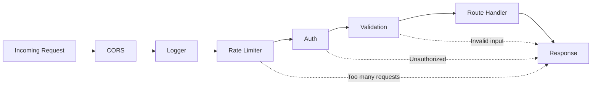


The dotted lines show short-circuiting: if the rate limiter detects too many requests, it sends a 429 response directly and does NOT call `next()`, so the auth middleware and everything after it never runs.

### 3.2.1 HardWire's Middleware Stack

Let us examine the actual server wiring code:

```ts
// backend/server/server.app.ts
expressApp.use(cors({ origin: [...], credentials: true }));
requestLogger(expressApp);
expressApp.use('/api/auth', rateLimiter({...RATE_LIMIT_PRESETS.auth, skip: ...}), authHandler);
expressApp.use('/api', rateLimiter({...RATE_LIMIT_PRESETS.standard, skip: ...}), express.json(), apiRouter);
expressApp.use(clientErrorHandler);
expressApp.use(serverErrorHandler);
```

Let us annotate each line:

**Line 1**: `cors({ origin: [...], credentials: true })` — **CORS (Cross-Origin Resource Sharing)** middleware. Browsers enforce a security policy that prevents a web page from making requests to a different domain unless the server explicitly allows it. Since the frontend (e.g., `app.hardwire.com`) and the backend (e.g., `api.hardwire.com`) may be on different domains, the CORS middleware adds headers that tell the browser "yes, this origin is allowed." The `credentials: true` option allows cookies (needed for authentication) to be sent cross-origin.

**Line 2**: `requestLogger(expressApp)` — Logs every incoming request (method, URL, status code, response time). Essential for debugging and monitoring.

**Line 3**: `expressApp.use('/api/auth', rateLimiter({...}), authHandler)` — All requests to `/api/auth/*` (login, register, etc.) go through a specific rate limiter (configured with auth-appropriate limits — stricter, to prevent brute-force attacks) and then to the auth handler.

**Line 4**: `expressApp.use('/api', rateLimiter({...}), express.json(), apiRouter)` — All other API requests go through a standard rate limiter, then `express.json()` (which parses the JSON request body into `req.body`), then the API router (which dispatches to the appropriate collection).

**Lines 5–6**: Error handlers. Express distinguishes between *client error handlers* (4xx — the client made a bad request) and *server error handlers* (5xx — something went wrong on the server). These are "error middleware" — they have four parameters `(err, req, res, next)` instead of three. They run when a handler calls `next(err)` (or throws synchronously), and they centralize the final HTTP response formatting for errors. In async handlers, errors must be passed to `next` (or wrapped) to reach these middleware.

## 3.3 The Collection Pattern

HardWire organizes its backend code into **collections**, where each collection manages one type of resource (chats, messages, workflows, tools, etc.). Every collection follows the same three-layer pattern:

```
Router → Controller → Service → PostGraphile → PostgreSQL
```

### 3.3.1 The Router Layer

The router defines HTTP endpoints and connects them to controller functions. It also applies route-specific middleware (like request validation).

```ts
// Conceptual example: chats router
import { Router } from 'express';
import { sessionValidator } from '../middleware/sessionValidator';
import { requestValidator } from '../middleware/requestValidator';
import { chatsController } from './chats.controller';

const router = Router();

router.use(sessionValidator);  // All chat routes require authentication

router.get('/',
    requestValidator('listChats'),
    chatsController.list
);

router.post('/',
    requestValidator('createChat'),
    chatsController.create
);

router.get('/:id',
    requestValidator('getChat'),
    chatsController.getById
);

router.put('/:id',
    requestValidator('updateChat'),
    chatsController.update
);

router.delete('/:id',
    requestValidator('deleteChat'),
    chatsController.delete
);

export { router as chatsRouter };
```

### 3.3.2 The Controller Layer

The controller extracts data from the request, calls the service, and formats the response. It is a thin **translation and orchestration** layer between HTTP and domain logic — it can sequence calls and shape responses, but core business rules should live in services.

```ts
// Conceptual example: chats controller
const create = async (req: Request, res: Response, next: NextFunction) => {
    const userId = res.locals.session.userId;
    const { name, workflowId } = req.body;

    const result = await chatsService.create({ userId, name, workflowId });

    if (result.isError()) {
        return next(result.value);  // Pass ResourceError to error handler
    }

    res.status(201).json(result.value);
};
```

Notice the pattern: the controller calls the service and checks whether the result is an error or a success. If it is an error, the controller passes the error to Express's error-handling middleware via `next(result.value)`. If it is a success, the controller sends the success value as JSON.

### 3.3.3 The Service Layer

The service contains the domain logic (business rules) and data access. It interacts with PostGraphile to read/write data, enforces rules like ownership checks or invariants, and returns `Either<ResourceError, T>`. In simple CRUD paths, the "business logic" may be mostly data access; in more complex flows, it includes validations and orchestration that should not live in controllers.

```ts
// Conceptual example: chats service
const create = async (params: CreateChatParams): Promise<Either<ResourceError, Chat>> => {
    // Business logic: validate that the workflow exists and belongs to the user
    const workflowResult = await workflowsService.getById(params.workflowId);
    if (workflowResult.isError()) {
        return error(new NotFoundError({ message: 'Workflow not found' }));
    }

    // Persist via PostGraphile
    const chat = await postGraphile.mutation.createChat({
        userId: params.userId,
        name: params.name,
        workflowId: params.workflowId,
    });

    return success(chat);
};
```

> **Key Takeaway**: The three-layer pattern (Router → Controller → Service) enforces a clean separation. The router knows about HTTP. The controller translates between HTTP and business logic. The service knows about business rules and data access. No layer reaches into the responsibilities of another.

### 3.3.4 Why This Pattern?

The benefits of this layered approach include:

**Testability**: Services can be unit-tested without HTTP by calling service functions directly with mocked PostGraphile responses. Controllers can be tested by stubbing services and asserting HTTP status/body formatting. Routers can be tested with integration tests (e.g., Supertest) to verify middleware + routing together.

**Consistency**: Every resource follows the same pattern, so developers always know where to find code. Need the business logic for creating a chat? It is in `chats.service.ts`. Need the HTTP route definition? It is in `chats.router.ts`.

**Separation of concerns**: The service does not know about HTTP status codes. The router does not know about database queries. Each layer has a focused responsibility.

## 3.4 The Either Monad: Error Handling Done Right

This section is the most conceptually challenging in the chapter, and also the most important. The Either monad is the backbone of HardWire's error-handling strategy.

### 3.4.1 The Problem with Exceptions

In most JavaScript/TypeScript codebases, errors are handled with exceptions:

```ts
// Traditional approach: throw and catch
function divide(a: number, b: number): number {
    if (b === 0) throw new Error('Division by zero');
    return a / b;
}

try {
    const result = divide(10, 0);
    console.log(result);
} catch (err) {
    console.error(err.message);
}
```

This approach has several problems:

1. **Invisible failure paths**: Looking at `divide`'s return type (`number`), you have no idea it can fail. The type system says "this always returns a number." That is a lie. Callers cannot tell from the signature that they must handle failure, so errors are discovered only at runtime.

2. **Forgettable**: If you forget the `try/catch`, the exception propagates up the call stack and potentially crashes the entire process. In a server handling hundreds of concurrent requests, one unhandled exception can bring everything down. This is especially easy to miss in async code, where an unhandled rejection can terminate the request or trigger global error handlers unexpectedly.

3. **Non-composable**: You cannot chain operations that might fail without nested try/catch blocks or repeated error handling. This quickly becomes unreadable and makes it hard to reuse smaller functions without re-wrapping them.

4. **Performance**: Throwing exceptions involves capturing a stack trace, which is expensive. In a hot path that frequently fails (like validation), this overhead adds up and can become a measurable cost under load.

### 3.4.2 What Is a Monad?

A monad is a design pattern for wrapping values in a context and providing a standard way to compose operations on those wrapped values. That is abstract, so let us make it concrete.

Think of a monad as a **container** with rules:
1. You can **put a value** into the container (this is called `return` or `of` or, in HardWire, `success`/`error`)
2. You can **transform the value inside** without unwrapping it (this is called `map` or `flatMap`)
3. The container **carries extra information** beyond just the value (for Either, it carries whether the operation succeeded or failed)

The Either monad specifically represents a value that is one of two things: a success (with a value of type `A`) or an error (with a value of type `L`).

### 3.4.3 HardWire's Either Implementation, Line by Line

```ts
// backend/types/either.ts

// The Either type is a union: it is EITHER an Error OR a Success.
// L is the type of the error value (Left, by convention).
// A is the type of the success value (right, by convention — "right" as in "correct").
export type Either<L, A> = Error<L, A> | Success<L, A>;

// The Error class wraps an error value.
export class Error<L, A> {
    // The error value itself. "readonly" means it cannot be changed after construction.
    readonly value: L;

    // Constructor: takes the error value and stores it.
    constructor(value: L) {
        this.value = value;
    }

    // Type guard: "Is this an Error?" Always returns true for Error instances.
    // The `this is Error<L, A>` return type is a TypeScript "type predicate" —
    // it tells the compiler that if this returns true, the variable is an Error.
    isError(): this is Error<L, A> {
        return true;
    }

    // Type guard: "Is this a Success?" Always returns false for Error instances.
    isSuccess(): this is Success<L, A> {
        return false;
    }
}

// The Success class wraps a success value.
export class Success<L, A> {
    // The success value itself.
    readonly value: A;

    constructor(value: A) {
        this.value = value;
    }

    // Always false for Success instances.
    isError(): this is Error<L, A> {
        return false;
    }

    // Always true for Success instances.
    isSuccess(): this is Success<L, A> {
        return true;
    }
}

// Factory function: creates an Error-wrapped Either.
// Usage: return error(new NotFoundError(...));
export const error = <L, A>(l: L): Either<L, A> => new Error(l);

// Factory function: creates a Success-wrapped Either.
// Usage: return success(chat);
export const success = <L, A>(a: A): Either<L, A> => new Success<L, A>(a);
```

**What this means in plain English:**

- `Either<L, A>` is **one of two shapes**: an `Error<L, A>` or a `Success<L, A>`. There is no third option.
- `Error` and `Success` are simple wrappers that both expose a `.value`, but the *type* of `.value` depends on which wrapper you have.
- `isError()` and `isSuccess()` are **type guards**. Once you check `result.isError()`, TypeScript knows which wrapper you are holding and narrows the type accordingly.
- The `error(...)` and `success(...)` functions are just convenience constructors so callers never instantiate the classes directly.

### 3.4.4 Using Either in Practice

Here is how the Either pattern plays out in real code:

```ts
// Service function that might fail
async function getChatById(chatId: string): Promise<Either<ResourceError, Chat>> {
    const chat = await db.findChat(chatId);

    if (!chat) {
        // Return an error — do NOT throw
        return error(new NotFoundError({
            message: `Chat ${chatId} not found`,
            clientMessage: 'Chat not found',
            code: 'CHAT_NOT_FOUND',
            statusCode: 404
        }));
    }

    // Return a success
    return success(chat);
}

// Controller that uses the service
async function handleGetChat(req: Request, res: Response, next: NextFunction) {
    const result = await getChatById(req.params.id);

    // You MUST check — the type system enforces this.
    // `result.value` could be a Chat or a ResourceError.
    // You cannot access chat-specific properties without narrowing first.
    if (result.isError()) {
        return next(result.value); // result.value is ResourceError
    }

    // TypeScript now KNOWS result.value is a Chat
    res.json(result.value);
}
```

### 3.4.5 Comparison with Other Approaches

| Approach | Type Safety | Composability | Performance | Verbosity |
|----------|------------|---------------|-------------|-----------|
| **Throw/catch** | None (errors invisible in types) | Poor (nested try/catch) | Slower (stack traces) | Low |
| **Return null** | Partial (null checks) | Poor (null propagation) | Fast | Low |
| **Result/Either** | Full (errors in return type) | Good (map/chain) | Fast (no stack traces) | Medium |
| **Go-style (value, err)** | Partial (tuple unpacking) | Poor (manual checks) | Fast | High |

HardWire's Either approach provides the strongest guarantees: the TypeScript compiler will not let you use the success value without first checking that the result is actually a success. This makes "forgetting to handle errors" a compile-time error rather than a runtime crash.

> **Key Takeaway**: The Either monad replaces exceptions with explicit return values. Every function that can fail returns `Either<ErrorType, SuccessType>`, making failure visible in the type system. This prevents the number-one cause of server crashes: unhandled exceptions.

## 3.5 The ResourceError Hierarchy

When a function returns an error via the Either pattern, *what* does it return? In HardWire, all errors extend from a base class called `ResourceError`:

```ts
// backend/errors/resourceError.ts
export class ResourceError extends Error {
    // The detailed error message (for developers/logs — may contain sensitive info)
    public message: string;

    // The safe error message (sent to the client — never contains sensitive info)
    public clientMessage: string;

    // A machine-readable error code (e.g., 'CHAT_NOT_FOUND', 'VALIDATION_FAILED')
    public code: string;

    // The original error, if this wraps another error (useful for debugging)
    public error: unknown;

    // A unique identifier for tracking this error across logs
    public requestId: string | undefined;

    // The HTTP status code to return (404, 400, 500, etc.)
    public statusCode: number;

    constructor({ message, clientMessage, code, error, statusCode }: ErrorConstructorParams) {
        super();
        this.message = message;
        this.clientMessage = clientMessage;
        this.statusCode = statusCode;
    }
}
```

The dual-message pattern (`message` vs `clientMessage`) is a security feature. The developer message might say "PostgreSQL connection to 10.0.1.5:5432 timed out after 30s" — useful for debugging, but you never want to expose internal IP addresses to end users. The client message would simply say "Something went wrong. Please try again."

Specific error types extend ResourceError:

```ts
// Conceptual examples of the error hierarchy
class NotFoundError extends ResourceError {
    constructor(params) {
        super({ ...params, statusCode: 404, code: 'NOT_FOUND' });
    }
}

class ValidationError extends ResourceError {
    constructor(params) {
        super({ ...params, statusCode: 400, code: 'VALIDATION_FAILED' });
    }
}

class UnauthorizedError extends ResourceError {
    constructor(params) {
        super({ ...params, statusCode: 401, code: 'UNAUTHORIZED' });
    }
}

class InternalError extends ResourceError {
    constructor(params) {
        super({ ...params, statusCode: 500, code: 'INTERNAL_ERROR' });
    }
}
```

## 3.6 Request Validation with Joi

**Joi** is a schema validation library for JavaScript. It allows you to define the expected shape of data and validate incoming requests against that shape.

### 3.6.1 How Request Validation Works

The request validator middleware takes a schema name, retrieves the corresponding Joi schema, and validates the request against it:

```ts
// Conceptual implementation of request validator middleware
const requestValidator = (schemaName: string) => {
    return (req: Request, res: Response, next: NextFunction) => {
        // 1. Look up the Joi schema by name
        const schema = schemas[schemaName];

        // 2. Build the content to validate (from params, query, body)
        const content = {
            params: req.params,
            query: req.query,
            body: req.body,
        };

        // 3. Validate
        const { error, value } = schema.validate(content, { abortEarly: false });

        // 4. If validation fails, return a structured error
        if (error) {
            const validationError = new ValidationError({
                message: error.details.map(d => d.message).join('; '),
                clientMessage: 'Invalid request data',
                code: 'VALIDATION_FAILED',
                statusCode: 400,
            });
            return next(validationError);
        }

        // 5. If validation passes, continue to the next middleware
        next();
    };
};
```

A Joi schema might look like:

```ts
const createChatSchema = Joi.object({
    body: Joi.object({
        name: Joi.string().min(1).max(255).required(),
        workflowId: Joi.string().uuid().required(),
    }),
    params: Joi.object({}),
    query: Joi.object({}),
});
```

This ensures that before the controller ever runs, the request body has been verified to contain a non-empty string `name` (max 255 characters) and a valid UUID `workflowId`. Any deviation results in a 400 error with a descriptive message.

### 3.6.2 Why Validate at This Layer?

You might wonder: if we already have TypeScript types, why do we need runtime validation?

TypeScript types are **compile-time only**. They are erased when the code is compiled to JavaScript. At runtime, `req.body` is whatever the client sent — it could be anything. A malicious client could send `{ "name": 12345, "workflowId": "not-a-uuid" }`. Without runtime validation, this invalid data would flow through the system and cause cryptic failures deep in the business logic.

Joi validation is the **boundary guard** between the untrusted outside world and the trusted interior of the application.

## 3.7 Session Validation Middleware

The session validator ensures that every API request (except public endpoints like login/register) comes from an authenticated user:

```ts
// Conceptual implementation of session validator
const sessionValidator = async (req: Request, res: Response, next: NextFunction) => {
    // 1. Convert Express headers to Web API Headers format
    //    (BetterAuth expects Web API Headers, not Express headers)
    const webHeaders = new Headers();
    Object.entries(req.headers).forEach(([key, value]) => {
        if (typeof value === 'string') webHeaders.set(key, value);
    });

    // 2. Call BetterAuth to validate the session
    const session = await betterAuth.api.getSession({
        headers: webHeaders,
    });

    // 3. If no valid session, reject the request
    if (!session) {
        return next(new UnauthorizedError({
            message: 'No valid session',
            clientMessage: 'Please log in',
        }));
    }

    // 4. If valid, attach the session to res.locals for use by controllers
    res.locals.session = session;
    next();
};
```

The `res.locals` object is an Express convention for passing data between middleware and route handlers within a single request. By attaching the session to `res.locals`, the session validator makes the authenticated user's information available to all downstream handlers without passing it as a function parameter.

> **Key Takeaway**: HardWire's middleware pipeline creates concentric rings of protection around every request. CORS allows only authorized origins. The rate limiter prevents abuse. The session validator ensures authentication. The request validator ensures data integrity. Only after passing all these guards does the request reach the business logic.

## 3.8 Error Handling Flow

When an error occurs anywhere in the pipeline, Express's error handling kicks in:

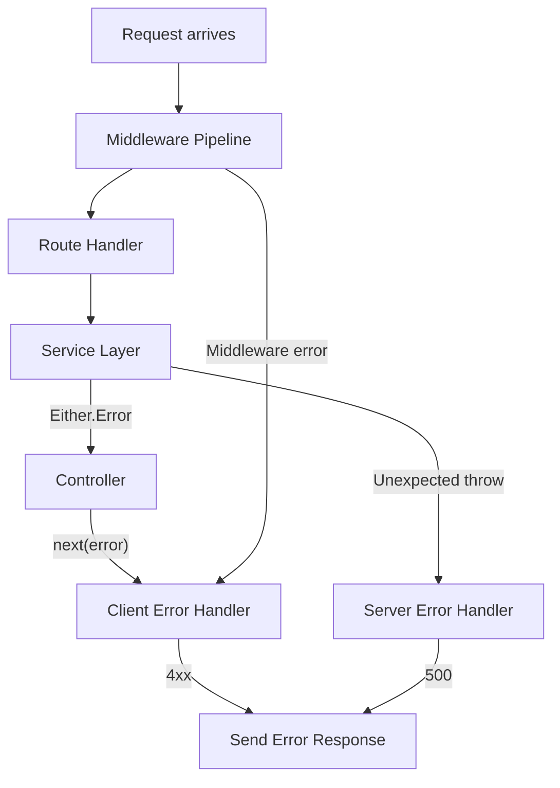

The flow is:

1. A service returns `Either.Error` with a `ResourceError`
2. The controller detects the error and calls `next(resourceError)`
3. Express routes this to the client error handler, which extracts `clientMessage`, `statusCode`, and `code`, and sends them as JSON
4. If an unexpected exception is thrown (a bug), it bypasses the Either pattern and hits the server error handler, which logs the full error and returns a generic 500 response

This two-tier error handling ensures that:
- Expected errors (not found, validation failure, unauthorized) return informative 4xx responses
- Unexpected errors (bugs, database crashes) return safe 500 responses without leaking internal details

## Study Questions

1. What is the difference between a *middleware function* and a *route handler* in Express? Can a route handler also be a middleware?
2. In HardWire's middleware stack, what would happen if you removed the `express.json()` middleware? How would it affect the application?
3. Explain the three-layer collection pattern (Router → Controller → Service). Why not just put all the logic in the route handler?
4. Write a short TypeScript function that returns `Either<string, number>`. Have it return an error if the input is negative, and a success with the square root otherwise.
5. Why does `ResourceError` have both a `message` and a `clientMessage` field? Give a concrete example where they would differ.
6. What is the difference between compile-time type checking (TypeScript) and runtime validation (Joi)? Why does HardWire need both?
7. In the Either pattern, what happens if a developer forgets to check `isError()` before accessing `result.value`? How does TypeScript's type system help prevent this?
8. Explain why the session validator converts Express headers to Web API Headers format. What is the Web API Headers interface, and why does BetterAuth expect it?
9. Trace the error flow when a user requests a chat that does not exist. Starting from the HTTP request, describe every component the error passes through until the response is sent.
10. Compare HardWire's Either-based error handling with Go's `(value, error)` return convention. What are the advantages and disadvantages of each?
11. What is CORS and why is it the *first* middleware in the pipeline? What would happen if it were placed after the authentication middleware?
12. The rate limiter has different presets for auth routes and standard routes. Why would auth routes need stricter rate limiting?

---

# Chapter 4: Workflow DAG Algorithms (Deep Dive)

## 4.1 Graph Theory 101

Before we can understand HardWire's workflow algorithms, we need to build a solid foundation in graph theory. This section assumes zero prior knowledge.

### 4.1.1 What Is a Graph?

A **graph** is a mathematical structure consisting of:
- **Nodes** (also called **vertices**): the "things" in the graph
- **Edges**: the connections between things

Graphs are everywhere in the real world:
- Social networks: nodes are people, edges are friendships
- Road maps: nodes are intersections, edges are roads
- The internet: nodes are web pages, edges are hyperlinks
- HardWire workflows: nodes are steps, edges are dependencies

### 4.1.2 Types of Graphs

**Undirected Graph**: Edges have no direction. If there is an edge between A and B, you can traverse it in either direction. Think of a friendship — if Alice is friends with Bob, Bob is also friends with Alice.

```
    A --- B
    |     |
    C --- D
```

**Directed Graph (Digraph)**: Edges have direction. An edge from A to B does NOT imply an edge from B to A. Think of Twitter follows — Alice can follow Bob without Bob following Alice.

```
    A → B
    ↓     ↓
    C → D
```

**Cyclic Graph**: Contains at least one cycle — a path that starts and ends at the same node.

```
    A → B
    ↑     ↓
    C ← D
```

In this graph, A → B → D → C → A is a cycle. You can follow the edges and return to where you started.

**Acyclic Graph**: Contains no cycles. No matter where you start, you cannot return to the same node by following edges.

```
    A → B
    ↓     ↓
    C → D
```

In this graph, there is no way to return to A from any path starting at A.

### 4.1.3 Directed Acyclic Graph (DAG)

A **DAG** is a directed graph with no cycles. This is the data structure at the heart of HardWire's workflow system.

Why a DAG? Because:
1. **Directed**: Dependencies have direction. "Write Body" depends on "Research," not the other way around.
2. **Acyclic**: No circular dependencies. If A depends on B and B depends on A, neither can ever start — this is an infinite loop, which is forbidden.

```
    Research → Analyze → Write Body → Review
                   ↓
              Write Intro → Format
```

This is a valid DAG. Research must happen first, then Analyze, then Write Body and Write Intro (which can happen in parallel since they both depend only on Analyze), then Format and Review.

### 4.1.4 In-Degree and Out-Degree

For a directed graph:
- **In-degree** of a node = number of edges pointing TO it
- **Out-degree** of a node = number of edges pointing FROM it

In the DAG above:
- Research: in-degree 0 (no dependencies), out-degree 1
- Analyze: in-degree 1, out-degree 2
- Write Body: in-degree 1, out-degree 1
- Write Intro: in-degree 1, out-degree 1
- Review: in-degree 1, out-degree 0
- Format: in-degree 1, out-degree 0

Nodes with **in-degree 0** are called **sources** — they have no dependencies and can be executed immediately. Nodes with **out-degree 0** are called **sinks** — nothing depends on them; they are terminal steps.

## 4.2 Topological Sort

### 4.2.1 Formal Definition

A **topological sort** (or topological ordering) of a DAG is a linear ordering of its nodes such that for every directed edge (u, v), node u appears before node v in the ordering.

In plain language: if step A must happen before step B, then A comes before B in the topological order.

### 4.2.2 Why It Matters

HardWire needs to execute workflow steps in order. But the workflow DAG only specifies *pairwise* ordering constraints ("A before B," "A before C"). It does not specify a complete ordering. The topological sort computes a valid complete ordering that satisfies all pairwise constraints.

A DAG can have **multiple valid topological orderings**. For example:

```
    A → C
    B → C
```

Both [A, B, C] and [B, A, C] are valid topological orderings — both satisfy the constraint that A and B come before C.

### 4.2.3 Kahn's Algorithm

HardWire uses a variant of **Kahn's algorithm** for topological sorting. Let us build up the algorithm from first principles.

**Intuition**: Start with all nodes that have no dependencies (in-degree 0). Process them. Once processed, remove them from the graph — this may cause other nodes' in-degrees to drop to 0. Repeat until all nodes are processed.

**Pseudocode:**

```pseudocode
function topological_sort(graph):
    // Step 1: Calculate in-degree for every node
    for each node in graph:
        indegree[node] = count of edges pointing to node

    // Step 2: Initialize queue with all source nodes (in-degree 0)
    queue = [all nodes where indegree[node] == 0]

    // Step 3: Process queue
    sorted = []
    while queue is not empty:
        node = queue.removeFirst()
        sorted.append(node)

        // For each node that depends on this one
        for each dependent of node:
            indegree[dependent] -= 1
            if indegree[dependent] == 0:
                queue.append(dependent)

    // Step 4: Check for cycles
    if sorted.length != graph.nodeCount:
        // Some nodes were never added to sorted — they are in a cycle
        error("Graph contains a cycle!")

    return sorted
```

### 4.2.4 Worked Example

Consider this DAG:

```
Steps: A, B, C, D, E
Edges: A→C, A→D, B→D, C→E, D→E
```

```
    A → C → E
    │       ↑
    ↓       │
    B → D ──┘
```

Wait, let me correct the diagram. B has no dependency on A in this example:

```
    A ──→ C ──→ E
    │           ↑
    └──→ D ──→─┘
          ↑
    B ────┘
```

**Step 1: Calculate in-degrees**

| Node | In-degree | Depends on |
|------|-----------|------------|
| A    | 0         | (none)     |
| B    | 0         | (none)     |
| C    | 1         | A          |
| D    | 2         | A, B       |
| E    | 2         | C, D       |

**Step 2: Initialize queue with sources**

Queue: [A, B] (both have in-degree 0)

**Step 3: Process**

Iteration 1: Remove A from queue. Sorted = [A]. Decrease in-degree of C (1→0) and D (2→1). C's in-degree is now 0, so add C to queue. Queue: [B, C].

Iteration 2: Remove B from queue. Sorted = [A, B]. Decrease in-degree of D (1→0). D's in-degree is now 0, so add D to queue. Queue: [C, D].

Iteration 3: Remove C from queue. Sorted = [A, B, C]. Decrease in-degree of E (2→1). Queue: [D].

Iteration 4: Remove D from queue. Sorted = [A, B, C, D]. Decrease in-degree of E (1→0). E's in-degree is now 0, so add E to queue. Queue: [E].

Iteration 5: Remove E from queue. Sorted = [A, B, C, D, E]. Queue: [].

**Result**: [A, B, C, D, E] — a valid topological ordering.

## 4.3 Stability: Why It Matters and How HardWire Achieves It

### 4.3.1 The Problem

Standard Kahn's algorithm does not guarantee a *stable* ordering. If multiple nodes have in-degree 0, the algorithm can pick them in any order. This means that if you run the algorithm twice on the same input, you might get different orderings.

Why is this a problem? **User experience**. Imagine a user looking at their workflow steps in the UI. They rearrange nothing, save, and suddenly the steps are in a different order because the sort algorithm happened to break ties differently. That would be confusing and feel like a bug.

### 4.3.2 The Solution: Stable Topological Sort

HardWire's implementation is a **stable topological sort**: when multiple nodes are eligible for processing (all have in-degree 0), they are processed in the order they originally appeared in the input array. This ensures that the output ordering is deterministic and preserves the user's original ordering wherever the DAG constraints allow.

Let us examine the actual implementation:

```ts
// backend/lib/workflowDags/dagSorter.ts

// Step 1: Build a lookup from step ID to its original position in the array.
// This captures the user's intended ordering.
const buildStepOrderLookup = (steps: WorkflowStep[]) => {
    const orderLookup = new Map<string, number>();
    steps.forEach((step, index) => {
        orderLookup.set(step.id, index);
    });
    return orderLookup;
};
```

**Annotation**: This function creates a Map where keys are step IDs and values are their positions in the original array. For example, if the original array is [StepA, StepB, StepC], the lookup is {StepA: 0, StepB: 1, StepC: 2}. This lookup is used later to break ties in the queue.

```ts
// Step 2: Build the data structures needed for Kahn's algorithm.
const buildDependencyMaps = (steps: WorkflowStep[]) => {
    // A map from step ID to step object, for fast lookup.
    const stepMap = new Map(steps.map(step => [step.id, step]));

    // In-degree: how many unprocessed dependencies does each step have?
    const indegree = new Map<string, number>();

    // Dependents: for each step, which other steps depend on it?
    // (This is the "reverse adjacency list" — we need it to efficiently
    //  decrease in-degrees when a step is processed.)
    const dependents = new Map<string, string[]>();

    // Initialize all in-degrees to 0 and all dependent lists to empty.
    steps.forEach(step => {
        indegree.set(step.id, 0);
        dependents.set(step.id, []);
    });

    // For each step, look at its dependencies.
    steps.forEach(step => {
        (step.dependsOn ?? []).forEach(depId => {
            // Guard: skip dependencies that reference non-existent steps.
            if (!stepMap.has(depId)) return;

            // Increase this step's in-degree (it has one more dependency).
            indegree.set(step.id, (indegree.get(step.id) ?? 0) + 1);

            // Record that the dependency has this step as a dependent.
            dependents.get(depId)?.push(step.id);
        });
    });

    return { stepMap, indegree, dependents };
};
```

**Annotation**: This builds two key data structures. `indegree` tells us how many unprocessed prerequisites each step has. `dependents` tells us, for each step, which other steps are waiting for it. The guard `if (!stepMap.has(depId)) return` is a defensive measure — if a step references a dependency that doesn't exist (perhaps it was deleted), we silently skip it rather than crashing.

```ts
// The stability mechanism: sort the queue by original position.
const sortQueueByOriginalOrder = (
    queue: WorkflowStep[],
    orderLookup: Map<string, number>
) => {
    queue.sort((left, right) =>
        (orderLookup.get(left.id) ?? 0) - (orderLookup.get(right.id) ?? 0)
    );
};
```

**Annotation**: This is the key to stability. Whenever we have multiple steps in the queue (all with in-degree 0), we sort them by their original position. The step that appeared first in the original array will be processed first. This ensures deterministic, user-friendly ordering.

```ts
// The main sort function.
export const sortWorkflowDagSteps = (steps: WorkflowStep[]): WorkflowStep[] => {
    // Guard: empty or invalid input returns empty array.
    if (!Array.isArray(steps) || steps.length === 0) return [];

    // Build the order lookup (for stability).
    const orderLookup = buildStepOrderLookup(steps);

    // Build dependency data structures.
    const { stepMap, indegree, dependents } = buildDependencyMaps(steps);

    // Initialize the queue with all source nodes (in-degree 0).
    const queue: WorkflowStep[] = [];
    steps.forEach(step => {
        if ((indegree.get(step.id) ?? 0) === 0) queue.push(step);
    });

    // Sort the initial queue by original order (stability).
    sortQueueByOriginalOrder(queue, orderLookup);

    // Kahn's algorithm main loop.
    const sorted: WorkflowStep[] = [];
    while (queue.length > 0) {
        // Remove the first element (the one with the lowest original position).
        const step = queue.shift();
        if (!step) continue;

        // Add it to the sorted output.
        sorted.push(step);

        // Process all dependents of this step.
        (dependents.get(step.id) ?? []).forEach(nextId => {
            // Decrease the dependent's in-degree.
            const nextIndegree = (indegree.get(nextId) ?? 0) - 1;
            indegree.set(nextId, nextIndegree);

            // If the dependent now has in-degree 0, add it to the queue.
            if (nextIndegree === 0) {
                const nextStep = stepMap.get(nextId);
                if (nextStep) {
                    queue.push(nextStep);
                    // Re-sort the queue to maintain stability.
                    sortQueueByOriginalOrder(queue, orderLookup);
                }
            }
        });
    }

    // Cycle handling: if not all steps were sorted, some are in a cycle.
    // Instead of throwing, append them at the end.
    if (sorted.length !== steps.length) {
        const sortedIds = new Set(sorted.map(step => step.id));
        steps.forEach(step => {
            if (!sortedIds.has(step.id)) sorted.push(step);
        });
    }

    return sorted;
};
```

**Annotation on the cycle handling**: Notice that this function does NOT throw an error if a cycle is detected. Instead, it appends the cycled nodes at the end of the sorted array. This is a **graceful degradation** strategy — the function always returns a result, even for invalid inputs. Cycle detection and rejection happens in the *validator* (separate concern), not in the sorter.

### 4.3.3 Step-by-Step Trace with Stability

Consider this input array: [D, B, A, C] with edges A→C, B→C, C→D.

Original positions: D=0, B=1, A=2, C=3.

In-degrees: A=0, B=0, C=2 (depends on A and B), D=1 (depends on C).

Queue initialization: [A, B] (in-degree 0). But wait — in the original array, B is at position 1 and A is at position 2. So after sorting by original order: Queue = [B, A].

Iteration 1: Remove B. Sorted = [B]. Decrease C's in-degree: 2→1. Queue = [A].

Iteration 2: Remove A. Sorted = [B, A]. Decrease C's in-degree: 1→0. Add C to queue. Queue = [C].

Iteration 3: Remove C. Sorted = [B, A, C]. Decrease D's in-degree: 1→0. Add D to queue. Queue = [D].

Iteration 4: Remove D. Sorted = [B, A, C, D]. Queue = [].

**Result**: [B, A, C, D]. Notice that B comes before A because B was earlier in the original array (position 1 vs 2). The algorithm preserves the user's original ordering wherever the DAG allows it.

## 4.4 Cycle Detection via DFS

HardWire uses a separate algorithm for cycle detection, based on **Depth-First Search (DFS)** with the **three-color technique**.

### 4.4.1 The Three-Color Algorithm

The idea is to "color" each node as we visit it:

- **White** (unvisited): The node has not been examined yet
- **Gray** (visiting): The node is currently being examined — we are exploring its descendants
- **Black** (visited): The node and all its descendants have been fully examined

Intuition: the **gray set** is the current DFS call stack. If you encounter a gray node, you just found a path that loops back into the active stack. The **black set** is safe — those nodes were fully explored with no cycles found in their subtrees.

A cycle exists if and only if, during DFS, we encounter a **gray node** — a node we are currently in the process of visiting. This means we have found a path from the node back to itself.

```pseudocode
function hasCycle(graph):
    visiting = empty set  // gray nodes
    visited = empty set   // black nodes

    function visit(node):
        if node in visiting:
            return true   // CYCLE FOUND! (back-edge to gray node)
        if node in visited:
            return false  // Already fully explored, no cycle here

        visiting.add(node)  // Color gray

        for each dependency of node:
            if visit(dependency):
                return true  // Cycle found in subtree

        visiting.remove(node)  // Done exploring
        visited.add(node)      // Color black
        return false

    for each node in graph:
        if visit(node):
            return true

    return false
```

### 4.4.2 The Actual Implementation

```ts
// backend/lib/workflowDags/dagValidator.ts

const hasCycle = (dag: WorkflowDAG): boolean => {
    // Build adjacency list: for each node, list its dependencies.
    const adjacency = new Map<string, string[]>();

    // The "gray" set: nodes currently being visited.
    const visiting = new Set<string>();

    // The "black" set: nodes fully visited.
    const visited = new Set<string>();

    // Populate adjacency list.
    dag.steps.forEach(step => {
        adjacency.set(step.id, step.dependsOn ?? []);
    });

    // DFS visit function.
    const visit = (node: string): boolean => {
        // If we encounter a gray node, we have found a back-edge = cycle.
        if (visiting.has(node)) return true;

        // If we encounter a black node, this subtree is already verified.
        if (visited.has(node)) return false;

        // Color this node gray (we are now visiting it).
        visiting.add(node);

        // Visit all dependencies.
        for (const dep of adjacency.get(node) ?? []) {
            if (visit(dep)) return true;  // Cycle found in subtree
        }

        // Color this node black (fully visited, no cycle found).
        visiting.delete(node);
        visited.add(node);
        return false;
    };

    // Start DFS from every node (handles disconnected components).
    for (const step of dag.steps) {
        if (visit(step.id)) return true;
    }

    return false;
};
```

### 4.4.3 Worked Example: Cycle Detection

Consider: A → B → C → A (a cycle).

```
visit(A):
  visiting = {A}
  visit(B):         // A depends on B (traversing A's dependency)
    visiting = {A, B}
    visit(C):       // B depends on C
      visiting = {A, B, C}
      visit(A):     // C depends on A
        A is in visiting! → return true (CYCLE!)
      return true
    return true
  return true
→ hasCycle returns true
```

Now consider: A → B → C (no cycle).

```
visit(A):
  visiting = {A}
  visit(B):
    visiting = {A, B}
    visit(C):
      visiting = {A, B, C}
      C has no dependencies
      visiting = {A, B}, visited = {C}
      return false
    visiting = {A}, visited = {C, B}
    return false
  visiting = {}, visited = {C, B, A}
  return false
→ hasCycle returns false
```

### 4.4.4 Why DFS and Not BFS for Cycle Detection?

BFS (Breadth-First Search) can also detect cycles (via Kahn's algorithm — if not all nodes are visited, a cycle exists). However, DFS is more natural for cycle detection because:

1. DFS directly finds back-edges (edges that point to a **gray** node in the current recursion stack), which is exactly what a cycle looks like
2. DFS can identify *which* nodes are in the cycle (the gray set at the time of detection)
3. DFS uses O(V) space on the call stack, while BFS uses O(V) space in the queue — similar, but DFS's recursive structure is easier to reason about for path-finding

## 4.5 DAG Validation: The Full Picture

The `validateWorkflowDag` function performs multiple checks beyond cycle detection:

```ts
export const validateWorkflowDag = (params: {
    dag: WorkflowDAG;
    validTools?: WorkflowToolRef[];
}): Either<WorkflowDagValidationFailed, void> => {
    // Check 1: Empty DAG
    // A workflow with zero steps is invalid — there is nothing to execute.

    // Check 2: Duplicate step IDs
    // Every step must have a unique ID. Duplicates would cause ambiguous references.

    // Check 3: Missing dependencies
    // If step B says it depends on step X, and step X does not exist in the DAG,
    // that is an error. The dependency can never be satisfied.

    // Check 4: Cycles
    // Uses the hasCycle function described above.

    // Check 5: Invalid tool references
    // If a step references a tool by ID, that tool must exist in the valid tools list.

    // Returns Either<WorkflowDagValidationFailed, void>
    // Success (void) means the DAG is valid.
    // Error contains a list of specific validation failures.
};
```

This function returns an `Either` — staying consistent with the codebase's error-handling philosophy. The error type `WorkflowDagValidationFailed` contains detailed information about what went wrong, enabling the UI to show specific error messages to the user.

## 4.6 Complexity Analysis

### 4.6.1 Topological Sort (Kahn's Algorithm)

Let V = number of steps (vertices) and E = number of dependency edges.

| Operation | Time Complexity |
|-----------|----------------|
| Build order lookup | O(V) |
| Build dependency maps | O(V + E) |
| Initialize queue | O(V) |
| Sort initial queue | O(V log V) |
| Main loop (process all nodes) | O(V) iterations |
| Re-sort queue per insertion | O(V log V) per insertion |
| Total | O(V² log V) worst case |

The re-sorting of the queue on every insertion is the expensive operation. In a standard Kahn's implementation, the overall complexity is O(V + E). HardWire pays an extra cost of O(V log V) per queue insertion for stability, giving a worst case of O(V² log V).

**Is this acceptable?** Yes. Workflow DAGs are small — typically 3–20 steps. At this scale, the difference between O(V + E) and O(V² log V) is negligible (microseconds). The UX benefit of stable ordering far outweighs the theoretical performance cost.

An alternative approach to achieve stability with better asymptotic complexity would be to use a **priority queue** (min-heap) keyed by original position, which would give O((V + E) log V). However, the simpler sort-the-array approach is easier to understand and maintain, and the performance is identical for the expected input sizes.

### 4.6.2 Cycle Detection (DFS)

| Operation | Time Complexity |
|-----------|----------------|
| Build adjacency list | O(V + E) |
| DFS traversal | O(V + E) |
| Total | O(V + E) |

Space complexity: O(V) for the visiting and visited sets, plus O(V) for the recursion stack in the worst case (a linear chain of dependencies).

## 4.7 Tradeoff Analysis: Kahn's vs. DFS Topological Sort

| Feature | Kahn's (BFS-based) | DFS-based |
|---------|---------------------|-----------|
| Output | Processes nodes in BFS order | Processes nodes in reverse-DFS order (reversed post-order) |
| Cycle detection | Implicit (if sorted.length < total) | Explicit (back-edge detection) |
| Stability | Easy to add (sort the queue) | Harder to achieve |
| Parallelism hints | Natural (all in-degree-0 nodes can run in parallel) | Not natural |
| Implementation | Iterative (no recursion) | Recursive (or explicit stack) |

HardWire chose Kahn's algorithm because:
1. **Stability** is easy to implement by sorting the queue
2. **Parallelism hints** are natural — all nodes in the queue at any given time could theoretically execute in parallel (though HardWire currently executes sequentially)
3. **Iterative** implementation avoids stack overflow for deeply nested DAGs (though this is unlikely with small workflows)
4. **Cycle handling** is graceful — unprocessed nodes are simply appended, rather than requiring separate cycle detection

> **Key Takeaway**: HardWire's topological sort is a stable variant of Kahn's algorithm. Stability means that when multiple orderings are valid, the algorithm chooses the one that best preserves the user's original step ordering. This is achieved by sorting the ready-queue by original position, at a negligible performance cost for the expected input sizes. Cycle detection is handled separately by a DFS-based three-color algorithm, keeping each algorithm focused on a single responsibility.

## Study Questions

1. Draw a DAG with 6 nodes and at least 7 edges. Compute the in-degree of every node.
2. Find all valid topological orderings of the following DAG: A→C, B→C, B→D. How many are there?
3. Trace through HardWire's stable topological sort with the input [C, A, B] and edges A→C, B→C. Show the state of the queue, sorted array, and in-degrees at every step.
4. Explain the three-color algorithm for cycle detection. What does each color represent?
5. Prove (informally) that if DFS encounters a gray node, a cycle must exist.
6. What happens in HardWire's topological sort if the DAG contains a cycle? Why does it not throw an error? Where is the error handling responsibility placed instead?
7. Explain why stability matters for user experience. Give a concrete scenario where an unstable sort would confuse a user.
8. What is the time complexity of HardWire's topological sort? How does it compare to standard Kahn's algorithm, and why is the difference acceptable?
9. Could HardWire use a priority queue (min-heap) instead of re-sorting the queue on every insertion? What would the tradeoffs be?
10. The `buildDependencyMaps` function silently skips dependencies that reference non-existent step IDs. Is this the right design choice? What are the alternatives, and what are the tradeoffs?
11. If HardWire wanted to support parallel step execution (running independent steps simultaneously), how would the topological sort algorithm help identify which steps can run in parallel?
12. Write pseudocode for a DFS-based topological sort (not Kahn's). Compare its properties with Kahn's algorithm.

---

# Chapter 5: Workflow Modification and Execution

## 5.1 How the LLM Emits Tool Calls

When a user asks HardWire to modify a workflow — "add a step that searches for recent papers" or "remove the formatting step" — the system does not parse the natural language directly. Instead, it delegates to an LLM and provides the LLM with a set of **tool definitions**.

A tool definition tells the LLM: "Here is a function you can call. Here are its parameters and their types. Here is what it does." The LLM then generates a structured **tool call** — a JSON object specifying which function to call and with what arguments.

This is a fundamental pattern in modern AI systems: instead of building a natural language parser for every possible user intent, you define tools and let the LLM figure out which tool to use and how to parameterize it. The LLM acts as a natural language interface to a structured API.

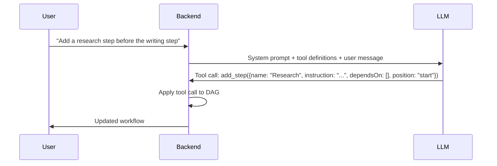

## 5.2 Tool Call Types

HardWire defines four tool call types for workflow modification. Let us examine each one in detail.

### 5.2.1 AddStepToolCall

```ts
export interface AddStepToolCall {
    name: 'add_step';
    args: {
        tempId?: string;        // A temporary ID for referencing this step
                                 // in subsequent tool calls within the same batch
        name: string;            // Human-readable step name (e.g., "Research")
        instruction: string;     // The prompt/instruction for the LLM at this step
        tools?: Array<{          // External tools this step can use
            id: string;
            version: string;
        }>;
        dependsOn?: string[];    // IDs of steps that must complete before this one
        position?: 'start' | 'end' | 'after';  // Where to insert the step
        afterStepId?: string;    // If position is 'after', insert after this step
    };
}
```

The `tempId` field deserves special attention. When the LLM emits multiple tool calls in a batch (e.g., "add step A, then add step B that depends on A"), step B needs to reference step A. But step A does not have a permanent ID yet — it has not been saved to the database. The `tempId` is a placeholder that the system resolves after all additions are processed. We will explore this in detail in Section 5.4.

The `position` field controls where the new step is inserted relative to existing steps:
- `'start'`: The new step has no dependencies (it becomes a source node)
- `'end'`: The new step depends on all current sink nodes (it becomes the final step)
- `'after'`: The new step is inserted after a specific step, inheriting its position in the dependency chain

### 5.2.2 UpdateStepToolCall

```ts
export interface UpdateStepToolCall {
    name: 'update_step';
    args: {
        stepId: string;              // The ID of the step to update
        name?: string;               // New name (optional)
        instruction?: string;        // New instruction (optional)
        tools?: Array<{id: string; version: string}>;   // Replace all tools
        addTools?: Array<{id: string; version: string}>; // Add tools to existing
        removeTools?: Array<{id: string}>;               // Remove specific tools
        dependsOn?: string[];        // Replace dependency list
    };
}
```

Note the three different tool-modification strategies: `tools` (replace all), `addTools` (add to existing), `removeTools` (remove specific ones). This gives the LLM fine-grained control — it can say "add web search to this step" without needing to know what other tools the step already has.

### 5.2.3 DeleteStepToolCall

```ts
export interface DeleteStepToolCall {
    name: 'delete_step';
    args: {
        stepId: string;                              // The step to delete
        rewireStrategy?: 'auto' | 'manual';          // How to handle dependents
        rewireToStepId?: string;                      // If manual, rewire to this step
    };
}
```

Deleting a step is more complex than adding or updating one, because other steps might depend on it. The `rewireStrategy` controls what happens to those dependents. We will explore this in detail in Section 5.5.

### 5.2.4 ReorderStepsToolCall

```ts
export interface ReorderStepsToolCall {
    name: 'reorder_steps';
    args: {
        stepId: string;              // The step to reorder
        newDependsOn: string[];      // Its new dependency list
    };
}
```

Reordering does not move a step to a different position in an array — it changes its *dependencies*, which changes where it appears in the topological order. This is a subtle but important distinction: in a DAG, position is determined by dependencies, not by array index.

## 5.3 DAG Modification Algorithm: Clone → Apply → Validate → Sort

Every modification to a workflow DAG follows a four-phase algorithm:

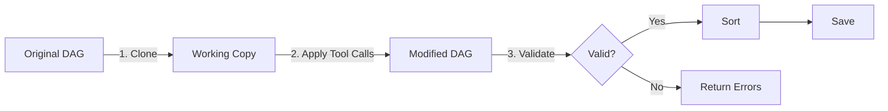

**Phase 1 — Clone**: Create a deep copy of the current DAG. This ensures that if anything goes wrong during modification, the original DAG is untouched. This is the **immutability principle** discussed in Chapter 2.

```ts
// Deep clone to avoid mutating the original
const workingDag: WorkflowDAG = JSON.parse(JSON.stringify(originalDag));
```

**Phase 2 — Apply**: Process each tool call in sequence, modifying the working copy.

**Phase 3 — Validate**: Run the full validation suite (Chapter 4, Section 4.5) on the modified DAG. Check for empty DAG, duplicate IDs, missing dependencies, cycles, and invalid tool references.

**Phase 4 — Sort**: If validation passes, topologically sort the steps (Chapter 4, Section 4.3) to ensure they are in a valid execution order.

If validation fails at Phase 3, the original DAG is returned unchanged, along with a detailed error describing what went wrong. The user (or LLM) can then fix the issue and try again.

> **Key Takeaway**: The clone-apply-validate-sort pipeline ensures that every DAG modification is atomic. Either all changes are applied and the result is a valid, sorted DAG, or no changes are applied and the original DAG is preserved. When changes succeed, the new DAG is saved as a **new workflow version**, preserving history. There is no intermediate state where the DAG is partially modified or invalid.

## 5.4 Temp ID Resolution

### 5.4.1 The Problem

When the LLM emits a batch of tool calls, later calls may reference steps created by earlier calls. For example:

```json
[
    { "name": "add_step", "args": { "tempId": "temp_1", "name": "Research", "instruction": "..." } },
    { "name": "add_step", "args": { "tempId": "temp_2", "name": "Analyze", "instruction": "...", "dependsOn": ["temp_1"] } }
]
```

Step "Analyze" depends on step "Research," but Research does not have a permanent ID yet. It only has the temporary ID "temp_1."

### 5.4.2 The Solution

The DAG modifier maintains a **temp ID map** — a mapping from temporary IDs to permanent IDs:

```pseudocode
function applyToolCalls(dag, toolCalls):
    tempIdMap = {}  // Maps temp IDs to permanent IDs

    for each toolCall in toolCalls:
        if toolCall.name == 'add_step':
            permanentId = generateUUID()

            // If a temp ID was provided, record the mapping
            if toolCall.args.tempId:
                tempIdMap[toolCall.args.tempId] = permanentId

            // Resolve any temp IDs in the dependsOn list
            resolvedDependsOn = toolCall.args.dependsOn.map(id =>
                tempIdMap[id] ?? id  // Use permanent ID if available, else keep as-is
            )

            // Add the step with its permanent ID and resolved dependencies
            dag.steps.push({
                id: permanentId,
                name: toolCall.args.name,
                instruction: toolCall.args.instruction,
                tools: toolCall.args.tools,
                dependsOn: resolvedDependsOn,
            })

        else if toolCall.name == 'update_step':
            // Resolve the step ID (might be a temp ID)
            resolvedStepId = tempIdMap[toolCall.args.stepId] ?? toolCall.args.stepId
            // ... apply updates ...

        // ... other tool call types ...

    return dag
```

### 5.4.3 Visual Example

```
Before:
  Tool Call 1: add_step(tempId="temp_1", name="Research")
  Tool Call 2: add_step(tempId="temp_2", name="Analyze", dependsOn=["temp_1"])
  Tool Call 3: add_step(name="Write", dependsOn=["temp_2"])

Processing:
  Step 1: "Research" gets permanent ID "abc-123"
          tempIdMap = { "temp_1": "abc-123" }

  Step 2: "Analyze" gets permanent ID "def-456"
          Its dependsOn ["temp_1"] resolves to ["abc-123"]
          tempIdMap = { "temp_1": "abc-123", "temp_2": "def-456" }

  Step 3: "Write" gets permanent ID "ghi-789"
          Its dependsOn ["temp_2"] resolves to ["def-456"]

After:
  Steps: [
    { id: "abc-123", name: "Research", dependsOn: [] },
    { id: "def-456", name: "Analyze", dependsOn: ["abc-123"] },
    { id: "ghi-789", name: "Write",   dependsOn: ["def-456"] },
  ]
```

## 5.5 Rewire Strategies on Delete

When a step is deleted, its dependents need to be "rewired" to maintain a valid DAG. HardWire supports two strategies.

### 5.5.1 Auto Rewire

The deleted step's dependents inherit the deleted step's own dependencies. This is like removing a link from a chain and connecting the remaining pieces.

**Before deleting step B (auto rewire):**

```
    A → B → C → D
```

B depends on A. C depends on B. When B is deleted with auto rewire, C inherits B's dependencies (A):

**After:**

```
    A → C → D
```

More complex example:

```
    A → B → D
    C → B → E
```

B depends on A and C. D depends on B. E depends on B. When B is deleted with auto rewire, D and E both inherit B's dependencies (A and C):

**After:**

```
    A → D      A → E
    C → D      C → E
```

Or, drawn more compactly:

```
    A ──→ D
    │     ↑
    │     │
    C ──→ D
    │
    └──→ E
    A ──→ E
```

### 5.5.2 Manual Rewire

The deleted step's dependents are rewired to a specific step chosen by the caller.

**Before deleting step B (manual rewire to step A):**

```
    A → B → C
            ↓
            D
```

C and D depend on B. When B is deleted with manual rewire to A, C and D now depend on A:

**After:**

```
    A → C
    A → D
```

### 5.5.3 Implementation in Code

Rewiring is implemented in `applyToolCallsToDag` inside `backend/lib/workflowDags/dagModifier.ts`. There is **no automatic detection** of “undesirable topology” — that choice is made by the caller via the `rewireStrategy` and `rewireToStepId` fields in the `delete_step` tool call.

```ts
// backend/lib/workflowDags/dagModifier.ts
if ( toolCall.name === 'delete_step' ) {
    const resolvedStepId = resolveStepId( toolCall.args.stepId, tempIdMap );
    const deleteIndex = updatedDag.steps.findIndex( step => step.id === resolvedStepId );
    if ( deleteIndex < 0 ) return error( new WorkflowDagModificationFailed( `Step not found: ${ resolvedStepId }.` ) );

    const deletedStep = updatedDag.steps[ deleteIndex ];
    const deletedDependsOn = deletedStep.dependsOn ?? [];
    updatedDag.steps.splice( deleteIndex, 1 );

    for ( const step of updatedDag.steps ) {
        const dependsOn = step.dependsOn ?? [];
        if ( dependsOn.includes( resolvedStepId ) ) {
            const remainingDependsOn = dependsOn.filter( dep => dep !== resolvedStepId );
            if ( toolCall.args.rewireStrategy === 'manual' && toolCall.args.rewireToStepId ) {
                remainingDependsOn.push( resolveStepId( toolCall.args.rewireToStepId, tempIdMap ) );
            } else {
                deletedDependsOn.forEach( dep => {
                    if ( !remainingDependsOn.includes( dep ) ) remainingDependsOn.push( dep );
                } );
            }
            step.dependsOn = remainingDependsOn;
        }
    }
}
```

Call chain for workflow edits: `backend/app/workflowChatMessages/workflowChatMessages.helper.ts` generates tool calls (via `generateWorkflowToolCalls`) and applies them with `applyToolCallsToDag`.

### 5.5.4 Why Two Strategies?

**Auto rewire** is the safe default. It preserves the logical flow — if step C needed B's output, and B needed A's output, then C likely needs A's output too. This is what the LLM typically chooses.

**Manual rewire** is needed for edge cases where auto rewire would create an undesirable topology. For example, suppose step **B** is a "Draft" step and step **E** is a "Research" branch. Steps **C** and **D** depend on B only because B produced the draft. If B is deleted, C and D should now depend on E (the research output), not on A. Auto rewire would incorrectly connect C and D to A, skipping research entirely.

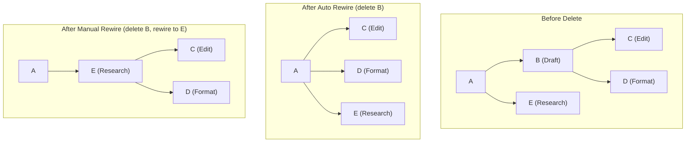

## 5.6 Workflow Execution Engine

When a workflow run starts, HardWire loads the latest workflow version, validates and sorts the DAG, then executes it step by step. The execution engine is the orchestration layer that drives this process.

### 5.6.1 The Execution Loop

```pseudocode
function runWorkflow(chat, workflow, userMessage):
    // Load and sort the DAG
    dag = workflow.dag
    sortedSteps = topologicalSort(dag.steps)

    // Accumulated context from all completed steps
    context = [userMessage]

    // Execute each step in topological order
    for each step in sortedSteps:
        // Build the prompt for this step
        prompt = buildPrompt(step.instruction, context, step.tools)

        // Call the LLM
        response = streamLLMResponse(prompt)

        // If the step has tools, the LLM might emit tool calls
        while response.hasToolCalls():
            for each toolCall in response.toolCalls:
                toolResult = executeTool(toolCall)
                response = continueLLMWithToolResult(prompt, toolResult)

        // Evaluate whether the step succeeded
        stepResult = evaluateStepSuccess(step, response)

        // Add the step's output to the accumulated context
        context.append({
            stepName: step.name,
            output: response.text,
            toolResults: response.toolResults,
            success: stepResult.success,
        })

        // Save the step result as a message in the chat
        saveStepMessage(chat, step, response)

    return context
```

Implementation reference: `runWorkflow` in `backend/lib/workflowRunner.ts` (see its usage in `backend/app/messages/messages.ctrl.ts` when a workflow is selected).

### 5.6.2 Prompt Construction

Each step's prompt is constructed from multiple sources:

1. **System prompt**: General instructions for the LLM (role, constraints, formatting)
2. **Step instruction**: The specific instruction for this step (from the WorkflowStep's `instruction` field)
3. **Accumulated context**: The outputs from all previously completed steps
4. **Tool definitions**: If the step has tools, their schemas are included so the LLM can emit tool calls
5. **User's original message**: The message that initiated the workflow execution

The prompt is structured so the LLM understands its role within a larger workflow. It knows which step it is executing, what has been done before, and what tools are available.

Implementation reference: `buildWorkflowStepExecutionPrompt` in `backend/utils/constants.ts`, called from `runWorkflow` in `backend/lib/workflowRunner.ts`.

```ts
// backend/lib/workflowRunner.ts
const prompt = buildWorkflowStepExecutionPrompt( {
    userMessage: params.userMessage
    , step
    , upstreamOutputs
    , toolNames: runtimeTools.toolNames
} );
```

```ts
// backend/utils/constants.ts
export const buildWorkflowStepExecutionPrompt = (
    params: WorkflowStepExecutionPromptParams
): string => {
    const upstreamBlock = params.upstreamOutputs.length > 0
        ? params.upstreamOutputs.join( '\n\n' )
        : 'None';
    const toolsBlock = params.toolNames.length > 0
        ? `Available tools for this step: ${ params.toolNames.join( ', ' ) }`
        : 'No tools available for this step.';
    return `You are executing a single step in a deterministic workflow pipeline.
...`;
};
```

### 5.6.3 Tool Execution During Steps

When a step has tools assigned, the LLM can emit tool calls during its response. The execution engine handles this in a loop:

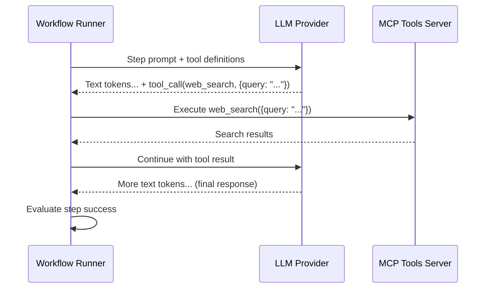

The tool execution loop continues until the LLM produces a response without any tool calls, indicating it has gathered enough information to complete the step.

### 5.6.4 Tool Runtime Wrappers

Each tool available through the MCP server has a runtime wrapper that:

1. **Validates the tool call arguments** against the tool's schema
2. **Executes the tool** (e.g., calls the MCP `web_search` tool backed by DuckDuckGo)
3. **Formats the result** into a standard structure the LLM can understand
4. **Handles errors** (timeouts, API failures, invalid responses)

```ts
// backend/lib/workflowRunner.ts
const buildRuntimeTools = (
    stepTools: WorkflowToolRef[]
    , toolLookup: Map<string, MCPTool>
    , toolLogs: WorkflowToolLogEntry[]
) => {
    const tools: Record<string, ReturnType<typeof tool<any, any>>> = {};
    const toolNames: string[] = [];

    stepTools.forEach( toolRef => {
        const toolRecord = toolLookup.get( buildToolKey( toolRef ) ) ?? toolLookup.get( `${ toolRef.id }::` );
        if ( !toolRecord ) return;

        tools[ toolRecord.name ] = tool( {
            inputSchema: jsonSchema( toolRecord.schema as Record<string, unknown> )
            , outputSchema: jsonSchema( { type: 'object', additionalProperties: true } )
            , execute: async ( input: Record<string, unknown> ) => {
                const runResult = await runMcpTool( { id: toolRecord.id, version: toolRecord.version, input } );
                if ( runResult.isError() ) {
                    toolLogs.push( { toolName: toolRecord.name, input, status: 'FAILED', startedAt: new Date().toISOString(), completedAt: new Date().toISOString() } );
                    return { error: true, message: runResult.value.message ?? 'Tool execution failed.' };
                }
                toolLogs.push( { toolName: toolRecord.name, input, status: 'PASSED', startedAt: new Date().toISOString(), completedAt: new Date().toISOString(), output: runResult.value.output } );
                return runResult.value.output;
            }
        } );
    } );

    return { tools, toolNames };
};
```

### 5.6.5 Step Success Evaluation

After a step completes, the engine evaluates whether it succeeded. This evaluation considers:

1. **LLM response validity**: Did the LLM produce a non-empty response?
2. **Tool call results**: Did all tool calls succeed? Were the results meaningful?
3. **Content quality signals**: Does the response address the step's instruction?

The success evaluation result is included in the context passed to subsequent steps, so later steps know whether earlier steps succeeded or failed and can adjust their behavior accordingly.

Implementation reference: `evaluateStepSuccess` and `summarizeToolExecution` in `backend/lib/workflowRunner.ts`.

```ts
const MIN_MEANINGFUL_OUTPUT_LENGTH = 20;
const ERROR_OUTPUT_PATTERNS = [
    /^(error|failed|unable to|cannot|could not|i('m| am) (sorry|unable))/i,
    /tool (call|execution) failed/i
];

const evaluateStepSuccess = (
    output: string
    , toolSummary: ToolExecutionSummary
    , hasDownstreamSteps: boolean
): StepSuccessEvaluation => {
    const trimmedOutput = output.trim();
    if ( trimmedOutput.length === 0 ) {
        return { success: false, reason: 'Step produced no output.', toolSummary };
    }

    if ( hasDownstreamSteps && trimmedOutput.length < MIN_MEANINGFUL_OUTPUT_LENGTH ) {
        return { success: false, reason: 'Step output too short to feed downstream.', toolSummary };
    }

    for ( const pattern of ERROR_OUTPUT_PATTERNS ) {
        if ( pattern.test( trimmedOutput ) ) {
            return { success: false, reason: 'Step output appears to be an error message.', toolSummary };
        }
    }

    return { success: true, reason: 'Step succeeded.', toolSummary };
};
```

Tradeoffs of the current implementation:
- The heuristic length threshold can misclassify concise but valid outputs.
- Regex‑based error detection is brittle and language‑dependent.
- “Meaningful output” is subjective; the evaluation is intentionally simple to keep runtime costs low.
- Tool failures do not automatically fail the step unless the output lacks usable content.

### 5.6.6 Streaming to the Client

As each step executes, the LLM's response is streamed to the client via SSE:

```ts
// Conceptual SSE streaming
function streamToClient(res: Response, step: WorkflowStep, llmStream: AsyncIterable<Token>) {
    // Send step-start event
    res.write(`event: step_start\ndata: ${JSON.stringify({ stepId: step.id, stepName: step.name })}\n\n`);

    // Stream tokens
    for await (const token of llmStream) {
        res.write(`event: token\ndata: ${JSON.stringify({ stepId: step.id, token: token.text })}\n\n`);
    }

    // Send step-complete event
    res.write(`event: step_complete\ndata: ${JSON.stringify({ stepId: step.id })}\n\n`);
}
```

The SSE protocol uses a specific format: each event has an optional `event:` field (the event type) and a `data:` field (the payload), separated by newlines. Events are separated by double newlines. The client-side SSE handler parses these events and updates the UI accordingly.

Implementation reference: `streamWorkflowRunHandler` in `backend/app/workflowRuns/workflowRuns.ctrl.ts`, which polls for run snapshots and writes SSE `data:` events to the response.

## 5.7 Error Handling and Recovery

### 5.7.1 Step-Level Errors

HardWire is **fail‑fast** at the step level. Tool failures are logged and returned to the LLM (so a step *might* still succeed), but if a step’s output fails `evaluateStepSuccess`, the step is marked **FAILED** and the workflow run terminates.

```ts
// backend/lib/workflowRunner.ts
const evaluation = evaluateStepSuccess( output, toolSummary, hasDownstreamSteps );
if ( !evaluation.success ) {
    await updateStepRun( {
        workflowRunId
        , stepId: step.id
        , status: 'FAILED'
        , output
        , errorMessage: evaluation.reason
        , toolCalls: toolCalls.length > 0 ? toolCalls : null
        , logs: stepLogs
        , completedAt
    } );
    throw new ResourceError( { message: `Step "${ step.name ?? step.id }" failed: ${ evaluation.reason }` } );
}
```

This exception is caught by the outer `try/catch`, which updates the workflow run status to **FAILED** and stops execution. There is no built‑in retry/skip logic today.

### 5.7.2 Workflow-Level Errors

Workflow‑level errors occur when the runner cannot safely continue the run. Examples include:

- **Invalid DAG or missing version** (before a run is created): `validateWorkflowDag` fails or no workflow version exists.
- **Missing tools**: required tool refs aren’t found even after refresh.
- **Infrastructure failures**: DB write failures while creating/updating step runs or the workflow run.

Once a run exists, failures lead to the workflow run being marked **FAILED**:

```ts
// backend/lib/workflowRunner.ts
} catch ( err ) {
    const completedAt = new Date().toISOString();
    if ( activeStepId ) {
        await updateStepRun( {
            workflowRunId
            , stepId: activeStepId
            , status: 'FAILED'
            , errorMessage: err instanceof Error ? err.message : 'Workflow step failed.'
            , completedAt
        } );
    }
    await updateWorkflowRunStatus( { workflowRunId, status: 'FAILED', completedAt } );
    return error( new ResourceError( { message: 'Workflow execution failed.', error: err } ) );
}
```

SSE status updates are delivered by `streamWorkflowRunHandler` (polling snapshots from the DB), so clients will see the failed status once persisted.

### 5.7.3 The Importance of Idempotency

Idempotency is an **operational goal**, not a fully enforced guarantee in the current implementation. The runner does not use idempotency keys or dedupe repeated executions; re‑running a workflow will create a new workflow run and re‑execute every step.

What is implemented today:
- **Fail‑fast execution** with no automatic retries (so steps are not retried implicitly).
- **Tool isolation** in the MCP server, but no built‑in deduping. The `http_request` tool can cause side effects if pointed at a mutating endpoint.

Practical implications:
- Idempotency depends on **workflow authoring discipline** (avoid side‑effectful tools where possible, or make the target APIs idempotent).
- If a run is restarted manually, side effects may repeat.

Relevant code: `runWorkflow` in `backend/lib/workflowRunner.ts` (creates a new workflow run each time) and MCP tool executors in `mcp-tools-server/app/v0/tools/tools.executors.ts` (includes `http_request`).

## 5.8 Full Execution Sequence Diagram

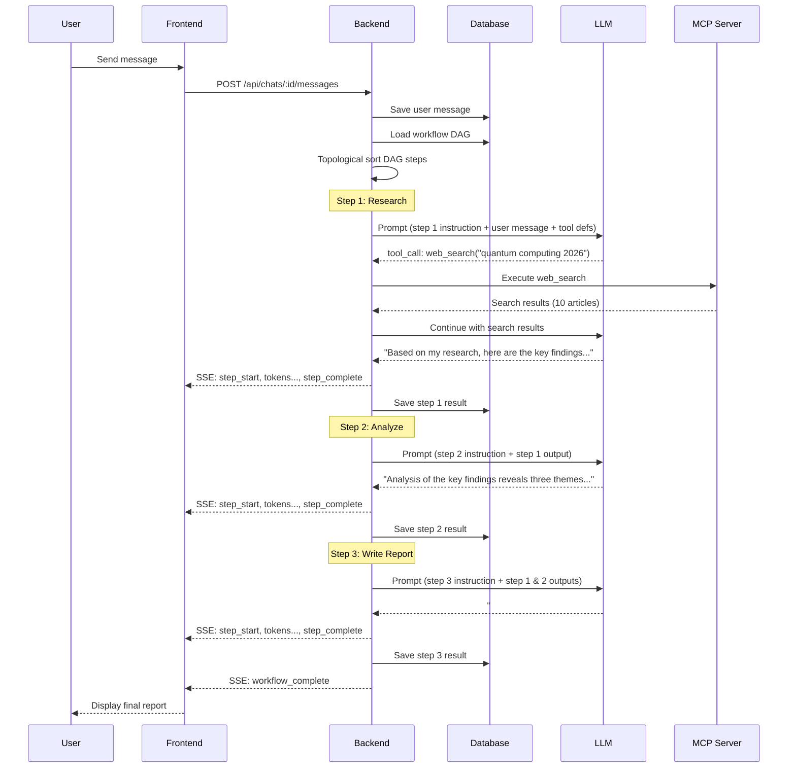

## 5.9 Putting It All Together

The workflow modification and execution system is a layered pipeline:

1. **Input layer**: User message or LLM tool calls trigger modifications or execution
2. **Modification layer**: Tool calls are applied through the clone-apply-validate-sort pipeline, ensuring DAG integrity
3. **Scheduling layer**: Topological sort determines execution order
4. **Execution layer**: Steps are executed sequentially, with LLM streaming and tool execution
5. **Persistence layer**: Results are saved incrementally to the database
6. **Presentation layer**: SSE streams deliver real-time updates to the frontend

Each layer is independent and can be tested, debugged, and modified without affecting the others. The DAG is the contract between layers — the modification layer produces valid DAGs, and the execution layer consumes them.

> **Key Takeaway**: Workflow modification and execution form a disciplined pipeline. Modifications are always atomic (clone → apply → validate → sort), ensuring the DAG is never left in an invalid state. Execution follows the topological order faithfully, accumulating context as it goes. Temp IDs bridge the gap between the LLM's natural language understanding and the system's need for unique identifiers. Rewire strategies ensure that step deletion does not break the dependency graph. And throughout it all, SSE streaming keeps the user informed in real time.

## Study Questions

1. Why does HardWire use LLM tool calls for workflow modification instead of building a custom natural language parser? What are the tradeoffs?
2. Explain the four phases of DAG modification (clone → apply → validate → sort). What would go wrong if you skipped the clone phase?
3. Walk through a temp ID resolution example with three add_step calls, where the third step depends on both the first and second.
4. Compare auto rewire and manual rewire for step deletion. Give a scenario where auto rewire would produce an undesirable result and manual rewire would be better.
5. In the execution loop, why is the accumulated context from previous steps included in each step's prompt? What would happen if each step only received its own instruction?
6. Explain the tool execution loop within a single step. Why does it loop (potentially multiple times) rather than just executing tool calls once?
7. What is the difference between step-level errors and workflow-level errors? Give an example of each.
8. Why does the system continue executing subsequent steps even when a step fails (by default), rather than stopping the workflow?
9. Describe the SSE event format used for streaming step execution to the client. What events are sent, and what data does each contain?
10. How does the `position` parameter in `add_step` affect the resulting DAG? Draw diagrams for each of the three position values ('start', 'end', 'after') applied to a three-step linear DAG.
11. The `update_step` tool call has three different strategies for modifying tools (`tools`, `addTools`, `removeTools`). Why not just have a single `tools` field that replaces everything?
12. If the LLM emits an invalid batch of tool calls (e.g., adding a step that creates a cycle), what happens? Trace through the system's response from the tool call to the error message displayed to the user.

# HardWire Study Guide — Part II: Deep Dives

## Chapters 6–10 and Glossary

---

# Chapter 6: LLM Integration, RAG, and Tooling (Deep Dive)

## 6.1 What Is a Large Language Model?

A **Large Language Model (LLM)** is a neural network trained on vast quantities of text data to predict the next token in a sequence. Before we can understand how HardWire uses LLMs, we need to understand three foundational concepts: tokens, attention, and generation parameters.

### 6.1.1 Tokens

LLMs do not read words the way humans do. Instead, they break text into **tokens** — sub-word units that the model can process numerically. For example, the word "understanding" might be split into the tokens `["under", "stand", "ing"]`. A rough rule of thumb is that one token corresponds to approximately four characters of English text, or about three-quarters of a word.

Why does this matter for HardWire? Because every API call to an LLM provider is billed by token count, and every model has a **context window** — the maximum **total** tokens allowed in a single request (system + user + tools + output). If your prompt plus the model’s response would exceed the context window, the call will fail or the output will be truncated.

### 6.1.2 Attention and the Transformer

The architecture powering modern LLMs is called the **Transformer**. Its key innovation is the **attention mechanism**, which allows every token in the input to "attend to" (i.e., consider the relevance of) every other token. This is what lets the model understand that in the sentence "The cat sat on the mat because it was tired," the word "it" refers to "cat" and not "mat."

Attention is computed as a weighted sum:

```pseudocode
For each token T in the input:
    Compute a relevance score between T and every other token
    Normalize scores into probabilities (softmax)
    Compute T's new representation as a weighted combination of all tokens
```

You do not need to implement attention yourself — the LLM providers handle this. But understanding it helps you reason about why longer prompts cost more (attention is quadratic in sequence length) and why prompt order matters (tokens attend to all previous tokens, with varying strength).

### 6.1.3 Temperature and Max Tokens

When generating text, two parameters are critical:

- **Temperature** (0.0–2.0): Controls randomness. A temperature of 0.0 makes the model always choose the most likely next token (deterministic). A temperature of 1.0 samples proportionally to predicted probabilities. Higher values increase creativity but also increase the chance of nonsensical output. HardWire uses `0.7` for chat generation (a balance of coherence and creativity) and `0.1` for search classification (where we want near-deterministic answers). We avoid `0.0` for classification because a tiny bit of stochasticity can improve JSON compliance and robustness across providers while remaining effectively deterministic.

- **maxOutputTokens**: The maximum number of tokens the model will generate in its response. HardWire sets this to `2000` for chat responses and `100` for search classification. Setting this too low truncates responses; setting it too high wastes money if the model generates padding.

```pseudocode
Temperature = 0.0  →  "The capital of France is Paris."
Temperature = 0.7  →  "The capital of France is Paris, a vibrant city known for..."
Temperature = 1.5  →  "The capital of France is Paris, where luminous boulevards dance..."
```

## 6.2 What Is a Prompt? Prompt Engineering Basics

A **prompt** is the text you send to an LLM to get a response. **Prompt engineering** is the discipline of crafting prompts to reliably elicit the desired behavior.

Key principles used in HardWire's prompts:

1. **Role assignment**: "You are a workflow assistant that helps users build deterministic workflows."
2. **Context injection**: Providing conversation history, current workflow state, and available tools.
3. **Output format specification**: "Respond with valid JSON matching this schema: ..."
4. **Few-shot examples**: Showing the model examples of correct input/output pairs.
5. **Constraint enumeration**: "You must NOT add steps that duplicate existing step names."

HardWire constructs prompts programmatically using builder functions rather than hardcoding strings. This ensures consistency and testability.

## 6.3 The Provider Abstraction Pattern

HardWire supports multiple LLM providers — OpenAI, Anthropic, and Google — through a **strategy pattern** abstraction. The strategy pattern is a design pattern where you define a family of algorithms (here, "call OpenAI," "call Anthropic," "call Google"), encapsulate each one, and make them interchangeable.

In practice, this means:
- The caller passes a `modelId` string (e.g., `gpt-5.2`, `claude-opus-4.5`, `gemini-2.5-pro`).
- `getModelProvider` chooses the correct provider **strategy** based on the prefix, and returns a **uniform `LanguageModel` interface**.
- The rest of the codebase only deals with `LanguageModel`, so switching providers is just a `modelId` change — no branching logic scattered across the code.

```ts
// backend/lib/llm/providers.ts
import { openai } from '@ai-sdk/openai';
import { anthropic } from '@ai-sdk/anthropic';
import { google } from '@ai-sdk/google';
import type { LanguageModel } from 'ai';

export const getModelProvider = (modelId: string): LanguageModel => {
    if (modelId.startsWith('gpt-')) return openai(modelId);
    if (modelId.startsWith('claude-')) return anthropic(modelId);
    if (modelId.startsWith('gemini-')) return google(modelId);
    return openai('gpt-4o');  // fallback
};
```

Let us trace through this carefully:

1. The caller passes a `modelId` string like `"gpt-4o"`, `"claude-3-opus"`, or `"gemini-pro"`.
2. The function inspects the **prefix** of the string to determine which provider SDK to use.
3. Each provider SDK function (e.g., `openai(modelId)`) returns a `LanguageModel` object — a unified interface defined by the AI SDK.
4. If the model ID does not match any known prefix, the function falls back to `gpt-4o`.

**Important:** `gpt-4o` is not currently present in the seeded `models` table (`backend/migrations/1770062933213_seed-models-data.ts`), and the later “delete weak models” migration does not add it. To keep the fallback consistent with the DB, we should add a migration to insert `gpt-4o` (or change the fallback to an existing model). **Do not run the migration here.**

This is the **strategy pattern** in action:

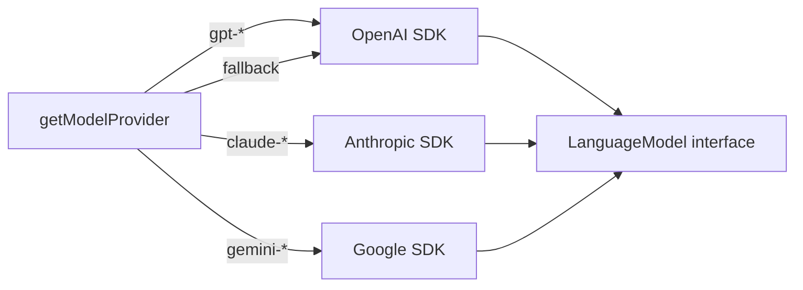

> **Key Takeaway:** The provider abstraction means the rest of the codebase never needs to know which LLM provider is being used. Swapping from OpenAI to Anthropic requires changing only the `modelId` string — no code changes anywhere else.

## 6.4 The Vercel AI SDK

The **AI SDK** (by Vercel) is an open-source TypeScript library that provides a unified API for interacting with multiple LLM providers. Instead of writing separate code for OpenAI's API format, Anthropic's API format, and Google's API format, you write code against the AI SDK's `generateText` and `streamText` functions, and the SDK handles the translation.

Key functions used by HardWire:

| Function | Purpose | Returns |
|---|---|---|
| `generateText()` | Send a prompt, wait for the full response | `{ text, usage }` |
| `streamText()` | Send a prompt, receive tokens as they are generated | `{ textStream }` |

Both functions accept the same core parameters:

```pseudocode
generateText({
    model: LanguageModel,      // from getModelProvider
    prompt: string,            // the full system + user prompt
    maxOutputTokens: number,   // cap on response length
    temperature: number        // randomness control
})
```

## 6.5 The Full LLM Pipeline

When a user sends a message in HardWire's chat, the following pipeline executes:

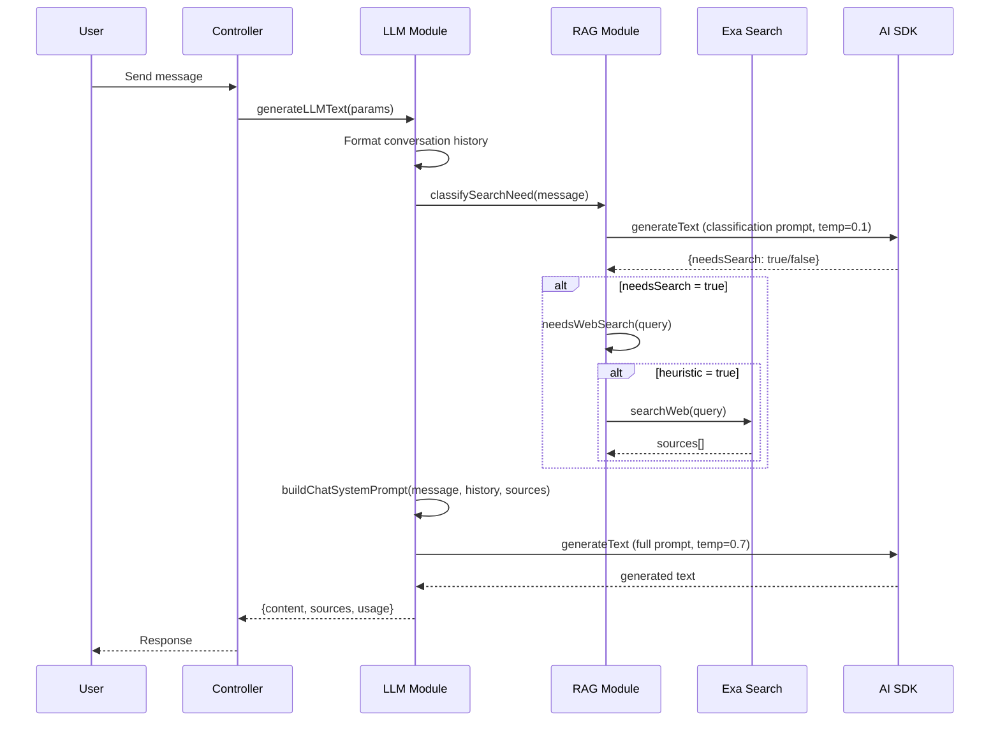

Let us walk through each stage:

### Stage 1: Build Conversation Context

```ts
const conversationContext = params.conversationHistory
    ? formatHistoryForContext(params.conversationHistory)
    : null;
```

The conversation history (previous messages in this chat) is formatted into a string that the LLM can understand. This gives the model context about what has already been discussed, enabling coherent multi-turn conversations.

### Stage 2: Classify Whether Search Is Needed

Before spending money and latency on a web search, HardWire asks: "Does this message actually need external information?" This classification happens through **two layers** (discussed in detail in Section 6.7).

### Stage 3: Fetch Sources (Conditional)

If the classifier determines search is needed, the system calls `generateSources`, which applies a heuristic guard (`needsWebSearch`) before querying the Exa neural search API.

### Stage 4: Build the Full Prompt

All the pieces — the user's message, conversation history, and any retrieved sources — are assembled into a single prompt using `buildChatSystemPrompt`.

### Stage 5: Generate the Response

The assembled prompt is sent to the LLM via `generateText`, and the response is returned alongside metadata (sources, token usage).

```ts
export const generateLLMText = async (
    params: LLMGenerateParams
): Promise<Either<ResourceError, LLMGenerateResult>> => {
    const model = getModelProvider(params.modelId);
    const conversationContext = params.conversationHistory
        ? formatHistoryForContext(params.conversationHistory)
        : null;

    let sources = [];
    if (useRAG) {
        const classification = await classifySearchNeed({
            modelId,
            userMessage,
            conversationContext,
        });
        if (classification.needsSearch) {
            sources = await generateSources(params.prompt);
        }
    }

    const fullPrompt = buildChatSystemPrompt({
        userMessage,
        conversationContext,
        sourcesContext,
    });
    const result = await generateText({
        model,
        prompt: fullPrompt,
        maxOutputTokens: 2000,
        temperature: 0.7,
    });
    return success({
        content: result.text,
        sources,
        searchPerformed,
        usage: { inputTokens, outputTokens, totalTokens },
    });
};
```

> **Key Takeaway:** The LLM pipeline is a five-stage assembly line. Each stage has a single responsibility, making the system testable and debuggable. If search results are bad, you debug the RAG module. If the response tone is wrong, you debug the prompt builder.

## 6.6 RAG Explained from Scratch

### What Is RAG?

**Retrieval-Augmented Generation (RAG)** is a technique where you retrieve relevant documents from an external source and include them in the LLM's prompt before generating a response. The name breaks down as:

- **Retrieval**: Find relevant information from a knowledge base, database, or the web.
- **Augmented**: Add that information to the prompt.
- **Generation**: Let the LLM generate a response using both its trained knowledge and the retrieved context.

### Why Use RAG?

LLMs have a **knowledge cutoff** — they only know what was in their training data, which may be months or years old. RAG solves this by giving the model access to up-to-date information at inference time.

Consider this scenario:

| Approach | User asks: "What is the latest version of React?" |
|---|---|
| Without RAG | The LLM answers based on its training data, which may be outdated |
| With RAG | The system searches the web, finds "React 19.1," and includes that in the prompt |

### When to Use RAG

RAG is valuable when:
- The question requires **current information** (news, documentation, pricing)
- The question is about **specific facts** the model may not have memorized
- You want to provide **citations** (sources the user can verify)

RAG is **not** valuable when:
- The user is making small talk ("Hello!", "Thanks!")
- The question is about **general knowledge** ("What is photosynthesis?")
- The question is about the **application itself** ("How do I create a workflow?")

This is why HardWire implements search gating, which we discuss next.

## 6.7 Two-Layer Search Gating

HardWire uses a two-layer system to decide whether to perform a web search. This avoids unnecessary API calls (which cost money and add latency) while ensuring searches happen when they are actually needed.

### Layer 1: LLM Classifier

The first layer is an LLM-based classifier implemented in `classifySearchNeed` (`backend/lib/llm/llm.ts`). It asks the model for a small JSON response indicating whether search is needed:

```ts
const classifySearchNeed = async (params) => {
    const result = await generateText({
        model,
        prompt: buildSearchClassificationPrompt(...),
        maxOutputTokens: 100,
        temperature: 0.1,
    });
    try {
        return JSON.parse(result.text.trim());
    } catch {
        return {
            needsSearch: true,
            reason: 'classification parsing failed, defaulting to search',
        };
    }
};
```

Notice the defensive design:

- **Low temperature (0.1)**: We want a near-deterministic yes/no answer, not creative prose.
- **Low max tokens (100)**: The response should be a tiny JSON object, not a paragraph.
- **Fallback on parse failure**: If the LLM returns malformed JSON, the system defaults to searching. This is a **fail-open** strategy — it is better to do an unnecessary search than to miss information the user needs.

### Layer 2: Heuristic Guard (Pre-Filter)

Even when the LLM says “search,” HardWire applies a deterministic heuristic guard inside `generateSources` (`backend/lib/llm/rag.ts`) before actually calling Exa. This is the `needsWebSearch` function:

```ts
export const needsWebSearch = (query: string): boolean => {
    const normalizedQuery = query.trim().toLowerCase();
    const wordCount = normalizedQuery.split(/\s+/).length;
    if (wordCount < 3) return false;
    // Check casual patterns → false
    // Check search indicators → true
    return wordCount > 5;
};
```

If `needsWebSearch` returns `false`, `generateSources` short-circuits and returns an empty list — no Exa call is made, even if the classifier said “search.”

```
User Query: "What are the latest Next.js features?"
                    │
                    ▼
        ┌──────────────────────┐
        │   LLM Classifier      │
        │  temp=0.1, 100 tokens │
        │  Result: needsSearch  │
        └──────────┬───────────┘
                   │
                   ▼
        ┌──────────────────────┐
        │ Heuristic Guard       │
        │ needsWebSearch(query) │
        └──────────┬───────────┘
                   │
                   ▼
            Perform Exa Search
```

> **Key Takeaway:** Two-layer gating is a cost-optimization pattern. The LLM classifier decides intent, and a cheap heuristic guard prevents unnecessary searches. This keeps costs low while maintaining accuracy.

## 6.8 Exa Neural Search Integration

**Exa** is a neural search engine designed for AI applications. Unlike traditional keyword-based search (like Google), Exa uses embeddings to understand the semantic meaning of a query.

```ts
export const searchWeb = async (
    params: ExaSearchParams
): Promise<Either<ResourceError, ExaSearchResult[]>> => {
    const exa = new Exa(exaApiKey);
    const searchResult = await exa.search(params.query, {
        type: params.type ?? 'auto',
        useAutoprompt: true,
        numResults: 3,
        contents: {
            text: { maxCharacters: 2000, includeHtmlTags: false },
        },
    });
    return success(results);
};
```

Key configuration choices:

| Parameter | Value | Rationale |
|---|---|---|
| `type` | `'auto'` | Let Exa decide between keyword and neural search |
| `useAutoprompt` | `true` | Exa reformulates the query for better results |
| `numResults` | `3` | Balance between context quality and token cost |
| `maxCharacters` | `2000` | Enough text for context without overwhelming the prompt |
| `includeHtmlTags` | `false` | Clean text only — HTML tags waste tokens |

The results are transformed into `LLMSource` objects:

```ts
return searchResult.value.map(result => ({
    url: result.url,
    title: result.title,
    description: result.text,
}));
```

These sources serve dual purposes: they are injected into the LLM prompt for context, and they are returned to the user as clickable citations.

## 6.9 Streaming vs Non-Streaming

HardWire supports two modes of LLM generation:

### Non-Streaming (`generateText`)

The server waits for the LLM to finish generating the entire response, then sends it all at once.

```pseudocode
Client sends request
    → Server calls generateText()
    → Server waits 2-10 seconds
    → Server sends complete response
Client renders full response instantly
```

**Pros:** Simple. Easy to post-process the full response before sending.
**Cons:** The user stares at a loading spinner for seconds. Feels slow.

### Streaming (`streamText`)

The server sends tokens to the client as they are generated, using Server-Sent Events (SSE).

```pseudocode
Client sends request
    → Server calls streamText()
    → Server receives token "The"  → sends to client
    → Server receives token " capital" → sends to client
    → Server receives token " of" → sends to client
    → ... (continues until done)
Client renders tokens incrementally (typewriter effect)
```

**Pros:** The user sees the response forming in real-time, which feels much faster even though the total time is similar.
**Cons:** More complex. Harder to post-process. Requires SSE infrastructure.

HardWire uses streaming for the primary chat experience (where perceived speed matters) and non-streaming for internal operations like search classification (where the result is consumed programmatically, not shown to the user).

## 6.10 Workflow Tool Calling

One of HardWire's most sophisticated features is letting users modify workflows through natural language. The user might say "Add a step to validate the email address after the input step," and the LLM needs to translate that into a precise structural modification of the workflow DAG.

This works through **structured tool calling**, a process with multiple stages:

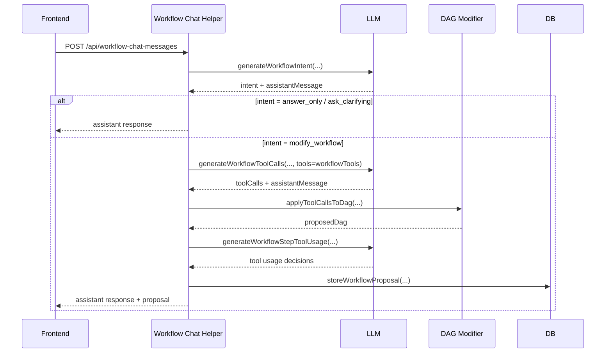

### Stage 1: Intent Classification

The LLM first classifies the user's intent in `generateWorkflowIntent` (`backend/lib/llm/llmWithTools.ts`), called from `generateWorkflowChatResponse` (`backend/app/workflowChatMessages/workflowChatMessages.helper.ts`):

```pseudocode
Possible intents:
    modify_workflow  → User wants to change the workflow structure
    ask_clarifying   → User's request is ambiguous, need more info
    answer_only      → User is asking a question, no modification needed
```

### Stage 2: Tool Call Generation

If the intent is `modify_workflow`, the LLM generates specific tool calls:

Implementation references:
- Tool definitions live in `backend/lib/llm/workflowTools.ts` (schema + names).
- Tool call types are defined in `backend/lib/workflowDags/workflowDags.types.ts`.
- Tool calls are generated by `generateWorkflowToolCalls` in `backend/lib/llm/llmWithTools.ts`.

```ts
// backend/lib/llm/workflowTools.ts (excerpt)
export const workflowTools = {
    add_step: tool({ description: 'Add a new workflow step to the DAG.', inputSchema: addStepInputSchema, outputSchema: emptyOutputSchema }),
    update_step: tool({ description: 'Update an existing workflow step in the DAG.', inputSchema: updateStepInputSchema, outputSchema: emptyOutputSchema }),
    delete_step: tool({ description: 'Delete a workflow step from the DAG.', inputSchema: deleteStepInputSchema, outputSchema: emptyOutputSchema }),
    reorder_steps: tool({ description: 'Change when a step runs by updating dependencies.', inputSchema: reorderStepsInputSchema, outputSchema: emptyOutputSchema })
};
```

The LLM outputs these as JSON:

```json
// Example LLM output for "Add an email validation step after input"
{
    "name": "add_step",
    "args": {
        "name": "Validate Email",
        "instruction": "Check that the email address is properly formatted",
        "dependsOn": ["input-step-id"]
    }
}
```

### Stage 3: Tool Usage Classification

For each step, the system determines whether it needs external tools (MCP tools) to execute:

```pseudocode
Step: "Validate Email"
    → Does this need an external API? No, can be done with code
    → toolUsage: none

Step: "Send Notification via Slack"
    → Does this need an external API? Yes, needs Slack API
    → toolUsage: { toolName: "slack_send_message", ... }
```

Implementation reference: `generateWorkflowStepToolUsage` in `backend/lib/llm/llmWithTools.ts` and `applyToolUsageDecisions` in `backend/app/workflowChatMessages/workflowChatMessages.helper.ts`.

### Stage 4: Step Plan Generation

Finally, detailed execution instructions are generated for each step — what inputs it expects, what processing it does, and what outputs it produces.

Implementation reference: `generateWorkflowStepPlan` in `backend/lib/llm/llmWithTools.ts` (used as a fallback when no tool calls are produced for an empty DAG).

### Prompt Construction

Each stage uses a specialized prompt builder. The prompts include:

- The current workflow state (all steps, their dependencies, their configurations)
- The available tools and their schemas
- Rules and constraints ("Do not create circular dependencies")
- Examples of correct tool call format

Implementation reference: prompt builders live in `backend/utils/constants.ts` and are re-exported via `backend/lib/llm/workflowSystemPrompt.ts`:
- `buildWorkflowIntentPrompt`
- `buildWorkflowToolCallPrompt`
- `buildWorkflowToolUsagePrompt`
- `buildWorkflowStepPlanPrompt`

```pseudocode
System Prompt for Tool Call Generation:
    "You are a workflow modification assistant.

    Current workflow:
    Step 1: 'Get User Input' (id: step-1, deps: [])
    Step 2: 'Process Data' (id: step-2, deps: [step-1])

    Available tools: add_step, update_step, delete_step, reorder_steps

    User request: {user_message}

    Respond with a JSON array of tool calls."
```

## 6.11 Defensive JSON Parsing

When the LLM is expected to return JSON (for search classification, tool calls, etc.), HardWire wraps the parsing in try/catch blocks with sensible defaults:

```ts
try {
    return JSON.parse(result.text.trim());
} catch {
    return {
        needsSearch: true,
        reason: 'classification parsing failed, defaulting to search',
    };
}
```

This is critical because LLMs are **probabilistic** — they do not always produce valid JSON. Common failure modes include:

- Adding a markdown code fence: `` ```json { ... } ``` ``
- Including explanatory text before or after the JSON
- Producing a trailing comma
- Outputting a truncated response (if `maxOutputTokens` is too low)

The `.trim()` call handles leading/trailing whitespace. The catch block ensures the system never crashes due to malformed LLM output.

> **Key Takeaway:** Never trust LLM output to be perfectly formatted. Always parse defensively, always have a fallback, and choose fail-safe defaults (e.g., "when in doubt, search").

## 6.12 Tradeoff Analysis

### RAG vs Fine-Tuning

| Dimension | RAG | Fine-Tuning |
|---|---|---|
| **Freshness** | Always up-to-date (searches at runtime) | Stale (locked to training data) |
| **Cost** | Per-query search cost | One-time training cost, then cheaper per query |
| **Accuracy** | Depends on search quality | Can be very high for narrow domains |
| **Flexibility** | Works across all topics | Specialized to training distribution |
| **Complexity** | Moderate (search pipeline) | High (data curation, training, evaluation) |

HardWire chose RAG because its users ask about diverse, rapidly changing topics. Fine-tuning would require constant retraining.

### Classifier Cost vs Accuracy

| Approach | Cost | Accuracy | Latency |
|---|---|---|---|
| Heuristic only | Free | ~75% | Instant |
| LLM classifier only | ~$0.001/query | ~95% | 500ms |
| Two-layer (HardWire) | ~$0.0003/query | ~93% | ~150ms average |

The two-layer approach uses the LLM classifier first, then applies a free heuristic guard before calling Exa, keeping costs and latency lower than LLM-only.

### Streaming Complexity

| Dimension | Non-Streaming | Streaming |
|---|---|---|
| Implementation | Simple HTTP request/response | SSE, buffering, partial state |
| Error handling | Single error point | Errors mid-stream require recovery |
| Post-processing | Easy (full text available) | Hard (text arrives incrementally) |
| User experience | Loading spinner → full text | Typewriter effect (feels fast) |
| Token usage tracking | Available immediately | Available only after stream ends |

---

## Study Questions

1. Explain what a token is and why LLM pricing is based on tokens rather than characters or words.
2. Why does HardWire use a temperature of 0.1 for search classification but 0.7 for chat responses?
3. Draw the strategy pattern diagram for `getModelProvider`. What happens if you pass `"llama-3"` as the model ID?
4. Describe the five stages of the LLM pipeline in your own words. Which stages are optional?
5. What is RAG? Give an example where RAG would improve the LLM's response and an example where it would not.
6. Explain the two-layer search gating system. Why not just always search?
7. What does "fail-open" mean in the context of HardWire's search classification? Why is this the right default?
8. Compare streaming and non-streaming generation. When would you choose each?
9. How does the LLM modify a workflow DAG? What are the four available tool operations?
10. Why is defensive JSON parsing necessary when working with LLM outputs? What could go wrong without it?

---

# Chapter 7: Frontend Application (Deep Dive)

## 7.1 What Is React?

**React** is a JavaScript library for building user interfaces. Created by Facebook (now Meta) in 2013, it introduced several paradigm-shifting ideas that are now standard across frontend development. To understand HardWire's frontend, you must understand React's core concepts.

### 7.1.1 Components

In React, the UI is built from **components** — reusable, self-contained pieces of interface. Think of components like LEGO bricks: each one has a specific shape and function, and you combine them to build complex structures.

```ts
// A simple React component
function WelcomeBanner({ userName }: { userName: string }) {
    return <h1>Welcome to HardWire, {userName}!</h1>;
}
```

Every component is a function that accepts **props** (short for "properties" — the inputs to the component) and returns **JSX** (a syntax that looks like HTML but compiles to JavaScript).

### 7.1.2 Props and State

- **Props** flow **down** from parent to child. They are read-only — a child cannot modify its own props.
- **State** is data that a component **owns and manages**. When state changes, React re-renders the component.

**Props example from HardWire (parent → child):**

```tsx
// frontend/src/components/chat/ChatList.tsx
{sortedChats.map((chat) => (
  <ChatListItem
    key={chat.id}
    chat={chat}
    isActive={chat.id === activeChatId}
    onDelete={onDeleteChat}
  />
))}
```

`ChatList` owns the list of chats and passes each `chat` object into `ChatListItem`. The child **reads** props and calls callbacks like `onDelete`, but it does not mutate the props directly.

**Why children can’t (and shouldn’t) modify props:**
- Props are **owned by the parent**. If a child tries to mutate a prop object (e.g., `chat.title = "X"`), React does not track that mutation, so no re-render is triggered.
- Even if the object changes in memory, the parent’s state is unchanged. On the next parent render, the old value can overwrite the mutation.
- In TypeScript/React conventions, props are treated as immutable. Mutating them is a bug pattern that leads to stale UI and inconsistent state.
- The correct pattern is to **signal the parent** via a callback (like `onDelete`), and let the parent update its own state. That state update then flows down as new props.

**How re-rendering happens:**
- A component re-renders when its **state** updates (`setState`), when its **props** change (parent re-renders with new props), or when a **Context value** it consumes changes.
- React **schedules** the update, batches multiple updates during the same event loop tick, and then re-invokes the component function to produce a new element tree.
- React reconciles the new virtual tree with the previous one and applies the minimal DOM updates.
- By default, when a parent re-renders, its children re-render too. Optimizations like `React.memo`, `useMemo`, and `useCallback` can reduce unnecessary work, but they do not eliminate the need for state changes at the source of truth.

**Where does state live?**
- **Local state** lives inside a component (`useState`).
- **Shared state** is lifted to a parent or stored in Context providers (e.g., `AuthContext`, `ChatContext`, `WorkflowContext`, `ChatRefetchContext`, `ModalContext`). This is covered in Sections 7.3 and 7.4.
- For truly global or cross-page state, a dedicated store can be used. HardWire intentionally keeps shared state in Context to minimize complexity.

```ts
function Counter() {
    const [count, setCount] = useState(0); // state

    return (
        <div>
            <p>Count: {count}</p>
            <button onClick={() => setCount(count + 1)}>
                Increment
            </button>
        </div>
    );
}
```

In this example, `count` is state. Clicking the button calls `setCount`, which updates the state, which triggers a re-render, which displays the new count. This cycle — state change, re-render, display — is the heartbeat of every React application.

### 7.1.3 Hooks

**Hooks** are functions that let components use React features like state and lifecycle events. The most common hooks are:

| Hook | Purpose |
|---|---|
| `useState` | Declare a piece of state |
| `useEffect` | Run side effects (API calls, subscriptions) |
| `useContext` | Read data from a Context provider |
| `useRef` | Hold a mutable reference that does not cause re-renders |
| `useCallback` | Memoize a function to prevent unnecessary re-renders |
| `useMemo` | Memoize a computed value |

**Lifecycle events (functional React):**
- **Mount**: the component is created and inserted into the DOM.
- **Update**: the component re-renders due to state/props changes.
- **Unmount**: the component is removed from the DOM.

In function components, `useEffect` is the primary way to respond to lifecycle events. The dependency array determines when the effect runs:

```tsx
React.useEffect(() => {
    const intervalId = window.setInterval(() => {
        // Poll or update a timestamp
    }, 1000);

    // Cleanup runs on unmount or before the next effect run
    return () => window.clearInterval(intervalId);
}, []); // empty deps = run on mount, cleanup on unmount
```

**How to use the common hooks:**
- `useState`: local state for UI inputs, toggles, and ephemeral values.
- `useEffect`: side effects that need to run after render (API calls, subscriptions). Return a cleanup function to run on unmount or before the next effect run.
- `useRef`: store mutable values or DOM references **without** triggering re-renders.
- `useMemo`: memoize an expensive computation so it only recomputes when dependencies change.
- `useCallback`: memoize a function identity (useful when passing callbacks to memoized children).

**Memoization (useMemo/useCallback)** means caching a computed result or function identity so React can skip work when inputs are unchanged.

**Rules of hooks (why they exist):**
- Hooks must be called **at the top level** of a component, not inside conditionals or loops.
- Hooks must be called in the **same order** every render so React can associate state with the right call.

### 7.1.4 Virtual DOM and Reconciliation

React does not manipulate the browser's DOM directly. Instead, it maintains a lightweight copy called the **Virtual DOM**. When state changes:

1. React builds a new Virtual DOM tree.
2. React **diffs** the new tree against the old tree (this is called **reconciliation**).
3. React applies only the minimal set of changes to the real DOM.

This process is fast because DOM operations are expensive (they trigger browser layout and paint), while JavaScript object comparisons are cheap.

**What is being diffed?**
- React compares **previous vs next virtual DOM trees**.
- It checks element **type**, **props**, and **keys** to decide whether to update, move, or recreate nodes.
- Lists rely on **keys** to match items between renders. Bad keys (like array index) can cause unnecessary DOM changes.
- If an element’s **type changes** (e.g., `div` → `span` or `ComponentA` → `ComponentB`), React tears down the old subtree and builds a new one.

**How changes are applied:**
- The **render phase** builds the new virtual tree.
- The **commit phase** applies the minimal set of DOM mutations (insert, remove, update attributes).
- During commit, React batches DOM writes together, which reduces layout thrashing.

**Browser layout and paint (and why they matter):**
- **Layout (reflow)**: the browser calculates positions/sizes of elements.
- **Paint**: pixels are drawn to the screen.
- **Repaint**: re-painting happens when visuals change (colors, borders).
- **Composite**: the browser combines painted layers, especially when transforms/opacity are involved.
- Heavy layout/paint work can cause jank; React’s diffing minimizes how often this happens by reducing DOM operations.

```pseudocode
State changes
    → Build new Virtual DOM
    → Diff new vs old Virtual DOM
    → Identify minimum changes
    → Apply changes to real DOM
    → Browser re-paints
```

> **Key Takeaway:** React's genius is making UI updates declarative. You describe what the UI should look like for a given state, and React figures out how to make it happen efficiently. You never write "find element X, change its text to Y" — you just update the state.

## 7.2 What Is Next.js?

**Next.js** is a React framework that adds routing, server-side rendering, and build optimization on top of React. HardWire uses Next.js 15 with the **App Router**, which represents the latest architecture.

### 7.2.1 App Router and File-Based Routing

In Next.js's App Router, the file system **is** the router. Every directory inside `app/` that contains a `page.tsx` file becomes a route:

```
frontend/src/app/
├── layout.tsx                          → Root layout (wraps everything)
├── page.tsx                            → Route: /
├── chats/
│   └── [chatId]/
│       └── page.tsx                    → Route: /chats/:chatId
└── workflows/
    └── [workflowId]/
        └── page.tsx                    → Route: /workflows/:workflowId
```

The square brackets `[chatId]` denote a **dynamic route segment**. When a user visits `/chats/abc123`, Next.js passes `{ chatId: "abc123" }` as a parameter to the page component.

**Why HardWire chose this:**
- File-based routing keeps routes co-located with the UI, which makes the chat and workflow pages easy to find and reason about.
- Nested layouts align with HardWire’s persistent sidebar + content shell UX.
- App Router makes server/client boundaries explicit, which helps audit what runs on the server vs the browser.

**Tradeoffs:**
- Routing is tied to the file system (less flexible if you want to build routes dynamically at runtime).
- The App Router mental model (server vs client components, streaming, caching rules) has a learning curve.
- Some features (route groups, parallel routes, intercepting routes) are powerful but add conceptual overhead if you do not use them.

**Five Next.js features you must know (even if HardWire uses only a subset):**
1. **App Router and layout files** (`app/`, `layout.tsx`, `template.tsx`) for nested shells and consistent UI.
2. **Server vs Client Components** (server by default; `"use client"` for hooks, events, browser APIs).
3. **Data fetching and caching semantics** (what runs on the server, when data is cached, and when it is revalidated).
4. **Loading and error boundaries** (`loading.tsx`, `error.tsx`, `not-found.tsx`) for streaming and resilient UX.
5. **Route handlers and metadata** (`route.ts` and the Metadata API) for edge/server endpoints and SEO.

**Other App Router file conventions you should recognize:**
- `layout.tsx` and `template.tsx` define layout and remount boundaries.
- `loading.tsx`, `error.tsx`, `not-found.tsx` define streamable UX states.
- `route.ts` defines API handlers when you want Next.js to serve endpoints.
- Route groups `(group)` and parallel routes enable advanced composition.

### 7.2.2 Server Components vs Client Components

Next.js 15 introduces a distinction between **Server Components** and **Client Components**:

- **Server Components** (the default): Render on the server. Can access databases, file systems, and secrets directly. Cannot use hooks or browser APIs.
- **Client Components** (marked with `"use client"`): Render in the browser. Can use hooks, event handlers, and browser APIs. Cannot access server-side resources directly.

```ts
// Server Component (default) — renders on the server
async function ChatPage({ params }: { params: { chatId: string } }) {
    // Can fetch data directly here
    return <ChatView chatId={params.chatId} />;
}

// Client Component — renders in the browser
"use client";
function ChatInput() {
    const [message, setMessage] = useState("");
    // Can use hooks and event handlers
    return <input value={message} onChange={(e) => setMessage(e.target.value)} />;
}
```

**How HardWire uses this:**
- The app uses the **App Router** (`frontend/src/app/`).
- Most pages are **client components** (`"use client"`) for interactivity (e.g., `frontend/src/app/page.tsx`, `frontend/src/app/chats/[chatId]/page.tsx`).
- The root layout is a **server component** (`frontend/src/app/layout.tsx`) that wraps client providers (Auth, Theme, ChatRefetch).
- The primary UI shell lives in `frontend/src/components/layout/ChatPageLayout.tsx`, which is a client component that wires `ChatProvider`, `ModalProvider`, and the sidebar layout together.

```tsx
// frontend/src/app/page.tsx
"use client";

import { ChatPageLayout } from "@/components/layout/ChatPageLayout";

export default function Home() {
  return <ChatPageLayout />;
}
```

**How Next.js components interact with the Express API:**
- Client components call API helpers in `frontend/src/lib/api/*` using the shared Axios instance in `frontend/src/lib/api-client.ts`.
- Example: `createMessage` in `frontend/src/lib/api/chats.ts` calls `POST /api/chats/:chatId/messages`.
- SSE streaming uses `EventSource` in `frontend/src/contexts/ChatContext.tsx` to listen to Express endpoints like `/api/chats/:id/workflow-runs/:runId/stream`.
- The client-side `ChatContext` `sendMessage` function is the primary call site for `createMessage`, which ties the UI to the backend workflow/chat execution.
- HardWire does **not** use Next.js Route Handlers today; all API traffic is handled by the Express backend.

## 7.3 The Provider Tree Pattern

HardWire wraps its application in multiple **Context Providers**, each supplying a different piece of global state. The providers are nested in a specific order because inner providers may depend on outer ones:

```tsx
<ThemeProvider>
  <AuthProvider>
    <ChatRefetchProvider>
      <AuthGuard>{children}</AuthGuard>
    </ChatRefetchProvider>
  </AuthProvider>
</ThemeProvider>
```

Let us trace the nesting from outside to inside:

1. **ThemeProvider**: Provides the current theme (light/dark mode, CSS variables). This is outermost because every component needs theme information, including auth-related UI.

2. **AuthProvider**: Provides authentication state (current user, session, login/logout functions). It depends on ThemeProvider only insofar as the auth UI needs styling.

3. **ChatRefetchProvider**: Provides a mechanism for chat-related components to trigger re-fetches when data changes. It depends on AuthProvider because only authenticated users have chats.

4. **AuthGuard**: Not a provider but a **gate**. It checks if the user is authenticated and redirects to the login page if not. It depends on AuthProvider for the auth state.

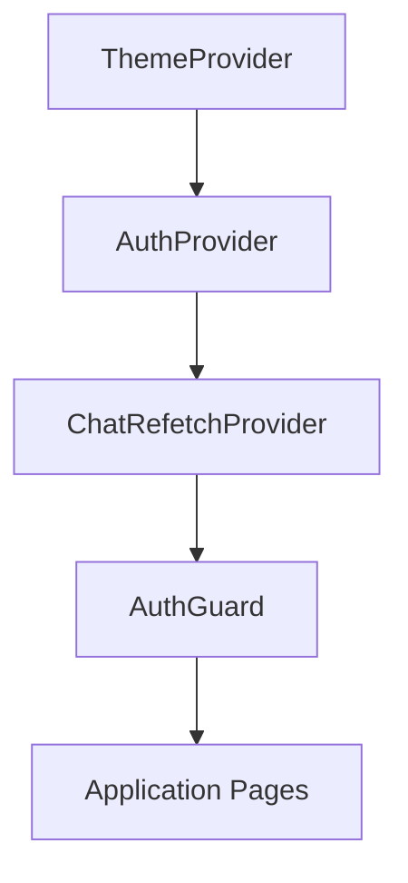

Inside the page shell, additional providers are mounted closer to the chat UI:

```tsx
// frontend/src/components/layout/ChatPageLayout.tsx
<ChatProvider models={models} workflows={workflows} initialChatId={initialChatId}>
  <ModalProvider>
    <SidebarProvider>
      <AppSidebar />
      <ChatContainer />
    </SidebarProvider>
  </ModalProvider>
</ChatProvider>
```

This ordering is not arbitrary. For example, `ChatProvider` calls `useAuth` internally, so it must be rendered **inside** `AuthProvider`. If it were not, `useAuth` would throw an error.

### Why This Pattern?

The provider tree solves a problem called **prop drilling** — passing data through many levels of components that do not need it. Without Context, if a deeply nested component needs the current user, you would have to pass `user` through every intermediate component. With Context, any component can access it directly via `useContext`.

```pseudocode
Without Context (prop drilling):
    App → Layout → Sidebar → UserMenu → Avatar
    (every component receives and passes 'user' prop)

With Context:
    AuthProvider provides 'user'
    Avatar calls useContext(AuthContext) directly
    (intermediate components are unaware of 'user')
```

**Prop drilling costs:**
- Boilerplate props passed through unrelated components.
- Tight coupling between layout and deeply nested features.
- Harder refactors (every layer must change when the prop changes).
- More re-render surfaces, because any parent prop change may cascade through unrelated components.

**HardWire’s shared state sources:**
- `AuthContext` for user/session state.
- `ChatContext` for chat state + SSE subscriptions.
- `WorkflowContext` for workflow builder state and proposals.
- `ChatRefetchContext` and `ModalContext` for cross-cutting triggers.

**When Context is not ideal:**
- If state changes very frequently (cursor positions, drag events), Context can cause excessive re-renders.
- In those cases, local state, memoization, or a dedicated store can provide finer-grained updates.

## 7.4 Context API vs Redux vs Other State Management

HardWire chose React's built-in Context API for state management. Here is why, compared to alternatives:

| Solution | Complexity | Performance | Boilerplate | Best For |
|---|---|---|---|---|
| **Context API** | Low | Good for infrequent updates | Minimal | Auth, theme, app-wide settings |
| **Redux** | High | Excellent (selective subscriptions) | High | Frequent updates, complex state logic |
| **Zustand** | Low | Excellent | Minimal | Medium complexity apps |
| **Jotai/Recoil** | Medium | Excellent (atomic) | Low | Fine-grained reactive state |

Context API's main limitation is that **all consumers re-render when the context value changes**, even if they only use a small part of the value. For data that changes rarely (auth state, theme), this is not a problem. For data that changes rapidly (e.g., cursor position, animations), Context would cause excessive re-renders.

HardWire's state profile — authentication, theme, and chat refetch triggers — is a perfect fit for Context. These values change infrequently (login/logout, theme toggle, new message received), so the re-render cost is negligible.

**Why not Redux/Zustand/Jotai here?**
- **Redux**: Great for large, frequently-updated state, but adds boilerplate and indirection that HardWire doesn’t need.
- **Zustand/Jotai**: Lightweight and powerful, but introduce another dependency and mental model when Context is sufficient.

**What you gain with Redux (and why HardWire skipped it):**
- Predictable state transitions (actions → reducers).
- Excellent DevTools and time-travel debugging.
- Selective subscriptions that can avoid unnecessary re-renders.
- Cost: more boilerplate, more files, and a more rigid architecture for a relatively small app.

**What you gain with Zustand/Jotai (and why HardWire skipped them):**
- Fine-grained subscriptions without Redux ceremony.
- Very small APIs and flexible store shapes.
- Cost: extra dependency, extra mental model, and fewer conventions for team consistency.

**Context tradeoffs and mitigations:**
- Tradeoff: Any context value change re-renders **all** consumers.
- Mitigation: Split contexts by domain (HardWire does this) and memoize provider values.
- Mitigation: Avoid putting extremely high-frequency data (e.g., mouse position) in Context.

> **Key Takeaway:** State management is not one-size-fits-all. Choose the simplest solution that meets your performance requirements. For HardWire's use case, Context API provides the right balance of simplicity and capability.

## 7.5 SSE Streaming: How EventSource Works

**Server-Sent Events (SSE)** is a web standard for pushing data from server to client over a single, long-lived HTTP connection. It is **one-way** (server → client) and uses the normal HTTP stack, which makes it simpler than WebSockets for streaming updates.

In HardWire, SSE is used for **workflow run streaming**. Chat token streaming uses a **POST + ReadableStream** approach because the backend needs a request body (EventSource only supports GET).

### The Protocol

SSE uses a simple text-based protocol over HTTP. The server returns `text/event-stream` and keeps the connection open, writing lines that start with `data:`. A blank line (`\n\n`) signals the end of a message.

```
HTTP/1.1 200 OK
Content-Type: text/event-stream
Cache-Control: no-cache
Connection: keep-alive

data: {"type": "snapshot", "stepId": "step-1", "status": "running"}

data: {"type": "snapshot", "stepId": "step-1", "status": "completed"}

data: {"type": "snapshot", "stepId": "step-2", "status": "running"}
```

Each message is prefixed with `data:` and separated by blank lines. The browser's `EventSource` API parses this automatically and emits a `MessageEvent` to your `onmessage` handler with the `data` string.

### Client-Side Implementation

The **EventSource** API is a browser-native class for SSE:

```ts
const streamUrl = `${API_BASE_URL}/api/chats/${run.chatId}/workflow-runs/${run.id}/stream`;
const eventSource = new EventSource(streamUrl, { withCredentials: true });

eventSource.onmessage = (event) => {
  const payload = JSON.parse(event.data);
  if (payload.type === "snapshot") {
    // Update workflow run state in the UI
  }
};

eventSource.onopen = () => {
  // Connection established
};

eventSource.onerror = () => {
  // Browser will attempt to reconnect automatically
  // You can call eventSource.close() to stop retrying
};
```

Key details:

- `withCredentials: true` sends cookies with the request, enabling authentication.
- `EventSource` automatically **reconnects** if the connection drops (built into the browser API). Its `readyState` transitions from `CONNECTING` → `OPEN`, and returns to `CONNECTING` on retry.
- Each message is a JSON snapshot of the current workflow run state.

### Server-Side Implementation (HardWire)

The workflow run stream endpoint is implemented in `backend/app/workflowRuns/workflowRuns.ctrl.ts` as `streamWorkflowRunHandler`:

```ts
res.setHeader("Content-Type", "text/event-stream");
res.setHeader("Cache-Control", "no-cache");
res.setHeader("Connection", "keep-alive");

const sendEvent = (payload: Record<string, unknown>) => {
  res.write(`data: ${JSON.stringify(payload)}\n\n`);
};
```

HardWire **polls the database** every second (`POLL_INTERVAL_MS = 1000`) and emits new snapshots if the workflow run state changed:

```ts
const snapshot = buildWorkflowRunSnapshot(normalizedSource);
sendEvent({ type: "snapshot", ...snapshot });
```

The stream ends when the run reaches a terminal status (`PASSED`, `FAILED`, `CANCELLED`). The handler sends a `complete` event and calls `res.end()` after either:
- A final assistant message is present, or
- A 15-second grace window elapses (`TERMINAL_GRACE_MS = 15000`).

Errors are emitted as `type: "error"` events and the stream is closed immediately. On client disconnect, the backend stops polling via `req.on("close", ...)`.

### SSE vs WebSockets

| Feature | SSE | WebSocket |
|---|---|---|
| Direction | Server → Client only | Bidirectional |
| Protocol | HTTP | WS (separate protocol) |
| Reconnection | Automatic | Manual |
| Browser support | Universal | Universal |
| Complexity | Low | Higher |
| Use case | Notifications, live feeds | Chat, gaming, collaborative editing |

HardWire uses SSE because workflow updates flow in only one direction: from the server (which is running the workflow) to the client (which is displaying progress). Bidirectional communication is not needed here.

## 7.6 The Chat Flow

This section explains **which components participate** and how a single message travels from the UI to the backend and back to the UI.

**Key frontend pieces:**
- `ChatInput` (`frontend/src/components/chat/ChatInput.tsx`) captures user input and triggers `sendMessage`.
- `ChatContext` (`frontend/src/contexts/ChatContext.tsx`) owns chat state and orchestrates API calls and streaming.
- `ChatContainer` + `ChatMessage` (`frontend/src/components/chat/ChatContainer.tsx`, `ChatMessage.tsx`) render the message list and workflow run panels.

Let us trace the complete lifecycle of a chat message:

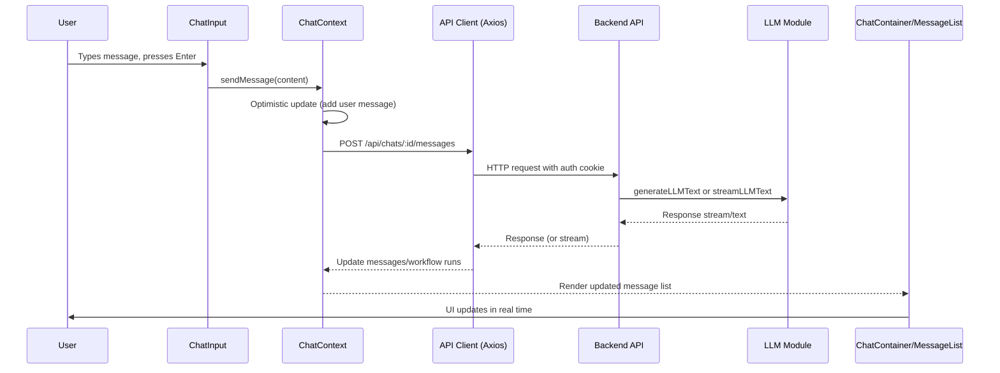

**What “ChatContainer/MessageList” means:** this is the combination of `ChatContainer`, `ChatMessage`, and `WorkflowRunPanel`, which render the list of messages and any workflow run panels anchored to them.

**Optimistic updates:** The user's message appears immediately (before the server confirms it). This makes the interface feel responsive even with latency.

### Two Execution Paths: Workflow vs. Plain Chat

**Workflow selected (non-streaming request):** `ChatContext.sendMessage` calls `createMessage` from `frontend/src/lib/api/chats.ts`. If the response includes a `workflowRunId`, `ChatContext` creates a `WorkflowRunState`, stores it, and starts the SSE stream via `startWorkflowStream`. The UI renders `WorkflowRunPanel` entries under the relevant message.

**No workflow selected (streaming tokens):** the frontend sends a **POST** to `/api/chats/:id/messages/stream` using `fetch`, because `EventSource` does not support POST bodies. `ChatContext` reads the response stream and parses `data:` lines manually. Token events incrementally update the assistant message as it streams in.

### Why This Matters

The distinction explains why you see **two streaming mechanisms** in the codebase:
- **EventSource** for workflow run status (SSE, GET).
- **ReadableStream + manual SSE parsing** for chat token streaming (POST).

## 7.7 The Workflow Builder UI Flow

The workflow builder is a **three-column** interface that combines a workflow list, a workflow chat (for natural-language edits), and a step list. It lives in:
- `frontend/src/components/layout/WorkflowsPageLayout.tsx`
- `frontend/src/components/workflows/*`
- `frontend/src/contexts/WorkflowContext.tsx`

### UI Layout (WorkflowsPageLayout)

`WorkflowsPageLayout` renders a three-column layout:
- **Left:** `WorkflowList` (pick or create workflows).
- **Middle:** `WorkflowChat` (describe edits, view proposals).
- **Right:** `WorkflowStepsPanel` (view steps, prompts, tools).

This layout is assembled here:

```tsx
// frontend/src/components/layout/WorkflowsPageLayout.tsx
<WorkflowList ... />
<WorkflowChat className="flex-1 min-h-0" />
<WorkflowStepsPanel workflow={selectedWorkflow} />
```

### Data Flow (WorkflowContext)

`WorkflowContext` is the orchestration layer. It loads workflows, fetches details when a workflow is selected, and manages chat/proposal state.

Key responsibilities:
- **Load workflow list**: `useWorkflows` hook provides the base list.
- **Load full workflow details**: `getWorkflowByIdApi` fetches steps when a workflow is selected and its steps are empty.
- **Load workflow chat**: `getWorkflowChatMessages` populates the chat history and proposals.
- **Send chat messages**: `sendWorkflowChatMessage` calls `sendWorkflowChatMessageApi`.
- **Apply/reject proposals**: `applyWorkflowChatProposalApi` and `rejectWorkflowChatProposalApi`.

### End-to-End Flow

```pseudocode
1. User navigates to /workflows/:workflowId
2. WorkflowsPageLayout renders the three-column UI
3. WorkflowProvider loads workflow list and selects initial workflow
4. On select:
   a. getWorkflowByIdApi loads steps
   b. getWorkflowChatMessages loads chat + proposals
5. User sends a chat message in WorkflowChat
6. sendWorkflowChatMessageApi returns:
   a. assistant response
   b. proposal (tool calls + preview steps)
7. User applies or rejects the proposal
8. Steps panel updates after applied changes
```

### Draft Workflows (Local-Only First)

When a user creates a new workflow, the UI starts with a **draft** workflow (local ID prefixed with `draft-`). On the first chat message, the draft is persisted via `createWorkflowApi`, and the URL is updated to the real workflow ID.

```pseudocode
1. User navigates to /workflows/:workflowId
2. Page fetches workflow data (steps, edges, metadata)
3. DAG is rendered as a visual graph
4. User can:
    a. Click a step to view/edit its details
    b. Use the chat panel to describe changes in natural language
    c. Manually add/remove steps through UI controls
5. Changes are sent to the backend as workflow version updates
6. When user runs the workflow:
    a. SSE connection is established
    b. Step-by-step execution is streamed back
    c. Each step's status updates in real-time on the DAG visualization
```

## 7.8 The API Client Pattern

HardWire uses **Axios** — a popular HTTP client library — wrapped in a configured instance. The shared client lives in `frontend/src/lib/api-client.ts` and is imported by every API module under `frontend/src/lib/api/*`.

```ts
export const apiClient = axios.create({
    baseURL: API_BASE_URL,
    headers: { "Content-Type": "application/json" },
    withCredentials: true,
});
```

### Request Interceptor

Before every request, the interceptor is a hook point. In the current code it **does not** add tokens or mutate the request — it simply returns the config unchanged:

```ts
apiClient.interceptors.request.use((config) => {
    return config;
});
```

### Response Interceptor

After every response, the interceptor is another hook point. In the current code it **passes successful responses through** and does not actively handle errors beyond returning the rejected Promise:

```ts
apiClient.interceptors.response.use(
    (response) => response,   // Success: pass through
    (error) => {
        // Placeholder for global error handling (401, 403, etc.)
        return Promise.reject(error);
    }
);
```

The `withCredentials: true` setting is essential — it tells Axios to include cookies with every request. Without this, the session cookie would not be sent, and every request would fail authentication.

### How Components Use the API Client

API modules wrap the `apiClient` into domain-specific functions. For example:

```ts
// frontend/src/lib/api/chats.ts
export async function createMessage(chatId: string, data: CreateMessageRequest) {
  const response = await apiClient.post(`/api/chats/${chatId}/messages`, data);
  return response.data;
}
```

Components do **not** call Axios directly. They call these API functions from Contexts or hooks. Example usage in `ChatContext`:

```ts
// frontend/src/contexts/ChatContext.tsx
const response = await createMessage(chatIdForRequest, {
  content: content.trim(),
  modelId: selectedModel.id,
  userId: user.id,
  workflowId: selectedWorkflow,
});
```

This pattern keeps HTTP details centralized and makes it easy to change base URLs, headers, or auth behavior in one place.

> **Key Takeaway:** The API client pattern centralizes HTTP configuration (base URL, headers, credentials, error handling) in one place. Instead of configuring every `fetch` call individually, every component uses the same pre-configured `apiClient`.

## 7.9 Auth Flow on the Frontend

HardWire's authentication uses **BetterAuth**, a modern auth library that supports email/password and OAuth. The frontend integrates via `better-auth/react` in `frontend/src/lib/auth-client.ts`.

```ts
// frontend/src/lib/auth-client.ts
export const authClient = createAuthClient({
  baseURL: process.env.NEXT_PUBLIC_API_URL ?? "http://localhost:3026",
  fetchOptions: { credentials: "include" },
});

export const { signIn, signUp, signOut, useSession, sendVerificationEmail } = authClient;
```

### AuthProvider

The `AuthProvider` component wraps the entire application and exposes auth state. It lives at `frontend/src/contexts/AuthContext.tsx` and is mounted in `frontend/src/app/layout.tsx`.

Key behaviors:
- `useSession()` queries the backend for the current session and returns `{ data, isPending, refetch }`.
- The provider derives a `user` object from the session and exposes `isAuthenticated` and `isLoading`.
- `signOut` calls `authClient.signOut` and then redirects to `/login`.
- Profile updates call BetterAuth methods like `authClient.updateUser` and `authClient.changeEmail`.

### AuthGuard

The `AuthGuard` component sits inside `AuthProvider` and gates access:

```ts
const PUBLIC_ROUTES = ["/login", "/signup", "/verify-email"];

if (isLoading) showSpinner();
if (!isAuthenticated && !isPublicRoute) router.replace("/login");
if (isAuthenticated && onLoginOrSignup) router.replace("/");
```

This ensures that no protected page ever renders for an unauthenticated user.

### Auth Methods

| Method | Flow |
|---|---|
| **Email/Password** | Register → Email verification → Login → Session cookie |
| **Google OAuth** | Click "Sign in with Google" → OAuth redirect → Callback → Session cookie |

Both methods result in a **session cookie** being set by the server. All subsequent API requests include this cookie automatically (thanks to `withCredentials: true`).

### Frontend Auth Flow (End-to-End)

```pseudocode
1. App loads → AuthProvider calls useSession()
2. If session exists:
   a. user is derived from session
   b. isAuthenticated = true
3. AuthGuard checks route:
   a. If protected and not authenticated → redirect to /login
   b. If authenticated and on /login or /signup → redirect to /
4. API calls use Axios with credentials included
5. signOut clears the session via BetterAuth and redirects to /login
```

## 7.10 Design System: Swiss-Modernist Principles

HardWire's frontend follows **Swiss-Modernist** design principles, a design philosophy originating from the Swiss International Typographic Style of the 1950s-60s. The key characteristics are:

1. **No rounded corners**: All elements use sharp, geometric edges.
2. **No shadows**: Depth is communicated through borders, spacing, and color contrast.
3. **Grid-based layout**: All elements align to a strict grid system.
4. **Limited color palette**: A small number of well-chosen colors.
5. **Strong typography**: Clean, sans-serif fonts with clear hierarchy.

### CSS Variables

HardWire uses CSS custom properties (variables) for theming:

```pseudocode
:root {
    --color-primary: #000000;
    --color-background: #ffffff;
    --color-text: #1a1a1a;
    --color-border: #e0e0e0;
    --color-accent: #0066ff;

    --spacing-xs: 4px;
    --spacing-sm: 8px;
    --spacing-md: 16px;
    --spacing-lg: 24px;
    --spacing-xl: 32px;

    --font-family: 'Inter', sans-serif;
    --font-size-sm: 13px;
    --font-size-md: 15px;
    --font-size-lg: 18px;
}

[data-theme="dark"] {
    --color-primary: #ffffff;
    --color-background: #0a0a0a;
    --color-text: #e0e0e0;
    --color-border: #333333;
}
```

By changing the values of these variables (e.g., swapping to dark theme), the entire application's appearance changes instantly without modifying any component code.

### Component Organization

Components are organized by domain:

```
frontend/src/components/
├── auth/           → Login, Register, AuthGuard
├── chat/           → ChatView, ChatInput, MessageList
├── workflows/      → WorkflowBuilder, StepEditor, DAGView
├── layout/         → Sidebar, Header, Footer
├── settings/       → UserSettings, ModelPreferences
├── search/         → SearchBar, SearchResults
└── ui/             → Button, Input, Modal, Toast (primitives)
```

The `ui/` directory contains **primitive components** — generic, reusable building blocks. The domain directories contain **feature components** that compose primitives into specific interfaces.

> **Key Takeaway:** A design system is not just about aesthetics — it is a technical architecture. CSS variables enable theming without code changes. Domain-organized components keep the codebase navigable. Sharp geometric design is a deliberate choice, not a lack of polish.

---

## Study Questions

1. Explain the difference between props and state in React. Give an example of each.
2. What is the Virtual DOM, and why does React use it instead of manipulating the real DOM directly?
3. In Next.js App Router, how does file-based routing work? How are dynamic route segments denoted?
4. What is the difference between Server Components and Client Components in Next.js 15?
5. Why does HardWire nest its Context Providers in the specific order shown? What would break if AuthProvider were placed outside ThemeProvider?
6. Compare SSE and WebSockets. Why did HardWire choose SSE for workflow streaming?
7. What is an optimistic update? Why does the chat flow use one?
8. Explain the purpose of Axios interceptors. What happens when a 401 response is received?
9. Describe the AuthGuard pattern. What are the three possible states it handles?
10. What are CSS variables, and how do they enable dark mode without changing component code?

---

# Chapter 8: MCP Tools Server (Deep Dive)

## 8.1 What Is MCP (Model Context Protocol)?

The **Model Context Protocol (MCP)** is a standardized protocol for connecting AI models to external tools and data sources. Think of MCP as a "USB port for AI" — just as USB provides a standard way for any device to connect to any computer, MCP provides a standard way for any AI model to use any tool.

In the context of HardWire, the MCP Tools Server is a separate service that manages a registry of **tools** — functions that can interact with external systems like APIs, databases, file systems, and web services. When a workflow step needs to perform an action (send an email, query a database, call an API), it does so through the MCP Tools Server.

**Where this lives in the repo:**
- `mcp-tools-server/index.ts` boots the HTTP server on port `4010`.
- `mcp-tools-server/server/server.app.ts` wires middleware, auth, and routes.
- `mcp-tools-server/app/v0/tools/*` handles the MCP `listTools`, `searchTools`, `getTool`, `runTool` requests.
- `mcp-tools-server/data/tools.json` is the tool registry (names, schemas, versions).
- `backend/lib/mcpToolsServer/*` is the backend client that calls the MCP server.

**Server wiring (real code):**

```ts
// mcp-tools-server/server/server.app.ts
export const app = http.createServer(expressApp);
expressApp.use(express.json());
expressApp.use('/', serviceAuth, apiRouter);
```

### Why a Standard Protocol?

Without a standard protocol, every tool integration would require custom code:

```pseudocode
Without MCP:
    if (tool === 'slack') { callSlackAPI(...) }
    else if (tool === 'github') { callGitHubAPI(...) }
    else if (tool === 'jira') { callJiraAPI(...) }
    // Every new tool = new code

With MCP:
    mcpClient.runTool({ toolName, params })
    // Every new tool = new registry entry, same code
```

MCP provides:
- A **discovery** mechanism (list available tools, search for tools)
- A **schema** for each tool (what inputs it expects, what outputs it produces)
- A **standard execution** interface (call any tool the same way)
- A **standard error** format

## 8.2 Why Isolate Tool Execution?

HardWire runs its MCP Tools Server as a **separate service** from the main backend. This isolation is a deliberate architectural decision with several benefits:

### Security (Blast Radius)

Tools execute arbitrary operations — HTTP requests to external APIs, file system access, database queries. If a tool has a bug or is exploited, the damage is contained within the tools server. The main backend (which handles user data, authentication, and workflow logic) is unaffected.

```
Without isolation:
    ┌─────────────────────────────────────────┐
    │            Monolithic Backend             │
    │  User Data + Auth + Workflows + Tools    │
    │  (A tool bug can access everything)      │
    └─────────────────────────────────────────┘

With isolation:
    ┌────────────────────────┐    ┌──────────────────┐
    │     Main Backend       │    │   Tools Server    │
    │  User Data + Auth +    │◄──►│   Tool execution  │
    │  Workflows             │    │   (sandboxed)     │
    └────────────────────────┘    └──────────────────┘
```

### Auditability

All tool executions go through a single gateway (the MCP request function), making it straightforward to log every tool call, its parameters, and its results. This creates an audit trail for debugging and compliance.

### Independent Scaling

Tool execution may have very different resource requirements than the main backend. Some tools might be CPU-intensive (data processing), others might be I/O-intensive (waiting for external APIs). Running them as a separate service allows independent scaling.

### Independent Deployment

The tools server can be updated, restarted, or rolled back without affecting the main backend. New tools can be added without deploying the main application.

**How the services connect (real paths):**
- Backend client: `backend/lib/mcpToolsServer/mcpToolsServer.request.ts`
- MCP route: `mcp-tools-server/app/v0/tools/tools.router.ts` (POST `/mcp`)

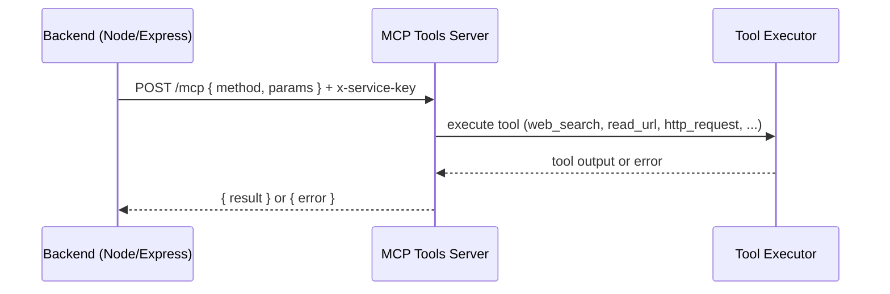

> **Key Takeaway:** Service isolation is about managing risk. By separating tool execution into its own service, HardWire limits the impact of tool failures, simplifies auditing, and enables independent scaling and deployment.

## 8.3 The JSON-RPC-Like Protocol

HardWire's MCP communication uses a protocol inspired by **JSON-RPC**, but the exact request/response shapes are defined in code. The MCP server exposes a **single** HTTP endpoint (`POST /mcp`) and switches on a `method` field.

**Request shape (real type):**

```ts
// mcp-tools-server/app/v0/tools/tools.types.ts
export interface MCPRequestBody {
  method: 'listTools' | 'searchTools' | 'getTool' | 'runTool';
  params: ListToolsParams | SearchToolsParams | GetToolParams | RunToolParams;
}
```

**Controller dispatch (real code):**

```ts
// mcp-tools-server/app/v0/tools/tools.ctrl.ts
if (method === 'listTools') return listToolsHelper(params);
if (method === 'searchTools') return searchToolsHelper(params);
if (method === 'getTool') return getToolHelper(params);
if (method === 'runTool') return runToolHelper(params);
```

**Concrete examples:**

```ts
// List tools (pagination)
{ method: "listTools", params: { cursor: "0", limit: 50 } }

// Run a tool
{ method: "runTool", params: { id: "tool_web_search", version: "1.0.0", input: { query: "SSE protocol" } } }
```

If the method is unknown, the server returns `MCPMethodNotFound` (a `ResourceError`) with a 400 status.

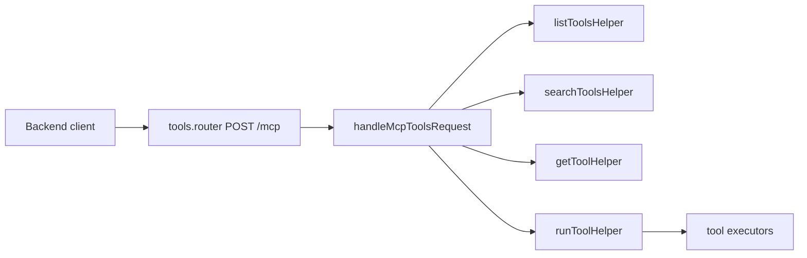

## 8.4 Service Authentication

The MCP Tools Server authenticates requests using an **API key** sent in the `x-service-key` HTTP header. The check is enforced in `mcp-tools-server/middleware/serviceAuth.ts`:

```ts
const serviceKey = process.env.MCP_TOOLS_API_KEY ?? '';
const headerKey = req.header('x-service-key') ?? '';
if (serviceKey && headerKey !== serviceKey) {
  return res.status(401).json(new UnauthorizedError());
}
```

This is a **service-to-service** authentication pattern. Unlike user authentication (which uses cookies and sessions), this is a shared secret known only to the main backend and the tools server. It prevents unauthorized services from executing tools.

Why an API key and not something more sophisticated (like OAuth or mTLS)?

| Approach | Complexity | Security | Use Case |
|---|---|---|---|
| API Key | Low | Moderate (rotate regularly) | Internal service-to-service |
| OAuth 2.0 | High | High | Third-party integrations |
| mTLS | High | Very High | Zero-trust environments |

For internal service communication within a private network (VPC), an API key stored in Secrets Manager provides adequate security with minimal complexity.

## 8.5 Tool Lifecycle

A tool in HardWire goes through a defined lifecycle:

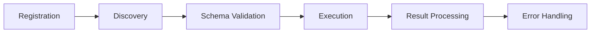

### Stage 1: Registration

Tools are registered in the MCP Tools Server's registry file: `mcp-tools-server/data/tools.json`. Each entry includes an ID, name, JSON schema, and version.

```json
{
  "id": "tool_web_search",
  "name": "web_search",
  "description": "Search the web for information",
  "schema": {
    "type": "object",
    "properties": { "query": { "type": "string" }, "limit": { "type": "number" } },
    "required": ["query"],
    "additionalProperties": false
  },
  "version": "1.0.0"
}
```

### Stage 2: Discovery

The MCP server loads tools from `tools.json` and exposes discovery via `listTools` and `searchTools` in `mcp-tools-server/app/v0/tools/tools.service.ts`.

### Stage 3: Schema Validation

Schema validation happens **upstream** in the backend when tools are constructed for LLM use. `buildRuntimeTools` in `backend/lib/workflowRunner.ts` converts the tool's JSON schema to an AI SDK `inputSchema` via `jsonSchema(...)`. This constrains what the model is allowed to call. The MCP server itself trusts the inputs and executes the tool.

### Stage 4: Execution

The tool's function is invoked with the validated parameters. This may involve HTTP calls to external APIs, database queries, or any other operation.

In HardWire, `runToolHelper` in `mcp-tools-server/app/v0/tools/tools.helper.ts` dispatches by tool name:

```ts
if (tool.name === "web_search") return executeWebSearch(input);
if (tool.name === "read_url") return executeReadUrl(input);
if (tool.name === "http_request") return executeHttpRequest(input);
if (tool.name === "summarize") return executeSummarize(input);
if (tool.name === "extract_json") return executeExtractJson(input);
```

### Stage 5: Result Processing

The tool's output is captured and returned in a standard format. This includes both the result data and metadata (execution time, status).

### Stage 6: Error Handling

If any stage fails, a structured `ResourceError` is returned. MCP-specific errors live in `mcp-tools-server/app/v0/tools/tools.errors.ts`:

```ts
export class MCPMethodNotFound extends ResourceError { /* code: MCP_METHOD_NOT_FOUND */ }
export class MCPToolNotFound extends ResourceError { /* code: MCP_TOOL_NOT_FOUND */ }
export class MCPToolExecutionFailed extends ResourceError { /* code: MCP_TOOL_EXECUTION_FAILED */ }
```

## 8.6 The Typed Request Client

HardWire wraps all MCP communication in a typed request function that enforces type safety and handles errors consistently. The real implementation is `backend/lib/mcpToolsServer/mcpToolsServer.request.ts`:

```ts
const axiosInstance = axios.create({
  headers: { "Content-Type": "application/json", "x-service-key": getServiceKey() },
  baseURL: process.env.MCP_TOOLS_URL ?? "http://localhost:4010",
});

const mcpToolsRequest = async <T>(payload: MCPRequestParams<unknown>) => {
  if (process.env.IS_INTEGRATION_TESTING === "true") {
    return success({} as T);
  }

  const requestId = getCurrentRequestId();
  const headers = requestId ? { "x-request-id": requestId } : {};
  const response = await axiosInstance.post<MCPResponse<T>>("/mcp", payload, { headers });
  return success(response.data.result);
};
```

This function uses TypeScript generics (`<T>`) so that each call site knows the exact type of the result. The convenience wrappers provide even more type safety:

```ts
export const listMcpTools = async (params) =>
    mcpToolsRequest<MCPListToolsResponse>({
        method: 'listTools',
        params,
    });

export const searchMcpTools = async (params) =>
    mcpToolsRequest<MCPSearchToolsResponse>({
        method: 'searchTools',
        params,
    });

export const getMcpTool = async (params) =>
    mcpToolsRequest<MCPGetToolResponse>({
        method: 'getTool',
        params,
    });

export const runMcpTool = async (params) =>
    mcpToolsRequest<MCPRunToolResponse>({
        method: 'runTool',
        params,
    });
```

Each wrapper specifies the exact response type (`MCPListToolsResponse`, `MCPRunToolResponse`, etc.), giving the caller type-safe access to the result fields without any casting or runtime checks.

When the MCP server returns an error code, the client maps it to a `ResourceError` subtype (`MCPMethodNotFound`, `MCPToolNotFound`, `MCPToolExecutionFailed`) in `backend/lib/mcpToolsServer/mcpToolsServer.request.ts`, preserving consistent error handling throughout the backend.

The `Either<ResourceError, T>` return type means every call site is forced to handle both success and error cases. This eliminates the common bug pattern of assuming an API call always succeeds.

## 8.7 Tool Safety

Executing arbitrary external operations introduces security risks. HardWire mitigates these through multiple layers:

### Host Allowlists

Tools that make HTTP requests are restricted to a list of approved hosts. The allowlist is read from `MCP_HTTP_REQUEST_ALLOWLIST` and enforced in `mcp-tools-server/app/v0/tools/tools.executors.ts`.

```pseudocode
Allowed hosts: ["api.slack.com", "api.github.com", "hooks.zapier.com"]

Tool request to "api.slack.com/messages" → ALLOWED
Tool request to "evil-server.com/steal-data" → BLOCKED
```

The enforcement logic also blocks private IPs and `localhost` by default:

```ts
if (!isHostAllowed(parsed.hostname)) {
  throw new MCPToolExecutionFailed();
}
```

### Schema Validation

Schema constraints are enforced in the backend when tools are exposed to the LLM. `buildRuntimeTools` wraps each MCP tool with an AI SDK `inputSchema` derived from the tool's JSON schema. That means the **model** is constrained to valid inputs before the MCP server is called. The MCP server itself trusts inputs and executes.

### Execution Timeouts

Tools are given a maximum execution time. `fetchWithTimeout` uses `AbortController` with a default timeout of `8000ms` to avoid hanging requests.

**Tool executor specifics (real behaviors):**
- `executeWebSearch` scrapes DuckDuckGo HTML (`https://duckduckgo.com/html/`) and extracts titles/snippets.
- `executeReadUrl` fetches a URL, strips HTML, and truncates to `maxChars`.
- `executeHttpRequest` enforces allowed hosts, request timeouts, and response size limits.
- `executeSummarize` and `executeExtractJson` run locally and do not call external services.

## 8.8 Runtime Tools for Workflow Execution

When a workflow runs, the workflow runner needs to provide tools to each step that requires external operations. The `buildRuntimeTools` function dynamically constructs a tool set based on the step's configuration:

```ts
// backend/lib/workflowRunner.ts
tools[toolName] = tool({
  description: toolRecord.description ?? toolName,
  inputSchema: jsonSchema(toolRecord.schema as Record<string, unknown>),
  outputSchema: jsonSchema({ type: "object", additionalProperties: true }),
  execute: async (input: Record<string, unknown>) => {
    const runResult = await runMcpTool({ id: toolRecord.id, version: toolRecord.version, input });
    if (runResult.isError()) {
      return { error: true, message: runResult.value.message, code: runResult.value.code, toolName };
    }
    return runResult.value.output;
  },
});
```

This is a **factory pattern** — `buildRuntimeTools` creates tool objects on-the-fly, tailored to the specific step's needs. A step that sends emails gets email tools. A step that queries databases gets database tools. No step gets tools it does not need (principle of least privilege).

Tool failures do **not** throw. The runtime tool returns a structured error object instead, allowing the LLM to decide how to proceed. This behavior is visible in `backend/lib/workflowRunner.ts`.

**MCP tools in the database:** The canonical MCP tools are synced into the `tools` table by migration `backend/migrations/1770245017633_sync-mcp-tools.ts`, which upserts `web_search`, `read_url`, `http_request`, `summarize`, and `extract_json`. This keeps the workflow system’s tool list aligned with the MCP server registry.

```mermaid
graph TD
    A[Workflow Step] --> B[buildRuntimeTools]
    B --> C{Step needs which tools?}
    C -->|web| D[web_search]
    C -->|read| E[read_url]
    C -->|http| F[http_request]
    C -->|summarize| I[summarize]
    C -->|extract| J[extract_json]
    D --> G[Runtime Tool Set]
    E --> G
    F --> G
    I --> G
    J --> G
    G --> H[Step Execution]
```

## 8.9 Tradeoff Analysis

### Separate Service vs Embedded Tools

| Dimension | Separate Service (HardWire's choice) | Embedded in Backend |
|---|---|---|
| **Isolation** | Strong (separate process) | Weak (shared process) |
| **Latency** | Higher (network hop) | Lower (in-process call) |
| **Deployment** | Independent | Coupled |
| **Complexity** | Higher (need protocol, auth) | Lower |
| **Scaling** | Independent | Must scale together |
| **Debugging** | Harder (distributed tracing) | Easier (single stack trace) |

For a production system like HardWire where tools interact with external services and handle potentially sensitive operations, the isolation benefits outweigh the added complexity.

### HTTP vs gRPC

| Dimension | HTTP/JSON (HardWire's choice) | gRPC |
|---|---|---|
| **Serialization** | JSON (human-readable) | Protobuf (binary, compact) |
| **Performance** | Good | Better (smaller payloads, HTTP/2) |
| **Schema** | Ad-hoc (TypeScript types) | Strict (.proto files) |
| **Tooling** | Universal (curl, Postman) | Specialized |
| **Streaming** | SSE (one-direction) | Bidirectional |
| **Learning curve** | Low | Medium |

HardWire chose HTTP/JSON because tool calls are relatively infrequent (not high-throughput), human readability aids debugging, and the team's existing infrastructure (Axios, Express) already supports it. For a system handling thousands of tool calls per second, gRPC would be worth the added complexity.

> **Key Takeaway:** MCP provides a standardized, secure, and extensible way to connect AI models to external tools. By isolating tool execution in a separate service and using a well-defined protocol, HardWire can add new tools without modifying the core backend, and can audit and secure all tool operations through a single gateway.

---

## Study Questions

1. What is MCP, and what problem does it solve? Draw an analogy to a real-world concept.
2. List three benefits of isolating tool execution in a separate service.
3. Explain the JSON-RPC-like protocol used by HardWire's MCP Tools Server. What are the four methods?
4. Why does HardWire use an API key for service authentication rather than OAuth?
5. Describe the six stages of the tool lifecycle.
6. What is the `Either<ResourceError, T>` return type, and why is it used for MCP requests?
7. What are host allowlists, and what attack do they prevent?
8. How does `buildRuntimeTools` implement the principle of least privilege?
9. Compare the tradeoffs between running tools as a separate service vs embedding them in the backend.
10. Under what circumstances would you switch from HTTP/JSON to gRPC for the MCP protocol?

---

# Chapter 9: Infrastructure (Deep Dive)

**Note:** This chapter describes the **AWS reference architecture** in `infrastructure/`. The live HardWire demo is deployed on Railway.

## 9.0 Current Deployment (Railway)

The live demo runs on Railway, and the canonical deployment details live in `infrastructure/README.md`. The AWS Terraform is a **reference architecture**, not the live deployment.

**Railway service map (from `infrastructure/README.md`):**

| Service | Root Dir | Build | Start | Public Domain |
|---|---|---|---|---|
| backend | `/backend` | Dockerfile | Dockerfile CMD | `api.hardwire.branmcf.com` |
| frontend | `/frontend` | Dockerfile | Dockerfile CMD | `app.hardwire.branmcf.com` |
| marketing | `/marketing` | `npm run build` | `npm run preview -- --host 0.0.0.0 --port $PORT` | `hardwire.branmcf.com` |
| docs | `/docs` | `mkdocs build` | `python -m http.server $PORT -d build` | `docs.hardwire.branmcf.com` |
| mcp-tools | `/mcp-tools-server` | Dockerfile | Dockerfile CMD | private |

## 9.1 What Is Infrastructure as Code (IaC)?

**Infrastructure as Code (IaC)** is the practice of managing and provisioning computing infrastructure through machine-readable configuration files rather than through manual processes (like clicking through a cloud provider's web console).

Consider the difference:

```pseudocode
Manual approach:
    1. Log into AWS Console
    2. Click "Create VPC"
    3. Fill in CIDR block: 10.0.0.0/16
    4. Click "Create Subnet"
    5. Fill in details...
    6. (30 more clicks)
    7. Hope you remember all the settings next time

IaC approach:
    1. Write a configuration file describing the VPC
    2. Run `terraform apply`
    3. All resources are created automatically
    4. Configuration file is version-controlled in Git
    5. Next time: run the same file, get the same infrastructure
```

IaC provides three critical benefits:

1. **Reproducibility**: The same configuration always produces the same infrastructure.
2. **Version control**: Infrastructure changes are tracked in Git, with diffs and rollback capability.
3. **Documentation**: The configuration file IS the documentation of what infrastructure exists.

## 9.2 What Is Terraform?

**Terraform** is the most widely used IaC tool, created by HashiCorp. It uses a declarative language called **HCL (HashiCorp Configuration Language)** to define infrastructure.

### Core Concepts (with real files)

**Providers** live in `infrastructure/environments/prod/main.tf`:

```hcl
provider "aws" {
  region = var.aws_region
  default_tags {
    tags = {
      Environment = var.environment
      Project     = var.project_name
      ManagedBy   = "terraform"
    }
  }
}
```

**Resources** are declared in the same directory. Example VPC from `infrastructure/environments/prod/main.tf`:

```hcl
resource "aws_vpc" "main" {
  cidr_block           = var.vpc_cidr
  enable_dns_support   = true
  enable_dns_hostnames = true
  tags = { Name = "${var.environment}-${var.project_name}-vpc" }
}
```

**State**: A JSON file that tracks the mapping between your configuration and real infrastructure. Terraform uses this to know what exists, what needs to be created, updated, or destroyed.

**Plan/Apply**: The two-phase workflow:

```pseudocode
terraform plan   → Shows what changes will be made (dry run)
terraform apply  → Actually creates/modifies/destroys resources
```

This two-phase approach is a safety mechanism. You always see what will happen before it happens.

```mermaid
graph LR
    A[Write HCL] --> B[terraform plan]
    B --> C{Review changes}
    C -->|Approve| D[terraform apply]
    C -->|Reject| A
    D --> E[Infrastructure created]
    E --> F[State file updated]
```

## 9.3 Networking Fundamentals

Before examining HardWire's infrastructure, you need to understand several networking concepts. These are presented from scratch, assuming no prior knowledge.

### VPC (Virtual Private Cloud)

A **VPC** is your own private, isolated section of a cloud provider's network. Think of it as renting a floor in an office building — you control what rooms exist, who can enter, and how they connect to each other, but the building (AWS) manages the physical infrastructure.

Every VPC has a **CIDR block** — an IP address range that defines how many IP addresses are available. For example, `10.0.0.0/16` provides 65,536 IP addresses.

### Subnets

**Subnets** are subdivisions of a VPC. They serve two purposes:

1. **Network segmentation**: Separating resources that should and should not be accessible from the internet.
2. **Availability zones**: Distributing resources across physically separate data centers for resilience.

There are two types:

- **Public subnets**: Have a route to the Internet Gateway. Resources here can be reached from the internet.
- **Private subnets**: No direct route to the internet. Resources here are hidden from the outside world.

### Internet Gateway

An **Internet Gateway** is a VPC component that allows resources in public subnets to communicate with the internet. It is like the front door of the building.

### NAT Gateway

A **NAT (Network Address Translation) Gateway** allows resources in private subnets to make outbound requests to the internet (e.g., downloading software updates, calling external APIs) WITHOUT being accessible from the internet. It is like a one-way mirror — you can look out but nobody can look in.

```
Internet
    │
    ▼
┌──────────────────────────────────────────────────┐
│                 Internet Gateway                   │
└───────────────┬──────────────────┬───────────────┘
                │                  │
    ┌───────────▼──────┐  ┌───────▼──────────┐
    │   Public Subnet   │  │  Public Subnet    │
    │   (AZ-1)          │  │  (AZ-2)           │
    │   NAT Gateway     │  │                   │
    └───────────┬──────┘  └──────────────────┘
                │
    ┌───────────▼──────┐  ┌──────────────────┐
    │  Private Subnet   │  │  Private Subnet   │
    │  (AZ-1)           │  │  (AZ-2)           │
    │  RDS, Redis       │  │  RDS replica      │
    └──────────────────┘  └──────────────────┘
```

> **Key Takeaway:** Networking in the cloud is about controlling access. Public subnets face the internet; private subnets are hidden behind NAT gateways. Databases and caches go in private subnets because they should never be directly accessible from the internet.

## 9.4 HardWire's Network Topology

HardWire's infrastructure spans two **Availability Zones (AZs)** — physically separate data centers within the same region. This provides resilience: if one AZ experiences an outage, the other continues operating.

```mermaid
graph TB
    Internet[Internet] --> Backend[App Runner - backend]
    Internet --> Frontend[App Runner - frontend]
    Internet --> MCP[App Runner - mcp-tools]

    Backend --> VPCConnector["aws_apprunner_vpc_connector.main"]

    subgraph VPC ["aws_vpc.main (10.0.0.0/16)"]
        IGW["aws_internet_gateway.main"] --> PubOne["aws_subnet.public_one"]
        IGW --> PubTwo["aws_subnet.public_two"]

        PubOne --> NATOne["aws_nat_gateway.one"]
        PubTwo --> NATTwo["aws_nat_gateway.two"]

        VPCConnector --> PrivOne["aws_subnet.private_one"]
        VPCConnector --> PrivTwo["aws_subnet.private_two"]

        NATOne --> PrivOne
        NATTwo --> PrivTwo

        PrivOne --> RDS[(aws_db_instance.postgres)]
        PrivTwo --> RDS
        PrivOne --> Redis[(aws_elasticache_cluster.redis)]
        PrivTwo --> Redis
    end
```

## 9.5 What Is App Runner?

**AWS App Runner** is a fully managed service for running containerized web applications. It handles provisioning, scaling, load balancing, and TLS termination automatically.

In the AWS reference architecture, HardWire uses App Runner for both the backend and frontend services. Here is how it compares to alternatives:

| Service | Managed Level | Scaling | Cost Model | Best For |
|---|---|---|---|---|
| **App Runner** | Fully managed | Auto (request-based) | Per-request + per-instance | Web apps, APIs |
| **ECS (Fargate)** | Semi-managed | Auto (metric-based) | Per-vCPU/memory | Custom scaling needs |
| **Lambda** | Fully managed | Auto (per-invocation) | Per-invocation | Event-driven, short tasks |
| **EC2** | Self-managed | Manual or ASG | Per-instance-hour | Full control needed |

Why App Runner for HardWire?

1. **Simplicity**: No need to configure load balancers, auto-scaling groups, or task definitions.
2. **Automatic scaling**: App Runner scales instances up and down based on incoming traffic.
3. **Managed TLS**: HTTPS is handled automatically.
4. **Container-based**: HardWire's backend and frontend are containerized, which App Runner natively supports.

The tradeoff is reduced control. You cannot fine-tune networking, scaling thresholds, or instance types as precisely as you could with ECS or EC2.

**Real App Runner wiring (backend):**

```hcl
# infrastructure/environments/prod/app_runner.tf
resource "aws_apprunner_service" "backend" {
  service_name = "${var.environment}-${var.project_name}-backend"

  network_configuration {
    egress_configuration {
      egress_type       = "VPC"
      vpc_connector_arn = aws_apprunner_vpc_connector.main.arn
    }
    ingress_configuration { is_publicly_accessible = true }
  }
}
```

**Key detail:** The backend App Runner service uses the VPC connector to reach private RDS/Redis. The frontend and MCP tools services are public-only (no VPC connector) in `app_runner.tf`.

## 9.6 Database Hosting: RDS Postgres

**Amazon RDS (Relational Database Service)** hosts HardWire's PostgreSQL database in a private subnet. Key characteristics:

- **Private subnet**: The database is not accessible from the internet, only from services within the VPC.
- **Multi-AZ** (production): RDS automatically maintains a standby replica in a different AZ. If the primary fails, RDS promotes the standby within minutes.
- **Automated backups**: Daily snapshots with point-in-time recovery.
- **Encryption at rest**: Data on disk is encrypted using AWS-managed keys.

```hcl
# infrastructure/environments/prod/database.tf
resource "aws_db_instance" "postgres" {
  engine               = "postgres"
  engine_version       = "16.4"
  instance_class       = var.db_instance_class
  allocated_storage    = var.db_allocated_storage
  db_subnet_group_name = aws_db_subnet_group.main.name
  vpc_security_group_ids = [aws_security_group.postgres.id]
  multi_az             = true
  deletion_protection  = true
}
```

## 9.7 Caching: ElastiCache Redis

**Amazon ElastiCache** runs a managed Redis instance in HardWire's private subnet. Redis serves several purposes:

1. **Session storage**: User sessions are stored in Redis for fast lookup.
2. **Rate limiting**: Request counts per user/IP are tracked in Redis with automatic expiration.
3. **Caching**: Frequently accessed data (like workflow definitions) can be cached to reduce database load.

Redis is chosen over alternatives because it provides sub-millisecond latency, built-in data expiration (TTL), and data structures (hashes, sorted sets, lists) that map well to session and rate-limiting use cases.

**Where this is defined:** `infrastructure/environments/prod/database.tf` includes the Redis cluster and subnet group:

```hcl
resource "aws_elasticache_cluster" "redis" {
  engine         = "redis"
  node_type      = var.redis_node_type
  num_cache_nodes = var.redis_num_cache_nodes
  subnet_group_name = aws_elasticache_subnet_group.main.name
}
```

## 9.8 Secrets Management

Sensitive values — database passwords, API keys, LLM provider credentials — are stored in **AWS Secrets Manager**, not in environment variables or configuration files. The real definitions live in `infrastructure/environments/prod/secrets.tf`:

```hcl
resource "aws_secretsmanager_secret" "database_url" {
  name = "${var.environment}/${var.project_name}/database-url"
}

resource "aws_secretsmanager_secret_version" "database_url" {
  secret_id     = aws_secretsmanager_secret.database_url.id
  secret_string = "postgres://${var.db_username}:${var.db_password}@${aws_db_instance.postgres.endpoint}/${var.db_name}"
}

resource "aws_secretsmanager_secret" "mcp_tools_api_key" {
  name = "${var.environment}/${var.project_name}/mcp-tools-api-key"
}
```

The application retrieves secrets at startup from Secrets Manager rather than reading them from environment variables. This provides:

- **Rotation**: Secrets can be rotated without redeploying the application.
- **Audit trail**: Every secret access is logged in AWS CloudTrail.
- **Encryption**: Secrets are encrypted at rest and in transit.
- **Access control**: IAM policies restrict which services can read which secrets.

## 9.9 Staging vs Production Differences

HardWire maintains two environments with different cost/resilience profiles. The concrete differences are visible in the Terraform files under `infrastructure/environments/staging` and `infrastructure/environments/prod`:

| Configuration | Staging | Production |
|---|---|---|
| **VPC CIDR** | `10.1.0.0/16` (`staging/variables.tf`) | `10.0.0.0/16` (`prod/variables.tf`) |
| **NAT Gateways** | 1 (`staging/main.tf`) | 2 (`prod/main.tf`) |
| **RDS Multi-AZ** | `false` (`staging/database.tf`) | `true` (`prod/database.tf`) |
| **DB Instance Class** | `db.t3.micro` | `db.t3.small` |
| **Redis Node Type** | `cache.t3.micro` | `cache.t3.micro` |
| **DB Max Storage** | `50` GB | `100` GB |

The staging environment optimizes for cost (smaller instance sizes, single NAT, single-AZ DB). The production environment optimizes for resilience (multi-AZ DB, dual NAT gateways).

```pseudocode
# Conditional resource sizing
variable "environment" {
    type = string  # "staging" or "production"
}

locals {
    db_instance_class = var.environment == "production" ? "db.t3.medium" : "db.t3.micro"
    multi_az          = var.environment == "production"
    nat_count         = var.environment == "production" ? 2 : 1
}
```

## 9.10 Annotated HCL Example

Here is an annotated example of the VPC configuration:

```hcl
# infrastructure/environments/prod/main.tf (excerpt)
resource "aws_vpc" "main" {
  cidr_block           = var.vpc_cidr
  enable_dns_support   = true
  enable_dns_hostnames = true
}

resource "aws_subnet" "public_one" {
  vpc_id                  = aws_vpc.main.id
  cidr_block              = var.public_subnet_one_cidr
  availability_zone       = var.availability_zone_one
  map_public_ip_on_launch = true
}

resource "aws_subnet" "private_one" {
  vpc_id            = aws_vpc.main.id
  cidr_block        = var.private_subnet_one_cidr
  availability_zone = var.availability_zone_one
}

resource "aws_internet_gateway" "main" {
  vpc_id = aws_vpc.main.id
}

resource "aws_nat_gateway" "one" {
  allocation_id = aws_eip.nat_one.id
  subnet_id     = aws_subnet.public_one.id
}
```

## 9.11 Cost Optimization Strategies

HardWire employs several strategies to keep infrastructure costs manageable:

1. **Single NAT in staging**: NAT gateways cost approximately $0.045/hour ($33/month). Staging uses one; production uses two.

2. **App Runner auto-scaling**: Rather than paying for always-on instances, App Runner scales to zero (or near-zero) during low traffic.

3. **Right-sized instances**: Staging uses the smallest available instance types (`t3.micro`). Production uses slightly larger instances sized to actual load.

4. **Reserved capacity**: For production databases and Redis instances that run 24/7, reserved instances (1-year commitment) can save 30-40% over on-demand pricing.

5. **Terraform modules**: Reusable modules ensure consistent configuration and prevent accidental over-provisioning.

> **Key Takeaway:** Infrastructure is a balance between cost, resilience, and complexity. Staging environments trade resilience for cost savings. Production environments trade cost for high availability. Terraform makes this tradeoff explicit and reproducible.

---

## Study Questions

1. What is Infrastructure as Code, and what three benefits does it provide over manual infrastructure management?
2. Explain Terraform's plan/apply workflow. Why is the plan phase important?
3. What is a VPC? What is a CIDR block? How many IP addresses does `10.0.0.0/16` provide?
4. Explain the difference between public and private subnets. Why does HardWire put its database in a private subnet?
5. What is a NAT Gateway, and why is it necessary? What analogy helps explain its function?
6. Compare App Runner, ECS, Lambda, and EC2. Why did HardWire choose App Runner?
7. What is Multi-AZ deployment for RDS, and why is it enabled only in production?
8. Why are secrets stored in AWS Secrets Manager rather than in environment variables?
9. List three differences between HardWire's staging and production environments. Explain the rationale for each.
10. If HardWire's traffic increased 10x, which infrastructure components would need to change, and which would scale automatically?

---

# Chapter 10: Testing, Evals, and Quality Assurance (Deep Dive)

**Where testing lives in this repo:**
- Unit and integration tests: `backend/tests/*`
- Test server and helpers: `backend/tests/tests.server.ts`, `backend/tests/tests.helper.ts`
- Mocks: `backend/lib/**/__mocks__/*`
- Evals: `backend/evals/*` and `backend/evals/datasets/*`

## 10.1 The Testing Pyramid

Software testing is organized into a hierarchy often called the **testing pyramid**. Each level tests at a different granularity, with different tradeoffs:

```
        /\
       /  \        End-to-End Tests
      / E2E\       (Few, slow, high confidence)
     /──────\
    /        \     Integration Tests
   / Integr.  \   (Some, moderate speed)
  /────────────\
 /              \  Unit Tests
/ Unit Tests     \ (Many, fast, focused)
──────────────────
```

### Unit Tests

**Unit tests** test a single function or module in isolation. They are fast (milliseconds), focused (test one thing), and numerous (hundreds or thousands in a codebase).

```pseudocode
Test: "needsWebSearch returns false for greetings"
    Input: "Hello!"
    Expected: false
    Assert: needsWebSearch("Hello!") === false
```

**HardWire example:** `backend/tests/rateLimiter/rateLimiter.test.ts` exercises the rate-limiter middleware in isolation using a minimal Express app:

```ts
const app = createTestApp({ maxRequests: 2, windowSeconds: 60 });
const request = supertest(app);
const result = await request.get("/test");
expect(result.status).toBe(200);
```

### Integration Tests

**Integration tests** test multiple components working together. They are slower (may involve HTTP requests, database queries) but verify that components actually integrate correctly.

```pseudocode
Test: "POST /api/chats creates a chat and returns 201"
    1. Create a test HTTP server
    2. Send POST request to /api/chats with valid body
    3. Assert response status is 201
    4. Assert response body contains chatId
    5. Assert database contains the new chat
```

**HardWire example:** `backend/tests/chats/chats.test.ts` exercises the real API router with mocked auth and database helpers:

```ts
const request = supertest(testApp);
const result = await request.get(`/api/users/${userId}/chats`);
expect(result.status).toBe(401);
```

### End-to-End Tests

**End-to-end (E2E) tests** test the entire system from the user's perspective — opening a browser, clicking buttons, typing text, and verifying what appears on screen. They are the slowest and most brittle but provide the highest confidence.

HardWire currently focuses on unit and integration tests. There are no frontend E2E tests in this repo. LLM evals serve a specialized role that does not fit neatly into the traditional pyramid.

## 10.2 Jest Framework Explained

**Jest** is a JavaScript testing framework created by Meta. It provides everything needed for testing: a test runner, assertion library, mocking system, and code coverage reporter.

### Basic Structure

```ts
describe('needsWebSearch', () => {
    it('returns false for short queries', () => {
        expect(needsWebSearch('Hi')).toBe(false);
    });

    it('returns true for queries with search indicators', () => {
        expect(needsWebSearch('What is the latest version of React?')).toBe(true);
    });

    it('returns true for long queries', () => {
        expect(needsWebSearch('Can you help me understand how to deploy to AWS?')).toBe(true);
    });
});
```

Key Jest concepts:

| Concept | Purpose | Example |
|---|---|---|
| `describe` | Group related tests | `describe('needsWebSearch', ...)` |
| `it` / `test` | Define a single test case | `it('returns false for greetings', ...)` |
| `expect` | Create an assertion | `expect(result).toBe(true)` |
| `beforeEach` | Run setup before each test | Database cleanup |
| `afterAll` | Run cleanup after all tests | Close connections |
| `jest.mock` | Replace a module with a fake | Mock the LLM API |

### Matchers

Jest provides many assertion **matchers**:

```ts
expect(value).toBe(5);                    // Strict equality
expect(value).toEqual({ a: 1 });          // Deep equality
expect(value).toBeTruthy();               // Truthy check
expect(value).toContain('hello');         // Array/string contains
expect(fn).toThrow();                     // Function throws
expect(fn).toHaveBeenCalledWith('arg');   // Mock was called with args
```

## 10.3 Test Infrastructure

HardWire has a dedicated test infrastructure that enables both unit and integration testing.

### Test Server (tests.server.ts)

For integration tests, HardWire creates a test Express application that mirrors the real server but uses test configurations:

```ts
// backend/tests/tests.server.ts
export const createTestApp = (): express.Express => {
  const testApp = express();
  testApp.use(cors({ origin: ["http://localhost:3000", "http://localhost:3026"], credentials: true }));
  testApp.use("/api", express.json(), apiRouter);
  testApp.use(clientErrorHandler);
  testApp.use(serverErrorHandler);
  return testApp;
};
```

This test server:
- Uses the same route handlers as the real server
- Replaces real authentication with test authentication (mock users, mock sessions)
- May use an in-memory database or test database
- Does not start listening on a port (supertest sends requests directly to the Express app)

### Test Helpers (tests.helper.ts)

Helper functions create test fixtures — pre-built test data:

```ts
// backend/tests/tests.helper.ts
export const getRandomSessionCookieHeader = (): [string, string] => {
  const sessionId = generateRandomString();
  return ["Cookie", `better-auth.session_token=${sessionId}`];
};

export const createMockUser = (overrides: Partial<MockUser> = {}) => ({
  id: `user-${generateRandomString()}`,
  email: `test-${generateRandomString()}@example.com`,
  name: "Test User",
  emailVerified: true,
  createdAt: new Date(),
  updatedAt: new Date(),
  ...overrides,
});
```

These helpers ensure consistent test data across all test files and reduce duplication.

## 10.4 What Is an LLM Eval?

Traditional software tests verify deterministic behavior: given input X, the output is always Y. LLMs are **probabilistic** — the same input can produce different outputs. The same prompt might yield slightly different wording, different formatting, or occasionally wrong answers. This makes traditional testing insufficient.

**LLM evaluations (evals)** are a specialized testing methodology designed for probabilistic systems. They:

1. Use **datasets** of input/expected-output pairs.
2. Run the LLM (or LLM-dependent function) on each input.
3. **Assert** that the output meets quality criteria (exact match, semantic similarity, format compliance, etc.).

**Where evals live:** `backend/evals/` with datasets in `backend/evals/datasets/`. The tooling glue is in:
- `backend/evals/evals.ls.ts` (LangSmith Jest wrapper)
- `backend/evals/evals.helper.ts` (OpenEvals assertions)
- `backend/evals/README.md` (how to run, environment variables)

```pseudocode
Traditional test:
    assert add(2, 3) === 5   // Always exactly 5

LLM eval:
    assert classifyIntent("Add a step") ∈ {"modify_workflow"}  // Should be this class
    assert generateTitle("Tell me about React").length < 100    // Quality constraint
    assert parseToolCall(output).isValidJSON === true            // Format constraint
```

### Why Not Just Use Unit Tests?

| Aspect | Unit Test | LLM Eval |
|---|---|---|
| **Determinism** | Input → exact output | Input → distribution of outputs |
| **Assertion** | Exact equality | Semantic match, format check, range check |
| **Failure meaning** | Code bug | Prompt quality issue, model regression |
| **Fix approach** | Change code | Adjust prompt, change model, add examples |
| **Running cost** | Free (no API calls) | Expensive (API calls per test case) |

## 10.5 Eval Structure: Dataset, Runner, Assertions

HardWire's eval system follows a consistent three-part structure:

### Part 1: Dataset

Each eval has a dataset file containing test cases:

```pseudocode
// Example: workflow-dag-sorter.dataset.ts
export const workflowDagSorterDataset = [
    {
        name: "Simple linear chain",
        inputs: {
            steps: [
                { id: "c", dependsOn: ["b"] },
                { id: "a", dependsOn: [] },
                { id: "b", dependsOn: ["a"] },
            ]
        },
        expected: {
            sortedIds: ["a", "b", "c"]
        }
    },
    {
        name: "Diamond dependency",
        inputs: {
            steps: [
                { id: "d", dependsOn: ["b", "c"] },
                { id: "b", dependsOn: ["a"] },
                { id: "c", dependsOn: ["a"] },
                { id: "a", dependsOn: [] },
            ]
        },
        expected: {
            sortedIds: ["a", "b", "c", "d"]  // b and c can be in either order
        }
    }
];
```

### Part 2: Runner

The eval runner iterates over the dataset and executes the function under test:

```ts
// backend/evals/workflow-dag-sorter.eval.ts
ls.describe('Workflow DAG sorter', () => {
    workflowDagSorterDataset.forEach(example => {
        ls.test(example.name, async () => {
            const sorted = sortWorkflowDagSteps(example.inputs.steps);
            const outputs = { sortedIds: sorted.map(step => step.id) };
            await logAndAssertExactMatch(ls, outputs, example.expected);
        });
    });
});
```

### Part 3: Assertions

The `logAndAssertExactMatch` function (and its variants) handles comparison and logging:

```pseudocode
function logAndAssertExactMatch(logger, actual, expected):
    logger.log({ actual, expected })
    if deepEqual(actual, expected):
        logger.pass()
    else:
        logger.fail(diff(actual, expected))
```

```mermaid
flowchart LR
    D[Dataset case] --> R[Eval runner]
    R --> F[Function/LLM call]
    F --> O[Outputs]
    O --> A["Assertions (OpenEvals)"]
    A --> L[LangSmith log]
```

Different evals use different assertion strategies:

| Strategy | Use Case | Example |
|---|---|---|
| **Exact match** | Deterministic functions | DAG sort order |
| **Contains** | LLM generates valid subset | Tool call includes required fields |
| **Format check** | LLM output structure | Valid JSON, correct schema |
| **Semantic similarity** | Natural language output | Chat title is relevant to conversation |

**Live evals:** `backend/evals/live-datasets.eval.ts` runs real model calls when `RUN_LIVE_EVALS=true`. The model defaults to `gpt-4o`, and can be overridden with `LIVE_EVAL_MODEL_ID`.

## 10.6 The Eval Dataset Catalog

HardWire maintains **27 eval datasets** in `backend/evals/datasets/`, covering every aspect of LLM-dependent behavior. Each dataset is exercised by a matching `*.eval.ts` file in `backend/evals/` (for example, `workflow-dag-sorter.dataset.ts` is paired with `workflow-dag-sorter.eval.ts`).

Here is the catalog with what each tests:

### Chat and General

| Dataset | Tests | Example |
|---|---|---|
| **Chat title generation** | Given a conversation, generate a concise title | "How to deploy to AWS" → "AWS Deployment Guide" |
| **LLM error handling** | Graceful handling of malformed LLM responses | Invalid JSON → fallback behavior |
| **Provider routing** | Correct model provider selection | "gpt-4o" → OpenAI, "claude-3" → Anthropic |

### RAG (Retrieval-Augmented Generation)

| Dataset | Tests | Example |
|---|---|---|
| **RAG augmentation** | Sources are properly injected into prompts | Sources appear in system prompt |
| **RAG heuristics** | `needsWebSearch` returns correct boolean | "Hi" → false, "What is React 19?" → true |
| **RAG source generation** | Sources are fetched and formatted correctly | Query → 3 relevant sources with URLs |

### Workflow Authoring

| Dataset | Tests | Example |
|---|---|---|
| **Workflow intent** | Classify user intent correctly | "Add a step" → modify_workflow |
| **Workflow metadata** | Extract workflow name and description | "Build an email pipeline" → correct metadata |
| **Workflow tool calls** | Generate correct tool call JSON | "Add validation step" → add_step(...) |
| **Workflow tool usage** | Identify which steps need MCP tools | "Send Slack message" → needs slack tool |
| **Workflow system prompt** | System prompts include required context | Prompt contains current workflow state |
| **Workflow step plan** | Generate detailed step execution plans | Step has inputs, processing, outputs |

### Workflow DAG Operations

| Dataset | Tests | Example |
|---|---|---|
| **DAG modifier** | Correctly add/remove/update steps | add_step produces valid DAG |
| **DAG sorter** | Topological sort produces correct order | Dependencies respected |
| **DAG validator** | Detect cycles, missing deps, invalid refs | Cycle → error, orphan → warning |

### Workflow Execution

| Dataset | Tests | Example |
|---|---|---|
| **Workflow runner** | Single-step workflows execute correctly | Step produces expected output |
| **Runner multi-step** | Multi-step workflows execute in order | Step 2 receives Step 1's output |
| **Runner tools success** | Steps with tools execute successfully | Tool returns data, step uses it |
| **Runner tools failure** | Steps handle tool failures gracefully | Tool fails → step reports error |

### Workflow Communication

| Dataset | Tests | Example |
|---|---|---|
| **Workflow chat response** | Natural language summaries of execution | "Step 3 completed successfully" |
| **Chat history summarization** | Long conversations are summarized | 50 messages → 3-sentence summary |
| **Workflow proposals** | LLM proposes valid workflow modifications | Proposal includes valid tool calls |
| **Golden workflows** | End-to-end workflow quality benchmark | Complete workflow matches reference |

## 10.7 Interpreting Eval Results

When an eval fails, the failure mode tells you where to look:

| Failure Pattern | Likely Cause | Fix |
|---|---|---|
| All tests fail | Prompt is fundamentally wrong | Rewrite prompt |
| Random tests fail | Model is non-deterministic | Lower temperature, add examples |
| Edge cases fail | Prompt does not cover edge cases | Add edge case instructions to prompt |
| Format failures | Model ignores output format | Add stricter format instructions, use structured output |
| New model version fails | Model behavior changed | Update prompts for new model |

A key metric is the **pass rate** — the percentage of dataset examples that pass. For deterministic functions (DAG sort), the expected pass rate is 100%. For LLM-dependent functions (chat title generation), a pass rate above 90% is typically acceptable.

## 10.8 Mock Strategy

**Mocking** is the practice of replacing real dependencies with controlled fakes during testing. HardWire uses mocks extensively to test components in isolation.

### When to Mock

| Dependency | Mock? | Reason |
|---|---|---|
| LLM API calls | **Yes** | Expensive, slow, non-deterministic |
| Database queries | **Sometimes** | Mock for unit tests, real for integration |
| MCP Tools Server | **Yes** | External service, may be unavailable |
| Authentication | **Yes** | Simplify test setup |
| PostGraphile | **Yes** | Heavy dependency, slow to initialize |
| Pure functions | **No** | They are their own best test |

**Real mocks in this repo:**
- `backend/lib/llm/__mocks__/llm.ts` mocks `generateLLMText` and `streamLLMText`.
- `backend/lib/betterAuth/__mocks__/auth.ts` mocks BetterAuth sessions and handlers.
- `backend/lib/postGraphile/__mocks__/postGraphile.request.ts` mocks GraphQL calls.
- `backend/lib/mcpToolsServer/__mocks__/mcpToolsServer.request.ts` mocks MCP requests.

### When NOT to Mock

If you mock everything, your tests verify only that mocks work, not that the real system works. The key principle is: **mock at the boundary, not at the core**.

```pseudocode
Good: Mock the LLM API response, test that your prompt builder works correctly
Bad: Mock the prompt builder itself, test nothing meaningful

Good: Mock the database, test that your controller handles errors correctly  
Bad: Mock the controller, test that your test framework works
```

## 10.9 The __mocks__/ Pattern in Node.js

Jest supports a convention where you place mock implementations in `__mocks__/` directories adjacent to the real modules. HardWire uses this across LLMs, BetterAuth, PostGraphile, and MCP tools:

```
backend/lib/llm/__mocks__/llm.ts
backend/lib/betterAuth/__mocks__/auth.ts
backend/lib/postGraphile/__mocks__/postGraphile.request.ts
backend/lib/mcpToolsServer/__mocks__/mcpToolsServer.request.ts
```

When a test file calls `jest.mock('../lib/llm/llm')`, Jest automatically uses the mock from `__mocks__/llm.ts`. Example (real mock):

```ts
// backend/lib/llm/__mocks__/llm.ts
generateLLMTextMock.mockResponseOnce = (result = defaultGenerateResult) =>
  generateLLMTextMock.mockImplementationOnce(async () => success(result));
```

This mock:
- Returns instantly (no API call)
- Returns a predictable response (always the same text)
- Costs nothing (no tokens consumed)
- Can be inspected (jest.fn tracks calls)

> **Key Takeaway:** Mocks are essential for testing LLM-dependent systems. Without mocks, every test run would cost money, take minutes, and produce non-deterministic results. The `__mocks__/` pattern keeps mock implementations organized and co-located with the modules they replace.

## 10.10 Tradeoff Analysis

### Speed vs Fidelity

| Approach | Speed | Fidelity | Cost |
|---|---|---|---|
| **All mocked** | Very fast (ms) | Low (only tests glue code) | Free |
| **Mixed (HardWire)** | Fast (seconds) | Medium (tests logic + integration) | Low |
| **All real** | Slow (minutes) | High (tests real behavior) | High |

HardWire's mixed approach uses mocks for expensive/slow dependencies (LLM, external APIs) and real implementations for core logic (DAG operations, data transformations).

### Deterministic vs Probabilistic Testing

| Aspect | Deterministic Tests | Probabilistic Tests (Evals) |
|---|---|---|
| **Repeatability** | Same result every time | May vary between runs |
| **Assertion** | Exact equality | Statistical (pass rate) |
| **Debugging** | Straightforward | Requires analyzing distributions |
| **CI/CD** | Easy to gate on pass/fail | Harder (threshold-based gating) |
| **Cost** | Free | Per-API-call |

HardWire handles this tension by:
1. Using deterministic tests for all deterministic logic (DAG operations, validation, data formatting).
2. Using evals for probabilistic LLM behavior, with clearly defined pass-rate thresholds.
3. Running evals separately from the main test suite (they are expensive and slow).

### The Cost of Not Testing

| What Happens Without Tests | Impact |
|---|---|
| DAG sort bug | Workflows execute in wrong order → data corruption |
| Prompt regression | LLM generates invalid tool calls → workflow creation fails |
| Auth bypass | Unauthenticated access to user data → security breach |
| Tool execution bug | MCP tool produces wrong output → workflow produces wrong results |

The cost of finding and fixing bugs increases exponentially the later they are discovered. A bug caught by a unit test costs minutes to fix. The same bug found in production may cost hours of debugging, data recovery, and user trust.

> **Key Takeaway:** Testing is not optional — it is the foundation of system reliability. For LLM-dependent systems, evals are as important as traditional tests. They catch prompt regressions, model behavior changes, and integration issues that unit tests cannot detect.

---

## Study Questions

1. Draw the testing pyramid and explain the tradeoffs at each level.
2. Write a Jest test for a function `formatCurrency(amount: number): string` that should format `1234.5` as `"$1,234.50"`.
3. What is the purpose of `tests.server.ts` and `tests.helper.ts`? Why not use the real server for integration tests?
4. Explain why traditional unit tests are insufficient for testing LLM behavior. Give a specific example.
5. Describe the three-part structure of a HardWire eval (dataset, runner, assertions).
6. Pick three eval datasets from the catalog and explain what failure in each would indicate.
7. When should you mock a dependency, and when should you use the real implementation? Give examples.
8. Explain the `__mocks__/` directory convention in Jest. What happens when you call `jest.mock('../lib/llm/llm')`?
9. What is the difference between a pass rate of 100% and a pass rate of 92% in the context of evals? When is each acceptable?
10. If you were adding a new feature to HardWire — say, a "summarize workflow results" LLM call — describe the full testing strategy you would implement (unit tests, integration tests, evals).

---

# Glossary

**API (Application Programming Interface)**
A set of rules and protocols that allows different software applications to communicate with each other. In HardWire, the backend exposes a REST API that the frontend consumes over HTTP. APIs define what operations are available, what inputs they accept, and what outputs they return.

**App Router**
The modern routing system in Next.js (version 13+), where the file system structure inside the `app/` directory determines the application's URL routes. Each directory with a `page.tsx` file becomes a route. It supports layouts, loading states, and error boundaries as first-class concepts.

**Auth (Authentication / Authorization)**
Authentication verifies who a user is (login). Authorization determines what they are allowed to do (permissions). HardWire uses BetterAuth for authentication, supporting email/password and Google OAuth, with session-based authorization.

**Axios**
A popular JavaScript HTTP client library used for making API requests from both browsers and Node.js. HardWire uses Axios for its API client (frontend-to-backend communication) and for MCP Tools Server communication (backend-to-tools-server). It supports interceptors, automatic JSON parsing, and request/response transformation.

**BetterAuth**
A modern authentication library for TypeScript applications that provides email/password authentication, OAuth providers, session management, and email verification out of the box. HardWire uses BetterAuth to handle all user authentication flows.

**CORS (Cross-Origin Resource Sharing)**
A browser security mechanism that restricts web pages from making requests to a different domain than the one that served the page. HardWire configures CORS to allow the frontend domain to make requests to the backend API.

**CSS Variables (Custom Properties)**
A CSS feature that allows you to define reusable values (colors, spacing, fonts) in one place and reference them throughout your stylesheets. HardWire uses CSS variables for theming, enabling light/dark mode by changing variable values rather than rewriting styles.

**DAG (Directed Acyclic Graph)**
A graph structure where edges have direction (A points to B) and no cycles exist (you cannot follow edges and return to your starting node). HardWire represents workflows as DAGs, where nodes are steps and edges are dependencies. The acyclic property guarantees that workflows can always complete.

**DFS (Depth-First Search)**
A graph traversal algorithm that explores as far as possible along each branch before backtracking. Used in HardWire for cycle detection in workflow DAGs — if DFS encounters a node that is currently being visited, a cycle exists.

**Docker**
A platform for building, shipping, and running applications in lightweight, portable containers. HardWire's backend and frontend are containerized with Docker, enabling consistent deployments across development, staging, and production environments.

**Either**
A functional programming pattern representing a value that is one of two types: a success (Right) or an error (Left). HardWire uses `Either<ResourceError, T>` throughout its codebase to force callers to handle both success and error cases explicitly, eliminating unhandled error bugs.

**ElastiCache**
An AWS managed service for running in-memory data stores like Redis or Memcached. In the AWS reference architecture, HardWire uses ElastiCache Redis for session storage, caching, and rate limiting, benefiting from sub-millisecond latency.

**EventEmitter**
A Node.js pattern for implementing the publish-subscribe pattern, where objects can emit named events and listeners can subscribe to those events. HardWire uses a custom `ChatEventEmitter` to notify the frontend when chat titles are updated or workflow states change.

**EventSource**
A browser API for receiving Server-Sent Events (SSE) from a server over a long-lived HTTP connection. HardWire's frontend uses EventSource to receive real-time workflow execution updates without polling.

**Express**
A minimal, flexible Node.js web framework for building HTTP servers and APIs. HardWire's backend uses Express to define routes, apply middleware, and handle HTTP requests and responses.

**Exa**
A neural search engine designed for AI applications. Unlike traditional keyword search, Exa uses embeddings to understand the semantic meaning of queries. HardWire uses Exa for RAG — retrieving relevant web content to augment LLM responses.

**GraphQL**
A query language for APIs that allows clients to request exactly the data they need. HardWire uses GraphQL through PostGraphile for database operations, enabling flexible queries without building separate REST endpoints for each use case.

**HCL (HashiCorp Configuration Language)**
The declarative configuration language used by Terraform to define infrastructure. HCL files describe the desired state of infrastructure resources (VPCs, databases, servers), and Terraform translates them into API calls to cloud providers.

**HTTP (HyperText Transfer Protocol)**
The foundational protocol of the web, defining how clients (browsers) and servers communicate. HTTP defines methods (GET, POST, PUT, DELETE), status codes (200, 404, 500), headers, and body formats. All HardWire API communication uses HTTP/HTTPS.

**Hook (React)**
A special function that lets React function components use features like state, effects, context, and refs. Hooks must be called at the top level of a component (not inside conditionals or loops) so React can track state consistently.

**IaC (Infrastructure as Code)**
The practice of managing infrastructure through version-controlled configuration files rather than manual processes. HardWire's AWS reference architecture uses Terraform as its IaC tool, defining AWS resources in HCL files stored in Git.

**In-degree**
In graph theory, the number of edges pointing into a node. In HardWire's workflow DAGs, a step's in-degree is the number of dependencies it has. Steps with in-degree zero have no dependencies and can execute immediately. This concept is central to Kahn's algorithm for topological sorting.

**Jest**
A JavaScript testing framework that provides test running, assertions, mocking, and code coverage. HardWire uses Jest for unit tests, integration tests, and LLM evaluations, leveraging its `describe`/`it`/`expect` API and `__mocks__/` directory convention.

**Joi**
A schema validation library for JavaScript that allows you to define the expected shape of data and validate inputs against it. HardWire uses Joi to validate API request bodies, ensuring that invalid data is rejected before reaching business logic.

**JSON-RPC (JSON Remote Procedure Call)**
A lightweight protocol for making remote function calls using JSON. HardWire's MCP Tools Server uses a JSON-RPC-inspired protocol where requests contain a `method` name and `params` object, and responses contain a `result` or `error`.

**JWT (JSON Web Token)**
A compact, URL-safe token format for securely transmitting information between parties. While HardWire primarily uses session-based authentication (cookies), JWTs are a common alternative where the token itself contains the user's identity and permissions.

**Kahn's Algorithm**
A topological sorting algorithm that repeatedly removes nodes with in-degree zero from a graph. HardWire uses Kahn's algorithm to determine the execution order of workflow steps, ensuring that every step runs only after all its dependencies have completed.

**Lifecycle (React)**
The phases a React component goes through: mount (inserted into the DOM), update (re-rendered due to state/props changes), and unmount (removed from the DOM). In function components, `useEffect` is used to run side effects tied to these phases.

**LLM (Large Language Model)**
A neural network trained on vast text data to generate human-like text. HardWire integrates with multiple LLM providers (OpenAI, Anthropic, Google) for chat responses, workflow authoring, search classification, and tool call generation. The model processes text as tokens and generates output probabilistically.

**MCP (Model Context Protocol)**
A standardized protocol for connecting AI models to external tools and data sources. HardWire runs a separate MCP Tools Server that manages tool registration, discovery, and execution, providing a uniform interface for workflow steps to interact with external systems.

**Memoization**
An optimization technique that caches the result of a computation so it can be reused when the inputs are the same. In React, `useMemo` memoizes computed values and `useCallback` memoizes function identities to avoid unnecessary work.

**Middleware**
A function that sits between the incoming request and the route handler in a web server, processing or modifying the request/response. HardWire uses middleware for authentication (session validation), request validation (Joi schemas), CORS, and error handling.

**Migration**
A versioned, incremental change to a database schema. HardWire uses node-pg-migrate to manage 22 migrations that create tables, add columns, define triggers, and set up indexes. Migrations run in order and are tracked so they execute only once.

**NAT (Network Address Translation)**
A networking technique that allows devices in a private network to access the internet through a single public IP address. In HardWire's AWS reference architecture, NAT Gateways enable resources in private subnets (databases, caches) to make outbound internet requests without being directly accessible from the internet.

**Next.js**
A React framework that adds server-side rendering, file-based routing, and build optimization. HardWire uses Next.js 15 with the App Router for its frontend, leveraging Server Components for data fetching and Client Components for interactive UI.

**Node.js**
A JavaScript runtime built on Chrome's V8 engine that allows JavaScript to run on servers. HardWire's backend is built with Node.js, using Express for HTTP handling, and the entire codebase is written in TypeScript which compiles to JavaScript for Node.js execution.

**PostGraphile**
A tool that automatically generates a GraphQL API from a PostgreSQL database schema. HardWire uses PostGraphile to execute database queries and mutations through GraphQL, avoiding the need to write raw SQL or maintain a separate ORM layer.

**Prompt**
The text input sent to an LLM to elicit a response. In HardWire, prompts are constructed programmatically by builder functions that combine system instructions, user messages, conversation history, and retrieved sources into a structured format that guides the LLM's behavior.

**Props (React)**
Inputs passed from a parent component to a child component. Props are read-only from the child's perspective; to change them, the child must call a parent callback so the parent can update its own state.

**Prop Drilling**
Passing props through multiple layers of components that do not directly need them, just to reach a deeply nested child. This creates boilerplate and tight coupling, which Context helps avoid.

**Provider Pattern**
A React design pattern where a component wraps its children and provides data through Context, making that data accessible to any descendant without explicit prop passing. HardWire uses the provider pattern for theme, authentication, and chat state management.

**RAG (Retrieval-Augmented Generation)**
A technique that enhances LLM responses by retrieving relevant documents from external sources and including them in the prompt. HardWire uses RAG with Exa neural search to provide up-to-date information that may not be in the LLM's training data.

**React**
A JavaScript library for building user interfaces through composable components. React uses a Virtual DOM for efficient updates, a one-way data flow (props down, events up), and hooks for state management and side effects. HardWire's entire frontend is built with React.

**Reconciliation**
React's process of comparing the previous Virtual DOM tree to the next one and computing the minimal set of changes needed for the real DOM. It uses element type and keys to decide whether to update, move, or recreate nodes.

**Reflow (Layout)**
The browser step where element sizes and positions are computed. Reflows are expensive; reducing DOM changes helps avoid excessive reflow work.

**Redis**
An in-memory data store used for caching, session management, and real-time data processing. In the AWS reference architecture, HardWire uses Redis (via AWS ElastiCache) for session storage and rate limiting, benefiting from its sub-millisecond read/write latency and built-in data expiration.

**ResourceError**
HardWire's custom error class that standardizes error representation across the application. Every failed operation returns a `ResourceError` with a code, message, and optional details, enabling consistent error handling and user-facing error messages.

**RDS (Relational Database Service)**
An AWS managed service for running relational databases (PostgreSQL, MySQL, etc.) with automated backups, patching, and optional Multi-AZ deployment. In the AWS reference architecture, HardWire uses RDS PostgreSQL in a private subnet with Multi-AZ enabled in production for high availability.

**Route**
A URL path that maps to a specific handler function in a web server. In HardWire's backend, routes like `/api/chats/:chatId/messages` are defined in Express. In the frontend, routes like `/chats/[chatId]` are defined by the Next.js App Router file structure.

**Session**
A server-side record that tracks an authenticated user's identity across multiple HTTP requests. HardWire uses session-based authentication where a session ID is stored in a secure cookie, and the session data (user ID, expiration) is stored server-side in Redis.

**SSE (Server-Sent Events)**
A web standard for pushing data from server to client over a long-lived HTTP connection. Unlike WebSockets, SSE is unidirectional (server to client only) and uses a simple text-based protocol. HardWire uses SSE for streaming workflow execution updates and LLM responses.

**State (React)**
Component-owned data that can change over time and trigger re-renders. Local state lives inside a component via `useState`; shared state is often lifted to a parent or stored in Context.

**Subnet**
A subdivision of a VPC's IP address range, associated with a specific Availability Zone. Public subnets have routes to the internet; private subnets do not. In the AWS reference architecture, HardWire places its databases and caches in private subnets for security and its application services in configurations accessible through App Runner.

**Terraform**
An Infrastructure as Code tool by HashiCorp that allows you to define, provision, and manage cloud infrastructure using declarative configuration files (HCL). HardWire's AWS reference architecture uses Terraform to manage AWS resources, enabling reproducible deployments and version-controlled infrastructure.

**Token**
In the context of LLMs, the smallest unit of text that the model processes — typically a sub-word fragment of 3-4 characters. Token count determines both the cost of an API call and whether the **combined input + output** fits within the model's context window. In authentication contexts, a token is a credential (like a session ID or JWT).

**Topological Sort**
An ordering of a directed acyclic graph's nodes such that for every edge from node A to node B, A appears before B in the ordering. HardWire uses topological sort to determine the correct execution order of workflow steps, ensuring dependencies are satisfied before a step runs.

**TypeScript**
A superset of JavaScript that adds static type annotations, enabling compile-time type checking. HardWire's entire codebase (frontend and backend) is written in TypeScript, catching type errors before runtime and providing better IDE support through type inference.

**Virtual DOM**
React's in-memory representation of the UI as a tree of JavaScript objects. React diffs the previous and next Virtual DOM to compute the minimal set of updates to apply to the real DOM.

**VPC (Virtual Private Cloud)**
An isolated virtual network within a cloud provider's infrastructure, providing control over IP addressing, subnets, routing, and security. In the AWS reference architecture, HardWire's VPC contains all AWS resources and uses public and private subnets across multiple Availability Zones for security and resilience.

**WebSocket**
A protocol providing full-duplex (bidirectional) communication between client and server over a single TCP connection. While HardWire uses SSE (unidirectional) for streaming, WebSockets would be the choice if the application needed bidirectional real-time communication, such as collaborative editing.

**Workflow**
In HardWire, a deterministic sequence of steps represented as a DAG, where each step performs a specific operation (LLM generation, tool execution, data transformation) and passes its output to dependent steps. Workflows are authored through natural language conversation and executed by the workflow runner.

# Answer Bank

## Chapter 1 — Study Questions

1. HardWire is deterministic because control flow is defined by a DAG and executed in a stable topological order; the LLM’s text may vary, but the step order and dependencies do not.
2. Structure is the DAG itself (steps, dependencies, tools); content is the runtime output generated by each step.
3. SSE streams tokens as they are generated, reducing perceived latency and enabling real-time UI updates instead of waiting for the full response.
4. PostgreSQL is the source of truth, PostGraphile maps the schema to GraphQL, and the backend uses GraphQL queries/mutations instead of hand-written SQL to reduce boilerplate while keeping strong typing.
5. A tool call is structured output from an LLM requesting an external action. Examples: workflow editing uses `add_step` or `delete_step`; workflow execution can call MCP tools like web search.
6. Chat flow stores messages and responses; execution flow runs the workflow DAG; editing flow applies LLM tool calls to propose DAG changes (creating new versions). A single session can trigger execution and also produce editing proposals, but edits do not modify a workflow mid-run.
7. A cycle means no valid topological order exists, so execution would deadlock; the DAG validator rejects cycles before execution.
8. Monad: a structured way to chain computations with context (e.g., errors). Middleware: a request/response pipeline stage. DAG: a directed graph with no cycles. RAG: retrieval-augmented generation. MCP: a protocol for tool access by LLMs.
9. TypeScript provides static type checking, earlier error detection, safer refactors, and clearer contracts in a large, multi-layered system.
10. Example DAG: Gather ingredients → Cook → Plate → Serve. Dependencies: Cook depends on Gather; Plate depends on Cook; Serve depends on Plate.

## Chapter 2 — Study Questions

1. Tier 1 (Presentation) renders UI; Tier 2 (Application Logic) handles business logic and tool execution; Tier 3 (Data Access) translates GraphQL to SQL; Tier 4 (Persistence) stores data in PostgreSQL.
2. The monolith keeps core logic cohesive, while the tools server isolates external, side-effectful execution for security, auditing, and independent scaling.
3. Add `tags` and `chat_tags` tables with foreign keys and indexes. PostGraphile will auto-generate GraphQL types, queries, and mutations for tags and their relationships.
4. Flow: frontend POSTs to `/api/chats/:chatId/messages` → sessionValidator + chatOwnershipValidator + requestValidator → `createMessageHandler` stores user message → `runWorkflow` loads latest workflow version, validates DAG, creates `workflow_runs`, sorts steps, executes via LLM and MCP tools, updates DB → client subscribes to `/workflow-runs/:runId/stream` for SSE snapshots → assistant message saved on completion.
5. SSE is unidirectional and simple; WebSocket is bidirectional and is better for collaborative editing or real-time client-to-server signals.
6. JSONB enables atomic versioning and flexible DAG structure, but trades away relational constraints and easy per-step querying.
7. Cloning avoids mutating the source DAG if validation fails, enabling safe, atomic proposals and versioned updates.
8. Placing rate limiting after auth would let abusive traffic hit auth and DB before throttling, increasing brute-force and DoS risk.
9. Scale-out would require horizontal backend/tools scaling, stronger caching, queueing for workflow runs, DB read replicas or sharding, and streaming infrastructure that can handle massive concurrent SSE connections.
10. Different layers validate different invariants; layered validation is defense-in-depth and protects against bypasses or mistakes in any single layer.

## Chapter 3 — Study Questions

1. Middleware preprocesses requests and can pass control with `next()`. Route handlers are endpoint logic. A route handler can be used as middleware, but it typically ends the response.
2. Without `express.json()`, request bodies are undefined, validation fails, and controllers cannot read JSON payloads.
3. Router handles routes, Controller handles HTTP formatting, Service handles business/data logic; separation improves testing and reuse.
4. Example:
```ts
type Either<E, T> = { isError: true; value: E } | { isError: false; value: T };

const sqrtEither = (n: number): Either<string, number> => {
    if (n < 0) return { isError: true, value: "negative" };
    return { isError: false, value: Math.sqrt(n) };
};
```
5. `message` is for developers/logs; `clientMessage` is safe for users. Example: message "DB timeout on chats query", clientMessage "Service temporarily unavailable."
6. TypeScript checks code at compile time; Joi validates untrusted runtime inputs. Both are needed because external data can violate types.
7. If `isError()` is not checked, code may treat an error as success and crash later. Type guards narrow the type so access is safe only after checks.
8. BetterAuth expects Web API `Headers`; Express headers are plain objects, so the middleware converts them to satisfy that interface.
9. Request → middleware → controller → service → PostGraphile query returns null → service returns `ChatNotFound` → controller returns error response (4xx) via error handler.
10. Either is explicit and composable but verbose; Go’s `(value, error)` is simple and idiomatic but easier to ignore or forget.
11. CORS must run first to handle preflight requests; if placed after auth, browsers may fail before authentication even runs.
12. Auth routes are targets for brute-force attacks, so stricter limits protect login and verification endpoints.

## Chapter 4 — Study Questions

1. Example DAG edges: A→C, A→D, B→D, B→E, C→F, D→F, E→F. In-degrees: A=0, B=0, C=1, D=2, E=1, F=3.
2. For A→C, B→C, B→D, valid orderings are: A B C D; A B D C; B A C D; B A D C; B D A C. Total: 5.
3. Input order [C,A,B], edges A→C, B→C. In-degrees: A=0, B=0, C=2. Queue starts [A,B]. Pop A → sorted [A], C indegree=1. Pop B → sorted [A,B], C indegree=0, enqueue C. Pop C → sorted [A,B,C].
4. White = unvisited, gray = visiting (in recursion stack), black = fully visited.
5. Encountering gray means a back-edge into the current DFS stack, which forms a cycle.
6. The sorter returns a partial order and appends remaining nodes; it does not throw. Cycle errors are handled by `validateWorkflowDag` instead.
7. Stability preserves the user’s step ordering when multiple orders are valid, preventing UI “jumps” for independent steps.
8. Base complexity is O(V+E); stability adds queue sorting overhead (worst-case higher), but workflows are small so the tradeoff is acceptable.
9. A priority queue reduces sorting overhead to O(log V) per enqueue but adds complexity and still needs a stable tie-break rule.
10. Skipping unknown deps keeps the sorter pure and fast; validation is responsible for correctness. Alternatives include throwing immediately or auto-creating placeholders, which complicate concerns.
11. All nodes with in-degree 0 at a given time are safe to run in parallel; the queue identifies these “ready” steps.
12. DFS topological sort (pseudocode): `dfs(v){ mark gray; for n in adj[v]: if gray -> cycle; if white -> dfs(n); mark black; push v }` then reverse the push order. DFS is recursive and gives reverse post-order; Kahn’s is iterative and makes parallel-ready sets explicit.

## Chapter 5 — Study Questions

1. LLM tool calls handle open-ended language without a brittle parser; the tradeoff is nondeterminism and the need for strict validation.
2. Clone → apply → validate → sort ensures atomic changes. Skipping clone risks corrupting the source DAG if a later step fails.
3. Example: add_step tempId t1 → id S1; add_step tempId t2 dependsOn [t1] → id S2; add_step tempId t3 dependsOn [t1,t2] → id S3.
4. Auto rewire preserves upstream deps of a deleted step; manual rewire targets a specific step. Auto can be wrong when a deleted step represented a gate or approval step; manual lets you route around it intentionally.
5. Upstream outputs provide the data each step depends on; without them, steps would generate generic or incoherent results.
6. Tool calls can be chained: the model may need results from one tool to decide the next. In HardWire this is handled by the AI SDK’s tool-calling loop inside `generateText`, not by a manual loop in application code.
7. Step-level errors occur when a step run fails evaluation or tools are missing; workflow-level errors occur when the overall run fails due to validation or exceptions.
8. In the current implementation, the workflow fails fast on step failure to avoid propagating bad context downstream.
9. Workflow run streaming uses SSE events: `snapshot` (workflowRun + steps + latest message), `complete` (workflowRunId + status), and `error` (error payload).
10. For a linear DAG A→B→C: `start` makes X depend on nothing (X can run before A); `end` makes X depend on C (A→B→C→X); `after` with `afterStepId=B` makes X depend on B (A→B→X and C still depends on B).
11. Separate `tools`, `addTools`, and `removeTools` allow incremental edits without overwriting the entire tool list, reducing accidental loss of tools.
12. Invalid tool calls are rejected during DAG modification or validation; `generateWorkflowChatResponse` returns an error, and the controller returns the user message with no assistant/proposal and an `LLM_ERROR`.

## Chapter 6 — Study Questions

1. Tokens are sub-word units used by LLMs; pricing is token-based because compute and context limits scale with tokens, not characters.
2. Search classification uses low temperature (0.1) for consistency; chat responses use higher temperature (0.7) for more natural variability.
3. `getModelProvider` selects a provider by modelId prefix; `"llama-3"` falls back to OpenAI `gpt-4o` because it matches no known prefix.
4. Stages: build conversation context; classify search need; fetch sources (optional); build full prompt; generate response. Classification and source fetch are skipped if RAG is disabled or not needed.
5. RAG retrieves external info to improve freshness; it helps for “latest React version” but not for personal preferences or basic arithmetic.
6. Two-layer gating: an LLM classifier decides if search is needed, and `generateSources` applies a heuristic guard before hitting Exa; this reduces cost and latency.
7. Fail-open means defaulting to search on errors or parse failures so the response is less likely to miss critical facts.
8. Streaming improves perceived latency and responsiveness; non-streaming is simpler when you need full text for post-processing.
9. The LLM modifies DAGs via `add_step`, `update_step`, `delete_step`, and `reorder_steps`.
10. LLM outputs can be invalid JSON; defensive parsing avoids crashes and lets the system fall back safely.

## Chapter 7 — Study Questions

1. Props are inputs from a parent; state is component-owned, mutable data. Example: `userName` prop vs `isOpen` state in a modal.
2. The Virtual DOM batches updates and computes minimal real DOM changes, improving performance and simplifying UI updates.
3. App Router uses the filesystem: `app/chats/[chatId]/page.tsx` maps to `/chats/:chatId`; dynamic segments use `[param]`.
4. Server Components run on the server and cannot use client-only hooks; Client Components are marked with `"use client"` and handle interactivity.
5. ThemeProvider must wrap the app to set theme classes and CSS variables; AuthGuard depends on AuthProvider; changing order can cause theme flashes or missing auth context.
6. SSE is a simple server-to-client stream and matches workflow updates; WebSockets are better when the client must send real-time signals back.
7. Optimistic updates render the user’s message immediately, improving perceived responsiveness before the server responds.
8. Axios interceptors provide centralized request/response handling; currently a 401 is detected but not acted on (placeholder for redirect or refresh).
9. AuthGuard handles loading (spinner), unauthenticated access (redirect/blank), and authenticated access (render).
10. CSS variables define theme tokens once; switching themes swaps variable values without changing component styles.

## Chapter 8 — Study Questions

1. MCP standardizes tool access for LLMs, like a USB port standardizes device connections.
2. Isolation protects security, allows independent scaling, and makes tool auditing simpler.
3. Methods: `listTools`, `searchTools`, `getTool`, `runTool`.
4. An API key is simpler for service-to-service auth; OAuth is designed for user consent and delegated access.
5. Lifecycle: registration → discovery → schema validation → execution → result processing → error handling.
6. `Either<ResourceError, T>` standardizes error handling so failures are explicit and structured.
7. Allowlists prevent SSRF by blocking requests to private or disallowed hosts.
8. `buildRuntimeTools` only exposes the tools referenced by a step, preventing access to unrelated tools.
9. Separate service improves isolation and scalability; embedding simplifies deployment and tracing but increases risk.
10. gRPC is worth it at high throughput or when strict schemas and low latency matter more than simplicity.

## Chapter 9 — Study Questions

1. IaC provides reproducibility, version control, and built-in documentation.
2. `terraform plan` previews changes; `apply` executes them. Plan prevents accidental destructive changes.
3. A VPC is a private network; a CIDR block defines its IP range. `10.0.0.0/16` provides 65,536 addresses.
4. Public subnets route to the internet; private subnets do not. Databases live in private subnets to reduce exposure.
5. A NAT Gateway lets private resources make outbound internet calls; it’s like a secure shared exit for a private office.
6. App Runner is managed containers with autoscaling; ECS is more control, Lambda is event-driven, EC2 is full VM control. HardWire chose App Runner for simplicity and scale.
7. Multi-AZ provides failover and high availability; it is enabled in production due to cost.
8. Secrets Manager supports rotation and central management, reducing the risk of leaked env vars.
9. Staging uses smaller instances and fewer NATs; production uses larger instances and Multi-AZ for resilience. Cost vs reliability tradeoff.
10. App Runner and ALB scale automatically; databases, Redis, and NAT gateways likely need manual scaling or tier upgrades.

## Chapter 10 — Study Questions

1. Unit tests are fast and granular; integration tests are broader; E2E tests are slow but high confidence.
2. Example:
```ts
test("formatCurrency formats cents", () => {
    expect(formatCurrency(1234.5)).toBe("$1,234.50");
});
```
3. `tests.server.ts` creates a minimal Express app for integration tests; `tests.helper.ts` provides test utilities like mock sessions. Using the real server would pull in ESM/runtime concerns and slow tests.
4. LLM outputs are nondeterministic and prompt-sensitive; unit tests cannot reliably assert exact text, so evals are required.
5. Evals use a dataset (inputs), a runner (executes prompts), and assertions (expected intent/structure or pass-rate thresholds).
6. Examples: `workflow-dag-validator` failing indicates validation regressions; `workflow-intent` failing indicates intent classification drift; `workflow-runner-tools-failure` failing indicates tool error handling regressions.
7. Mock slow or external dependencies (LLMs, network calls); use real implementations for deterministic logic (DAG validation, formatting).
8. Jest uses `__mocks__` for manual mocks; `jest.mock('../lib/llm/llm')` swaps the module with its mock implementation.
9. 100% pass rate is expected for deterministic checks; 92% may be acceptable for probabilistic evals if above the defined threshold.
10. For a new summarization feature: unit test prompt builders and formatting; integration test API routes with mocked LLM; add eval datasets to verify summary quality and regressions; run in CI with thresholds.
