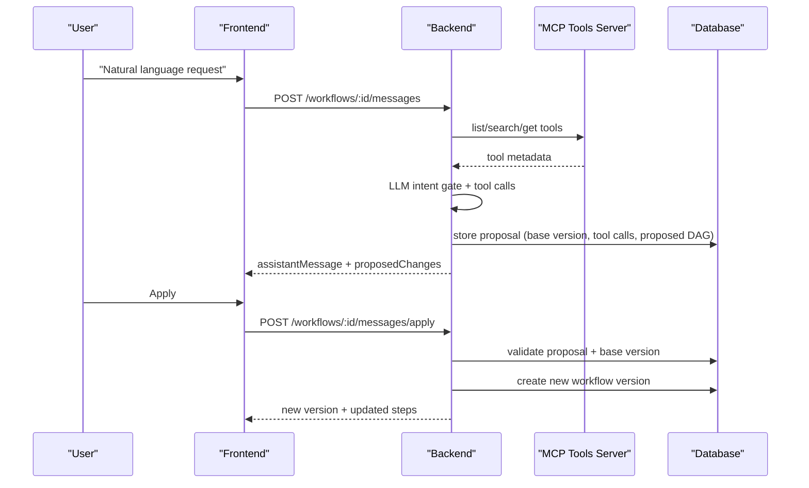

# Workflow Builder + MCP Tools Masterplan

This document is the single, authoritative plan for implementing the LLM workflow builder with a standalone MCP tool registry.

---

**Preflight Alignment (Required Reading)**

Read these before implementing anything in `/backend` or the new MCP service:

1. `markdown/PLAN.md`
2. `markdown/standards/backend/COLLECTION_STANDARDS.md`
3. `markdown/standards/backend/LIBRARY_STANDARDS.md`
4. `markdown/standards/backend/TESTING_STANDARDS.md`
5. `markdown/standards/backend/MIGRATION_STANDARDS.md`

---

**Non‑Negotiable Invariants**

1. The MCP server is the source of truth for tools.
2. The backend never searches the web to discover tools.
3. Workflow edits are implicit by default. Explicit add/remove/update only increases confidence.
4. All workflow changes are proposals first, applied only after user confirmation.
5. All DAG changes are validated for cycles, missing deps, and tool existence.
6. The MCP server must be structured and styled like the existing backend.
7. Tool references in DAGs include tool id and version for determinism.
8. `proposalStore` and `dagModifier` do not live in `workflowChatMessages`.
9. Workflows get ChatGPT‑style auto naming and description generation.
10. Descriptions are regenerated on each successful workflow change unless the user explicitly set a custom description.

---

**Architecture Overview**

1. Root MCP service `mcp-tools-server/` stores tools and serves MCP methods.
2. Backend calls MCP for list/search/get, and caches tool snapshots in DB.
3. LLM intent gate decides whether to modify, clarify, or answer only.
4. LLM tool calls produce a proposal. Proposal is stored until applied.
5. Frontend renders proposal diff with Apply/Reject.

---

**Root MCP Service**

**Location**

1. `mcp-tools-server/` at repo root, peer to `backend/`, `frontend/`, `marketing/`.

**Structure**

The MCP service mirrors backend conventions from `COLLECTION_STANDARDS.md`.

1. `mcp-tools-server/app/v0/tools/index.ts`
2. `mcp-tools-server/app/v0/tools/tools.types.ts`
3. `mcp-tools-server/app/v0/tools/tools.errors.ts`
4. `mcp-tools-server/app/v0/tools/tools.validation.ts`
5. `mcp-tools-server/app/v0/tools/tools.ctrl.ts`
6. `mcp-tools-server/app/v0/tools/tools.router.ts`
7. `mcp-tools-server/app/v0/tools/tools.helper.ts`
8. `mcp-tools-server/app/v0/tools/tools.service.ts`
9. `mcp-tools-server/app/index.ts`
10. `mcp-tools-server/server.ts`

**MCP Methods**

1. `listTools`
2. `searchTools`
3. `getTool`

---

**Backend Changes**

**New MCP Client Library**

1. `backend/lib/mcpToolsServer/index.ts`
2. `backend/lib/mcpToolsServer/mcpToolsServer.types.ts`
3. `backend/lib/mcpToolsServer/mcpToolsServer.request.ts`
4. `backend/lib/mcpToolsServer/__mocks__/mcpToolsServer.request.ts`

**New Tools Collection**

1. `backend/app/tools/index.ts`
2. `backend/app/tools/tools.types.ts`
3. `backend/app/tools/tools.errors.ts`
4. `backend/app/tools/tools.validation.ts`
5. `backend/app/tools/tools.ctrl.ts`
6. `backend/app/tools/tools.router.ts`
7. `backend/app/tools/tools.helper.ts`
8. `backend/app/tools/tools.service.ts`

**Workflow Chat Changes**

1. `backend/app/workflowChatMessages/workflowChatMessages.helper.ts`
2. `backend/app/workflowChatMessages/workflowChatMessages.ctrl.ts`
3. `backend/app/workflowChatMessages/workflowChatMessages.router.ts`
4. `backend/app/workflowChatMessages/workflowChatMessages.types.ts`
5. `backend/app/workflowChatMessages/workflowChatMessages.validation.ts`

**Workflow Naming and Description**

1. Add a workflow metadata generator modeled on `backend/app/messages/messages.helper.ts`.
2. Generate a workflow name and short description from the first meaningful user message and/or the current DAG.
3. Regenerate description on each applied workflow change if the description is auto‑managed.
4. Never overwrite a user‑edited name or description.
5. Add `backend/app/workflows/workflows.helper.ts` to house metadata generation logic.

**DAG Modifier and Proposal Store**

These are not in `workflowChatMessages`.

1. `backend/lib/workflowDags/dagModifier.ts`
2. `backend/lib/workflowDags/dagValidator.ts`
3. `backend/lib/workflowProposals/workflowProposals.helper.ts`

**LLM Tooling**

1. `backend/lib/llm/workflowTools.ts`
2. `backend/lib/llm/workflowSystemPrompt.ts`
3. `backend/lib/llm/llmWithTools.ts`

---

**Database Changes**

**Extend `tools` table**

1. `source` (enum text: `mcp` | `local`)
2. `external_id`
3. `version`
4. `schema_hash`
5. `last_synced_at`

**Extend `workflows` table**

1. `name_source` (`auto` | `user`)
2. `description_source` (`auto` | `user`)

**Optional snapshot table**

1. `tool_snapshots`
2. `tool_id`
3. `external_id`
4. `version`
5. `schema_json`
6. `created_at`

---

**Workflow DAG Schema**

Tools are stored as references with version:

```json
{
  "steps": [
    {
      "id": "step_validate",
      "name": "Validate Input",
      "instruction": "Check required fields",
      "tools": [
        { "id": "tool_validate_input", "name": "validate_input", "version": "1.2.0" }
      ],
      "dependsOn": []
    }
  ]
}
```

---

**LLM Intent Gate**

The LLM must return one of:

1. `modify_workflow`
2. `ask_clarifying`
3. `answer_only`

If `ask_clarifying`, return a single question and do not create a proposal.

---

**Proposal Flow**

1. User sends message.
2. Backend calls LLM with DAG + tools.
3. LLM returns intent and tool calls.
4. Backend computes proposed DAG.
5. Backend stores proposal with `baseVersionId`.
6. Frontend shows proposal diff.
7. User applies or rejects.
8. On apply, backend regenerates workflow description if `description_source` is `auto`.
9. On first workflow creation or first applied change, backend generates a default name and description if they are still auto.

---

**Sequence Diagram**



---

# Implementation Checklist

1. Read the required standards files listed above.
2. Create `mcp-tools-server/` root service.
3. Implement MCP tools collection with backend-style structure.
4. Add MCP auth middleware using a service key header.
5. Add `mcp-tools-server` to docker compose.
6. Add backend MCP client library in `backend/lib/mcpToolsServer`.
7. Extend `tools` table with MCP metadata columns.
8. Extend `workflows` table with `name_source` and `description_source`.
9. Optional: add `tool_snapshots` table.
10. Implement backend tool cache sync from MCP.
11. Add backend tools collection under `backend/app/tools`.
12. Update DAG schema for tool references.
13. Add DAG validator and modifier in `backend/lib/workflowDags`.
14. Add proposal store in `backend/lib/workflowProposals`.
15. Add LLM workflow tool calling modules.
16. Add workflow metadata generator for name + description.
17. Update workflow chat flow to create proposals and trigger metadata generation.
18. Add apply proposal endpoint.
19. Update frontend workflow chat to render proposals.
20. Add tests for DAG modifier and proposal flow.
21. Add tests for MCP client library.
22. Add tests for workflow metadata generation.
23. Add frontend tests for Apply/Reject UI.

---

# Implementation Brief

This section defines exact request/response types and LLM tool call payloads.

---

## Backend API Types

**Workflow Tool Reference**

```ts
export interface WorkflowToolRef {
    id: string;
    name: string;
    version: string;
}
```

**Workflow Step**

```ts
export interface WorkflowStep {
    id: string;
    name: string;
    instruction: string;
    tools?: WorkflowToolRef[];
    dependsOn?: string[];
}
```

**Workflow DAG**

```ts
export interface WorkflowDAG {
    steps: WorkflowStep[];
}
```

---

## Workflow Metadata Generation

**Source flags**

```ts
export type WorkflowNameSource = 'auto' | 'user';
export type WorkflowDescriptionSource = 'auto' | 'user';
```

**LLM output schema**

```ts
export interface WorkflowMetadataResult {
    name: string;
    description: string;
}
```

**Generation rules**

1. Use the first meaningful user message and current DAG (if present).
2. Name: 2‑6 words, title case, no trailing punctuation.
3. Description: 1‑2 sentences, plain language.
4. If LLM fails, fallback to a truncated summary of the user request.

**When to generate**

1. After first workflow creation if both sources are `auto`.
2. After every applied change if `description_source` is `auto`.
3. Never overwrite a user‑set name or description (`*_source = user`).

---

## Workflow Chat Message Response

**POST `/api/workflows/:workflowId/messages`**

```ts
export interface WorkflowChatMessageResponse {
    id: string;
    role: 'user' | 'assistant';
    content: string;
    createdAt: string;
}

export interface WorkflowChatProposedChanges {
    proposalId: string;
    baseVersionId: string;
    toolCalls: LLMToolCall[];
    previewSteps: WorkflowStep[];
}

export interface CreateWorkflowChatMessageResponse {
    userMessage: WorkflowChatMessageResponse;
    assistantMessage: WorkflowChatMessageResponse | null;
    workflowId: string;
    proposedChanges?: WorkflowChatProposedChanges;
    error?: {
        message: string;
        code: string;
    };
}
```

---

## Apply Proposal Response

**POST `/api/workflows/:workflowId/messages/apply`**

```ts
export interface ApplyProposalRequest {
    proposalId: string;
}

export interface ApplyProposalResponse {
    success: boolean;
    workflowVersion: {
        id: string;
        versionNumber: number;
        steps: WorkflowStep[];
    };
}
```

---

## Tools API

**GET `/api/tools`**

```ts
export interface ToolSummary {
    id: string;
    name: string;
    description: string | null;
    version: string;
    source: 'mcp' | 'local';
}

export interface GetToolsResponse {
    tools: ToolSummary[];
}
```

**GET `/api/tools/search?q=`**

```ts
export interface SearchToolsResponse {
    tools: ToolSummary[];
}
```

**GET `/api/tools/:toolId`**

```ts
export interface GetToolResponse {
    tool: {
        id: string;
        name: string;
        description: string | null;
        version: string;
        schema: Record<string, unknown>;
        source: 'mcp' | 'local';
    };
}
```

---

## LLM Tool Call Payloads

**LLM intent output**

```ts
export type WorkflowIntent =
    | 'modify_workflow'
    | 'ask_clarifying'
    | 'answer_only';

export interface WorkflowIntentResult {
    intent: WorkflowIntent;
    clarificationQuestion?: string;
    summary?: string;
}
```

**Add step**

```ts
export interface AddStepToolCall {
    name: 'add_step';
    args: {
        tempId?: string;
        name: string;
        instruction: string;
        tools?: Array<{ id: string; version: string }>;
        dependsOn?: string[];
        position?: 'start' | 'end' | 'after';
        afterStepId?: string;
    };
}
```

**Update step**

```ts
export interface UpdateStepToolCall {
    name: 'update_step';
    args: {
        stepId: string;
        name?: string;
        instruction?: string;
        tools?: Array<{ id: string; version: string }>;
        addTools?: Array<{ id: string; version: string }>;
        removeTools?: Array<{ id: string; version: string }>;
        dependsOn?: string[];
    };
}
```

**Delete step**

```ts
export interface DeleteStepToolCall {
    name: 'delete_step';
    args: {
        stepId: string;
        rewireStrategy?: 'auto' | 'manual';
        rewireToStepId?: string;
    };
}
```

**Reorder steps**

```ts
export interface ReorderStepsToolCall {
    name: 'reorder_steps';
    args: {
        stepId: string;
        newDependsOn: string[];
    };
}
```

**Union type**

```ts
export type LLMToolCall =
    | AddStepToolCall
    | UpdateStepToolCall
    | DeleteStepToolCall
    | ReorderStepsToolCall;
```

---

## MCP Client Types

```ts
export interface MCPTool {
    id: string;
    name: string;
    description: string | null;
    schema: Record<string, unknown>;
    version: string;
    tags?: string[];
}

export interface MCPListToolsResponse {
    tools: MCPTool[];
    nextCursor: string | null;
}

export interface MCPSearchToolsResponse {
    tools: MCPTool[];
}

export interface MCPGetToolResponse {
    tool: MCPTool;
}
```

---

**Implementation Notes**

1. The LLM tool calls never apply directly. They only generate proposals.
2. The backend assigns final step IDs when applying, even if LLM provides `tempId`.
3. Proposal validation must re-check tool existence against MCP or cached snapshot.
4. Proposal application must fail if the workflow version changed since proposal creation.
